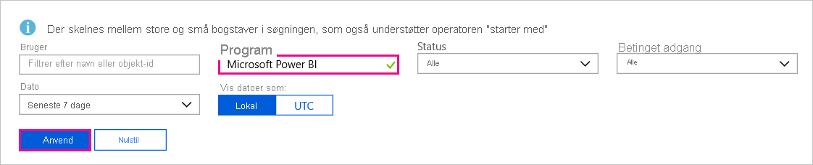

# Find Power BI-brugere, der er logget på

Hvis du er administrator for din organisation og gerne vil se, hvem der er logget på Power BI, kan du bruge adgangen til [Azure Active Directory og rapporter over forbrug](/azure/active-directory/reports-monitoring/concept-sign-ins).

> [!NOTE]
> Rapporter over **logonaktivitet** indeholder nyttige oplysninger, men du kan ikke se, hvilken type licens hver enkelt bruger har. Brug Microsoft 365 Administration til at få vist licenser.

## Krav

Alle brugere kan få vist en rapport over deres egne pålogninger. Hvis du vil se en rapport for alle brugere, skal du logge på med en af følgende roller: Global administrator, Sikkerhedsadministrator, Sikkerhedslæser, Global læser eller Rapportlæser.

## Brug Azure Active Directory Administration til at få vist logons

Følg disse trin for at få vist logonaktivitet.

1. Log på [Azure Active Directory Administration](https://aad.portal.azure.com), og vælg derefter **Azure Active Directory** i menuen på portalen.

1. I ressourcemenuen skal du vælge **Overvågning** > **Logons**.
   
    

1. Som standard vises alle logons fra de seneste 24 timer for alle brugere og programmer. Hvis du vil vælge en anden tidsperiode, skal du vælge **Dato** i arbejdsruden og vælge mellem de tilgængelige tidsintervaller. Det er kun oplysninger fra de seneste syv dage, der er tilgængelige. Hvis du kun vil logons i forbindelse med Power BI, skal du tilføje filtre. Vælg **Tilføj filter** > vælg **Program** som det felt, du vil filtrere efter, og vælg **Anvend**. Vælg **Programmet starter med** øverst i arbejdsruden, og angiv appnavnet. Vælg **Anvend**.

    **Microsoft Power BI**-filtre til logonaktivitet, der er relateret til tjenesten. **Power BI Gateway**-filtre til logonaktivitet, der er specifik for datagatewayen i det lokale miljø.
   
    

## Eksportér dataene

Du kan [downloade en rapport over logonaktivitet](/azure/active-directory/reports-monitoring/quickstart-download-sign-in-report) i et af to formater: en CSV-fil eller en JSON-fil.

1. I kommandolinjen for rapporten **Logons** skal du vælge **Download** og derefter vælge en af følgende indstillinger:

   * **CSV** for at downloade en CSV-fil med de data, der er filtreret efter i øjeblikket.

   * **JSON** for at downloade en JSON-fil med de data, der er filtreret efter i øjeblikket.

2. Angiv et filnavn, og vælg derefter **Download**.

## Dataopbevaring

Logonrelaterede data er tilgængelige i op til syv dage, medmindre din organisation har en Premium-licens til Azure Active Directory. Hvis du bruger Azure Active Directory Premium P1 eller Azure Active Directory Premium P2, kan du se data for de seneste 30 dage. Du kan finde flere oplysninger i [Politikker om opbevaring af Azure Active Directory-rapport](/azure/active-directory/reports-monitoring/reference-reports-data-retention).

## Næste trin

[Overvåg brugeraktivitet](service-admin-auditing.md)

Har du flere spørgsmål? [Prøv at spørge Power BI-community'et](https://community.powerbi.com/)