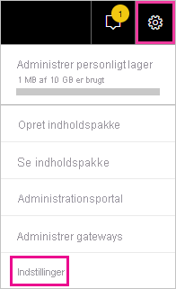
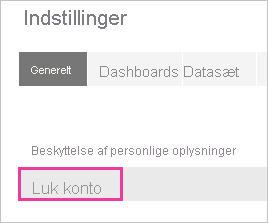
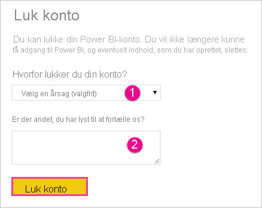
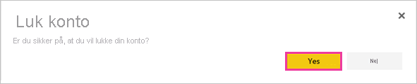

# Luk din Power BI-konto

Hvis du ikke vil bruge Power BI længere, kan du lukke din Power BI-konto.  Når du har lukket din konto, kan du ikke logge på Power BI. Som det også er angivet i politikken om dataopbevaring i [Power BI-serviceaftalen](https://azure.microsoft.com/support/legal/subscription-agreement/), sletter Power BI alle kundedata, du har uploadet eller oprettet.

## Individuelle Power BI-brugere

Hvis du har tilmeldt dig Power BI som enkeltperson, kan du lukke din konto via skærmen **Indstillinger**.

1. Vælg tandhjulet øverst til højre i Power BI, og vælg derefter **Indstillinger**.

    

1. På fanen **Generelt** skal du vælge **Luk konto**.

    

1. Vælg en årsag til at lukke kontoen (1). Du kan også angive yderligere oplysninger (2). Vælg derefter **Luk konto**.

    

1. Bekræft, at du vil lukke din konto.

    

    Du bør se en bekræftelse på, at Power BI har lukket din konto. Du kan genåbne din konto herfra, hvis det er nødvendigt.

    

## Administrerede brugere

Hvis din organisation har tilmeldt dig Power BI, skal du kontakte din administrator. Bed vedkommende om at fjerne tildelingen af licensen fra din konto.

Har du flere spørgsmål? [Prøv at spørge Power BI-community'et](https://community.powerbi.com/)