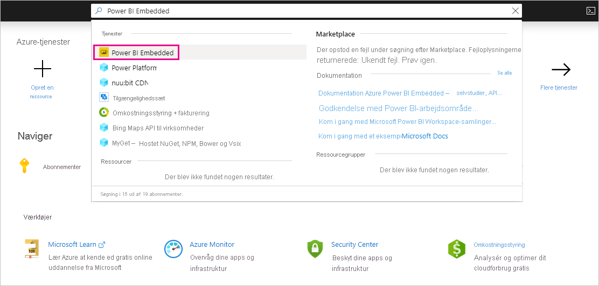
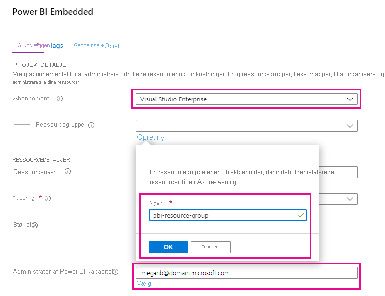
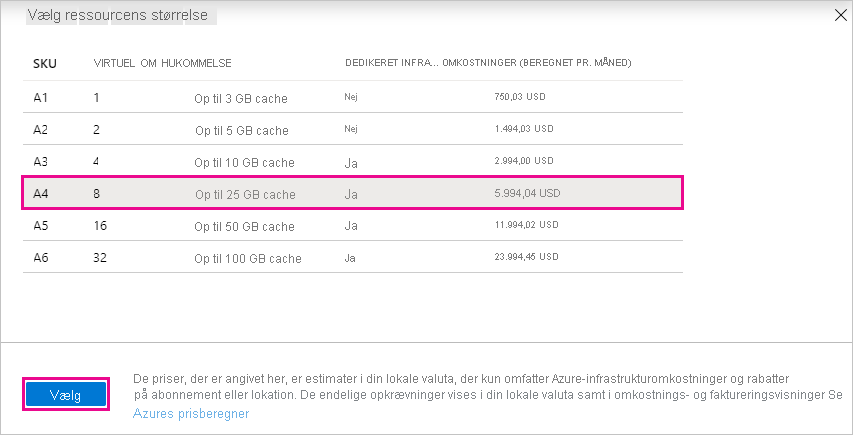

# Køb Power BI Premium til test

I denne artikel beskrives det hvordan du køber Power BI Premium-A-SKU'er til test af scenarier og i tilfælde, hvor du ikke har de nødvendige tilladelser til at købe P-SKU'er (rollen Global administrator eller rollen Faktureringsadministrator i Microsoft 365). A-SKU'er kræver ingen tidsforpligtelser og faktureres pr. time. Du køber A-SKU'er via [Azure Portal](https://portal.azure.com).

Du kan finde flere oplysninger om Power BI Premium under [Hvad er Power BI Premium?](service-premium-what-is.md). Du kan finde aktuelle priser og oplysninger om planlægning på [siden Priser for Power BI](https://powerbi.microsoft.com/pricing/) og under [Power BI Premium-beregner](https://powerbi.microsoft.com/calculator/). Indholdsforfattere skal stadig have en [Power BI Pro-licens](service-admin-purchasing-power-bi-pro.md), også selvom organisationen bruger Power BI Premium. Sørg for at købe mindst én Power BI Pro-licens til din organisation. Med A-SKU'er skal _alle brugere_, der forbruger indhold, også have Pro-licenser.

> [!NOTE]
> Hvis et Premium-abonnement udløber, har du 30 dages fuld adgang til din kapacitet. Derefter vil dit indhold igen blive en delt kapacitet. Modeller, der er større 1 GB, understøttes ikke i delt kapacitet.

## Køb A-SKU'er til test og andre scenarier

A-SKU'er er tilgængelige via Azure Power BI Embedded-tjenesten. Du kan bruge A-SKU'er på følgende måder:

- Aktivér integrering af Power BI i tredjepartsprogrammer. Se [Power BI Embedded](../developer/embedded/azure-pbie-what-is-power-bi-embedded.md) for at få flere oplysninger.

- Test Premium-funktionaliteten, før du køber en P-SKU.

- Opret udviklings- og testmiljøer sammen med et produktionsmiljø, der bruger P-SKU'er.

- Køb Power BI Premium, selvom du ikke har rollen Global administrator eller Faktureringsadministrator i Microsoft 365.

> [!NOTE]
> Hvis du køber en A4-SKU eller højere, kan du drage fordel af alle Premium-funktioner med undtagelse af ubegrænset deling af indhold. Med A-SKU'er skal _alle brugere_, der forbruger indhold, have Pro-licenser.

Følg disse trin for at købe A-SKU'er via Azure Portal:

1. Log på [Azure Portal](https://portal.azure.com) med en konto, hvor der mindst er tilladelser som administrator af Power BI-kapacitet.

1. Søg efter _Power BI Embedded_, og vælg tjenesten i søgeresultaterne.

    

1. Vælg **Opret Power BI Embedded**.

    

1. På oprettelsesskærmen i **Power BI Embedded** skal du angive følgende oplysninger:

    - Det **abonnement**, hvor Power BI Embedded-tjenesten skal oprettes.

    - Den fysiske **placering**, hvor den ressourcegruppe, der indeholder tjenesten, skal oprettes. For at opnå en bedre ydeevne skal denne placering ligge tæt på placeringen af din Azure Active Directory-lejer til Power BI.

    - Den eksisterende **ressourcegruppe** til brug, eller opret en ny, som vist i eksemplet.

    - **Administrator af Power BI-kapacitet**. Administratoren af kapacitet skal være en medlemsbruger eller en tjenesteprincipal i din Azure AD-lejer.

    

1. Hvis du vil bruge alle funktionerne i Power BI Premium (undtagen ubegrænset deling), skal du mindst bruge en A4-SKU. Vælg **Skift størrelse**.

    

1. Vælg en kapacitetsstørrelse på A4, A5 eller A6, der svarer til P1, P2 og P3.

    

1. Vælg **Gennemse + opret**, gennemse de indstillinger, du har valgt, og vælg derefter **Opret**.

    

1. Det kan tage et par minutter at fuldføre udrulningen. Når den er klar, skal du vælge **Gå til ressource**.

    

1. På administrationsskærmen skal du gennemse de indstillinger, du har til at administrere tjenesten, herunder afbryde tjenesten midlertidigt, når du ikke bruger den.

    

Når du har købt kapacitet, kan du få mere at vide om, hvordan du [administrerer kapaciteter](service-admin-premium-manage.md#manage-capacity) og [tildeler arbejdsområder](service-admin-premium-manage.md#assign-a-workspace-to-a-capacity) til en kapacitet.

## Næste trin

[Hvad er Power BI Premium?](service-premium-what-is.md)
[Sådan køber du Power BI Premium](service-admin-premium-purchase.md)
[Konfigurer og administrer kapaciteter i Power BI Premium](service-admin-premium-manage.md)\
[Side med Power BI-prisfastsættelse](https://powerbi.microsoft.com/pricing/)\
[Power BI Premium-beregner](https://powerbi.microsoft.com/calculator/)\
[Ofte stillede spørgsmål om Power BI Premium](service-premium-faq.md)\
[Hvidbog om planlægning af en Power BI Enterprise-installation](https://aka.ms/pbienterprisedeploy)

Har du flere spørgsmål? [Prøv at spørge Power BI-community'et](https://community.powerbi.com/)
