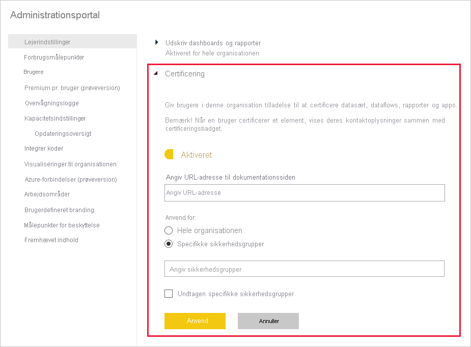

# Aktivér certificering af indhold

Din organisation kan certificere udvalgt indhold for at identificere det som en autoritativ kilde til vigtige oplysninger. Følgende indholdstyper kan certificeres i øjeblikket:
* Datasæt
* Dataflow (prøveversion)
* Rapporter (prøveversion)
* Apps (prøveversion)

Som Power BI-administrator er du ansvarlig for at aktivere og konfigurere certificeringsprocessen for din organisation. Det betyder:
* Aktivering af certificering på din lejer.
* Definering af en liste over sikkerhedsgrupper, hvis medlemmer er autoriseret til at certificere indhold.
* Angivelse af en URL-adresse, der peger på dokumentationen til organisationens certificeringsproces for indhold, hvis en sådan dokumentation findes.

Certificering er en del af funktionen til *anbefalinger* i Power BI. Se [Anbefaling: Promovering og certificering af Power BI-indhold](../collaborate-share/service-endorsement-overview.md) for at få flere oplysninger.

## Konfiguration af certificering

1. Gå til lejerindstillingerne i administrationsportalen.
1. Under indstillinger for eksport og deling skal du udvide afsnittet Certificering.

   

1. Slå **Aktiveret** til.
1. Hvis din organisation har en publiceret certificeringspolitik, kan du angive URL-adressen til den her. Dette bliver linket til at **få mere at vide** under certificeringsafsnittet i [dialogboksen med indstillinger for anbefalinger](../collaborate-share/service-endorse-content.md#request-content-certification). Hvis du ikke angiver et link, bliver de brugere, der gerne vil anmode om certificering af deres indhold, bedt om at kontakte deres Power BI-administrator.
1. Angiv en eller flere sikkerhedsgrupper, hvis medlemmer vil være autoriseret til at certificere indhold. Disse autoriserede certificeringseksperter kan bruge knappen Certificering under certificeringsafsnittet i [dialogboksen med indstillinger for anbefalinger](../collaborate-share/service-endorse-content.md#certify-content). Dette felt accepterer kun sikkerhedsgrupper. Du kan ikke angive navngivne brugere.
    
    Hvis en sikkerhedsgruppe indeholder undersikkerhedsgrupper, som du ikke vil give certificeringsrettigheder til, kan du markere afkrydsningsfeltet **Undtagen bestemte sikkerhedsgrupper** og angive navnene på disse grupper i det tekstfelt, der vises.
1. Klik på **Anvend**.

## Næste trin
* [Promover eller certificer indhold](../collaborate-share/service-endorse-content.md)
* [Læs om anbefalinger i Power BI](../collaborate-share/service-endorsement-overview.md)
* Har du spørgsmål? [Prøv at spørge Power BI-community'et](https://community.powerbi.com/)
