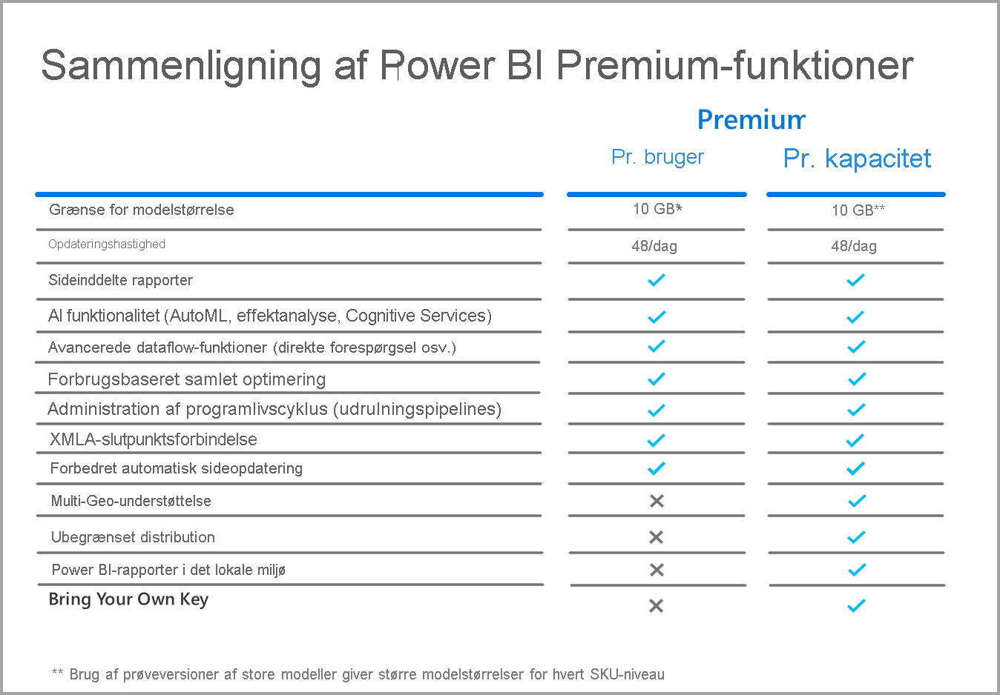

# Ofte stillede spørgsmål om Power BI Premium pr. bruger (prøveversion)

Power BI **Premium pr. bruger** giver organisationer mulighed for at give Premium-funktioner i licens pr. bruger. Premium pr. bruger omfatter alle Power BI Pro-licensfunktioner og tilføjer også funktioner som sideinddelte rapporter, AI og andre egenskaber, der kun er tilgængelige for Premium-abonnenter. 

I denne artikel finder du svar på almindelige spørgsmål om Premium pr. bruger-licenser. Alle oplysninger i denne artikel kan ændres og finjusteres i løbet af prøveperioden for Premium pr. bruger, inden den bliver generelt tilgængelig. 

I denne artikel grupperes spørgsmål og svar i følgende kategorier:
* Generelle spørgsmål 
* Spørgsmål vedrørende administration 
* Spørgsmål vedrørende slutbrugeroplevelsen 

## Generelle spørgsmål

1.  **Hvad er Premium pr. bruger?** 

    Premium pr. bruger giver organisationer en ny måde at give Premium-funktioner i licens på pr. bruger-basis. Den omfatter alle Power BI Pro-licensfunktioner sammen med funktioner som sideinddelte rapporter, AI og andre funktioner, der kun er tilgængelige i Premium i dag.

2.  **Hvornår bliver den tilgængelig?**

    Udvikling er i gang, og vi forventer ikke, at Premium pr. bruger bliver generelt tilgængelig før 2021. Den offentlige prøveversion er tilgængelig for alle organisationer uden beregning, indtil produktet bliver generelt tilgængeligt.

3.  **Har jeg brug for en Power BI Pro- og en Premium pr. bruger-licens?**

    Nej, du får alle mulighederne i Power BI Pro med Premium pr. bruger-licensen.

4.  **Hvordan får jeg en prøveversion?**

    Der er en prøveversionsoplevelse, der er tilgængelig via produktet, og en prøveversionsoplevelse, der er tilgængelig via Microsoft 365. Forudsat, at virksomheden ikke har begrænset Premium pr. bruger, kan enhver bruger få adgang til prøveversionsoplevelsen i produktet, ved at slå Premium pr. bruger til for et arbejdsområde. Prøveversionsoplevelser via Microsoft 365 kan aktiveres via portalen, fuldstændig ligesom Power BI Pro-prøveversioner initieres i dag.  
    
5.  **Min indledende prøveversion er udløbet, og vi er stadig i prøveperioden.  Hvordan forlænger/fornyr jeg min prøveversion af Premium pr. bruger i prøveperioden?**

    Kunder, der bruger prøveversionen i produktet, kan starte en ny prøveversion, når den oprindelige prøveversion udløber, ved at klikke på profilikonet i øverste højre hjørne af portalen.  Der vises en mulighed for at tilmelde sig prøveversionen igen.  Det starter endnu en 60-dages prøveversion.  Dette vil fortsat være en mulighed i prøveperioden.  
    
    For kunder, der bruger den prøveversion, der tilbydes via Microsoft 365, kan lejeradministratoren forlænge den oprindelige 30-dages prøveversion i yderligere 30 dage. Dette er den maksimale tidsperiode, som en prøveversion kan forlænges.

6.  **Hvilke funktioner er tilgængelige i Premium pr. bruger?**

    Funktionssammenligningen ses nedenfor:    

    

7.  **Min organisation har allerede Power BI Premium. Skal jeg nu have Premium pr. bruger-licens for at udgive indhold til min kapacitet?**
    
    Din organisation kan vælge at supplere deres Premium-kapacitet med Premium pr. bruger-licenser, men Premium pr. bruger er ikke påkrævet for at udgive indhold til eksisterende kapaciteter.  

## Administrative spørgsmål

1.  **Vil du Hvordan gør jeg aktivere Premium pr. bruger for min lejer?**
    
    Når en licens er klargjort til Premium pr. bruger for lejeren, er Premium pr. bruger-funktionerne tilgængelige i alle de arbejdsområder, hvor du slår dem til. I prøveversionen skal du blot aktivere Premium pr. bruger-funktionerne på kapacitetsrullelisten ved at vælge Premium pr. bruger-elementet som vist på følgende billede.

    

2.  **Fungerer dette som en Premium-kapacitet? Kan jeg slå funktioner til/fra?**

    Nej, der er ingen administration af hukommelse eller CPU for Premium pr. bruger. Det fungerer, som Power BI Pro gør i dag, i den henseende. Lejeradministratoren kan administrere udvalgte funktionsindstillinger, men de kan ikke deaktivere arbejdsbelastninger, f. eks. sideinddelte rapporter, ligesom du ikke kan slå dashboards fra i dag. 

3.  **Hvor kan jeg administrere de Premium pr. bruger-indstillinger, der vises?**

    Der er et nyt menupunkt i lejerindstillingerne for Premium pr. bruger, som gør det muligt for administratorer at administrere disse indstillinger.

4.  **Kan jeg begrænse, hvilke brugere der kan oprette Premium pr. bruger-arbejdsområder?**

    Ja, på samme måde som du i øjeblikket kan begrænse, hvilke brugere der kan oprette arbejdsområder.

5.  **Kan lejeradministratorer se, hvilke arbejdsområder der er markeret som Premium pr. bruger?**

    Ja, de er fremhævet i menupunktet Arbejdsområder på lejeradministratorens skærm, så det er tydeligt, hvilke arbejdsområder der er markeret som Premium.

6.  **Kan jeg flytte arbejdsområder mellem Premium pr. bruger og Premium-kapaciteter?**

    Ja. I forbindelse med generel tilgængelighed skal du udføre en komplet opdatering af alle datasæt eller dataflow i arbejdsområdet, når du flytter det tilbage til Premium-kapacitet. Dette krav forhindrer, at virksomheder kan omgå CPU-opkrævningsmekanismen i Premium Gen2.

7.  **Er kapacitets-API'erne tilgængelige for Premium pr. bruger?**

    Der er et begrænset sæt af API'er, der tillader flytning af arbejdsområder, men du kan f.eks. ikke slå arbejdsbelastninger og lignende aktiviteter fra.  
    
7.  **Understøttes tjenesteprincipaler med Premium pr. bruger-arbejdsområder?**

    Nej, vi understøtter i øjeblikket ikke tjenesteprincipaler i Premium pr. bruger-arbejdsområder.  

## Spørgsmål vedrørende slutbrugeroplevelsen

1.  **Hvordan ved andre brugere, at jeg har markeret et arbejdsområde som Premium pr. bruger?**
    
    Der er introduceret et nyt ikon, der viser, hvilke arbejdsområder der er Premium pr. bruger, som vist på følgende billede:

        

2.  **Hvem har adgang til indhold i et/en Premium pr. bruger-arbejdsområde/app?**

    Alle brugere skal have en Premium pr. bruger-licens for at få vist indholdet i et Premium pr. bruger-arbejdsområde. Dette omfatter scenarier, hvor brugerne kan få adgang til indholdet via XMLA-slutpunktet, Analysér i Excel, Sammensatte modeller osv. Du kan give brugere, der ikke har en Premium pr. user-licens endnu, adgang til arbejdsområdet, men de modtager en meddelelse om, at de ikke kan få adgang til indholdet. De bliver bedt om at angive en licens til en prøveversion, hvis de er berettiget. Hvis de ikke er berettiget, skal de tildeles en licens af deres lejeradministrator.

3.  **Hvilket indhold kan personer med de forskellige licenstyper se, når det deles med dem?**

    I følgende diagram beskrives det, hvem der kan se hvilken type indhold med Premium pr. bruger:

       

4.  **Kan jeg bruge Premium pr. bruger i forbindelse med integrerede use cases?**

    Premium pr. bruger fungerer på samme måde, som integrerede use cases fungerer, når du bruger en Pro-licens. Du kan integrere indholdet, og hver enkelt bruger skal have en Premium pr. bruger-licens for at få det vist.

5.  **Hvad sker der med mit Premium pr. bruger-arbejdsområde i slutningen af prøveperioden, hvis jeg vælger ikke at købe Premium pr. bruger-licenser?**

    Du og brugerne har stadig adgang til arbejdsområdet, men indhold, der kræver den pågældende licenstype, er dog ikke tilgængeligt. Du skal enten flytte arbejdsområdet til en Premium-kapacitet eller blot slå kravet fra. 

6.  **Hvor meget samlet lagerplads får jeg med Premium pr. bruger?**

    Hele lejeren har de samme 100 TB, som en Premium-kapacitet har, hvad angår lager.

7.  **Er eksport-API'en tilgængelig for Premium pr. bruger?**

    Denne er i øjeblikket tilgængelig for sideinddelte rapporter og er begrænset til et enkelt kald én gang hvert 5. minut.  Power BI-rapporter understøttes ikke på nuværende tidspunkt.  

8.  **Hvordan fungerer mailabonnementer i Premium pr. bruger?**

    Alle, der har en Premium pr. bruger-licens eller en Pro-licens, kan modtage abonnementet og eventuelle vedhæftede filer, det indeholder, hvis den vedhæftede fil er den samme for alle brugere. Pro-brugere kan ikke få vist indholdet i produktportalen. Hvis der introduceres yderligere abonnementsmuligheder, som giver mulighed for forskellige datavisninger til forskellige modtagere, kræves der en Premium pr. bruger-licens (eller Premium-kapacitet) for at bruge disse egenskaber.

9.  **Kan jeg overskride de 48 opdateringer via portalen via opdaterings-API'en?**

    Opdateringer er ikke begrænset på dette tidspunkt.  

10. **Kan jeg bruge appen Power BI Premium Capacity Metrics til at overvåge Premium pr. bruger-forbrug?**

    Appen Power BI Premium Capacity Metrics fungerer ikke sammen med Premium Gen2 og ville derfor ikke give dig mulighed for at få vist nogen Premium pr. bruger-elementer.  

11. **Kan jeg hoste et Power BI-datasæt til et Premium pr. bruger-arbejdsområde, oprette en rapport i forhold til det, udgive den i et arbejdsområde, der ikke er Premium pr. bruger, og give brugerne adgang til denne rapport, uden at de skal have en Premium pr. bruger-licens?**

    Nej. Da datasættet er placeret i et Premium pr. bruger-arbejdsområde, kan det ikke ses af brugere uden en licens, selvom de kan få adgang til rapporten i et arbejdsområde, der ikke er Premium pr. bruger.

12. **Kan jeg opdatere flere datamodeller på 10 GB på samme tid?**

    Du er underlagt de samme begrænsninger, som gælder for parallelle opdateringer i Premium Gen2.

13. **Kan jeg dele indhold, der er hostet i Premium pr. bruger, via Publicer på internettet?**

    Publicer på internettet fungerer på samme måde som med indhold, der er hostet i Premium-kapacitet i dag.

14. **Kan jeg få et dataflow til at køre i et Premium pr. bruger-arbejdsområde, der skal importeres til et Power BI-datasæt i et andet arbejdsområde, uden at brugere, der forbruger det pågældende indhold, skal have en Premium pr. bruger-licens?**

    Så længe Power BI-rapportens forfatter har en Premium pr. bruger-licens, er dette muligt i prøveperioden for Premium pr. bruger.

15. **Kan jeg bruge Power BI-mobilappsene sammen med Premium pr. bruger?**

    Ja, Power BI-mobilappsene er blevet opdateret, så de fungerer sammen med alt indhold, der er publiceret til en Premium pr. bruger-app eller et Premium pr. bruger-arbejdsområde.

**De næste trin**

* [Hvad er Power BI Premium?](service-premium-what-is.md)
* [Hvidbog om Microsoft Power BI Premium](https://aka.ms/pbipremiumwhitepaper)
* [Hvidbog om planlægning af en Power BI Enterprise-installation](https://aka.ms/pbienterprisedeploy)
* [Aktivering af den udvidede Pro-prøveversion](../fundamentals/service-self-service-signup-for-power-bi.md)
* [Ofte stillede spørgsmål om Power BI Embedded](../developer/embedded/embedded-faq.md)

Har du flere spørgsmål? [Prøv at spørge Power BI-community'et](https://community.powerbi.com/)
