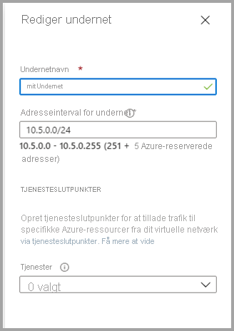
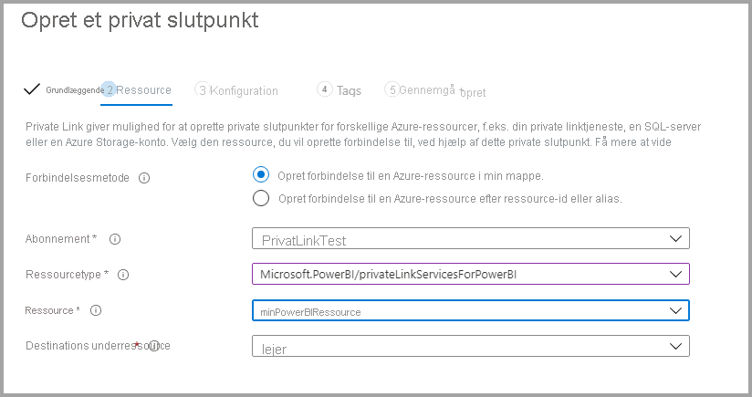

# <a name="private-links-for-accessing-power-bi"></a>Private links, der giver adgang til Power BI

Du kan konfigurere og bruge et slutpunkt i Power BI, der gør det muligt for din organisation at få adgang Power BI privat. Hvis du vil konfigurere private links, skal du være Power BI-administrator og have tilladelser i Azure til at oprette og konfigurere ressourcer som f. eks. Virtual Machines (VM'er) og virtuelle netværk (V-Net). 

De trin, der gør det muligt for dig at oprette sikker adgang til Power BI via private links, er:

1. [Aktivér private links til Power BI](#enable-private-links-for-power-bi)
2. [Opret en Power BI ressource i Azure Portal](#create-a-power-bi-resource-in-the-azure-portal)
3. [Opret et virtuelt objekt](#create-a-virtual-network)
4. [Opret en virtuel maskine (VM)](#create-a-virtual-machine-vm)
5. [Opret et privat slutpunkt](#create-a-private-endpoint)
6. [Opret forbindelse til en VM ved hjælp af Fjernskrivebord (RDP)](#connect-to-a-vm-using-remote-desktop-rdp)
7. [Opret adgang til Power BI privat fra den virtuelle maskine](#access-power-bi-privately-from-the-vm)
8. [Deaktiver offentlig adgang for Power BI](#disable-public-access-for-power-bi)

De følgende afsnit indeholder flere oplysninger om hvert trin.

## <a name="enable-private-links-for-power-bi"></a>Aktivér private links til Power BI

For at komme i gang skal du logge på Power BI på app.powerbi.com som administrator og gå til administrationsportalen. Vælg **Lejerindstillinger**, og rul til **Avanceret netværk**, og slå derefter alternativknappen til/fra for at aktivere **Azure Private Link** som vist på følgende billede. 

Det tager ca. 15 minutter at konfigurere et privat link til din lejer, hvilket omfatter konfiguration af et separat FQDN for lejeren, så det er muligt at kommunikere privat med Power BI-tjenester.


Når du er færdig, kan du gå videre til næste trin.

## <a name="create-a-power-bi-resource-in-the-azure-portal"></a>Opret en Power BI-ressource i Azure Portal

Log derefter på [Azure Portal](https://portal.azure.com), og opret en Power BI-ressource ved hjælp af en **Azure-skabelon**. Erstat parametrene i eksemplet på ARM-skabelonen, der vises i følgende tabel, for at oprette en Power BI-ressource.


|**Parameter**  |**Værdi**  |
|---------|---------|
|```<resource-name>```    | myPowerBIResource         |
|```<tenant-object-id>```     | 52d40f65-ad6d-48c3-906f-1ccf598612d4         |

Opret ARM-skabelonen 

```
{
  "$schema": "http://schema.management.azure.com/schemas/2015-01-01/deploymentTemplate.json#",
  "contentVersion": "1.0.0.0",
  "parameters": {},
  "resources": [
      {
          "type":"Microsoft.PowerBI/privateLinkServicesForPowerBI",
          "apiVersion": "2020-06-01",
          "name" : "<resource-name>",
          "location": "global",
          "properties" : 
          {
               "tenantId": "<tenant-object-id>"
          }
      }
  ]
}
```

I den dialogboks, der vises, skal du markere afkrydsningsfeltet for at acceptere vilkårene og betingelserne og derefter vælge **Køb**.


## <a name="create-a-virtual-network"></a>Opret et virtuelt netværk

Næste trin er at oprette et virtuelt netværk og undernet. Erstat eksempelparametrene i nedenstående tabel med din egen for at oprette et virtuelt netværk og undernet.

| Parameter |   Værdi| 
|---------|---------|
| ```<resource-group-name>```   | MyResourceGroup |
| ```<virtual-network-name>```  | myVirtualNetwork |
| ```<region-name>```   | Det centrale USA  |
| ```<IPv4-address-space>```    | 10.1.0.0/16 |
| ```<subnet-name>```   | mySubnet |
| ```<subnet-address-range>```  | 10.1.0.0/24 |

1. Vælg **Opret en ressource > Netværk > Virtuelt netværk**, eller søg efter **Virtuelt netværk** i søgefeltet.
2. Angiv eller vælg følgende oplysninger under fanen **Grundlæggende** i **Opret virtuelt netværk**:

    |Indstillinger | Værdi |
    |-------------------|---------|
    |**Projektdetaljer**|
    |Abonnement | Vælg dit Azure-abonnement |
    |Ressourcegruppe |   Vælg **Opret ny**, angiv ```<resource-group-name>```, og vælg derefter **OK**, eller vælg en eksisterende ```<resource-group-name>``` på basis af parametre. |
    |**Detaljer om forekomst** |
    | Name  | Angiv ```<virtual-network-name>``` |
    |Region | Vælg ```<region-name>``` |
    
    På følgende billede kan du se fanen **Grundlæggende**.
    
    


3. Vælg derefter fanen **IP-adresser**, eller vælg **Næste: Knappen IP-adresser** nederst i formularen. Angiv følgende oplysninger under fanen IP-adresser:

    |Indstillinger | Værdi |
    |-------------------|---------|
    |IPv4-adresseområde |Angiv ```<IPv4-address-space>``` |
    
    
    

4. Vælg ordet *standard* i **Navn på undernet**, og angiv følgende oplysninger i **Rediger undernet**:

    |Indstillinger | Værdi |
    |-------------------|---------|
    | Navn på undernet |Angiv ```<subnet-name>``` |
    | Adresseinterval for undernet | Angiv ```<subnet-address-range>``` |
    
    
    

5. Vælg derefter **Gem**, og vælg fanen **Gennemse + Opret**, eller vælg knappen **Gennemse + Opret**. 

6. Vælg derefter **Opret**.

Når du har gennemført disse trin, kan du oprette en virtuel maskine (VM) som beskrevet i næste afsnit.

## <a name="create-a-virtual-machine-vm"></a>Opret en virtuel maskine (VM)


Næste trin er at oprette et virtuelt netværk og det undernet, der skal hoste den virtuelle maskine (VM).

1. Vælg **Opret en ressource > Compute > Virtuel maskine** øverst til venstre på skærmen i Azure Portal.

2. Angiv eller vælg følgende oplysninger i **Opret en virtuel maskine – Grundlæggende**:

    |Indstillinger | Værdi |
    |-------------------|---------|
    |**Projektdetaljer**||
    |Abonnement | Vælg dit Azure-abonnement |
    |Ressourcegruppe |   Vælg **myResourceGroup**, som du oprettede i det forrige afsnit. |
    |**Detaljer om forekomst** ||
    |Name | Angiv **myVm** |
    |Region | Vælg **Det centrale USA** |
    |Indstillinger for tilgængelighed| Behold standardindstillingen **Der kræves ingen redundans i infrastruktur** |
    |Billede | Vælg **Windows 10 Pro** |
    |Størrelse | Behold standardindstillingen **Standard DS1 v2** |
    |ADMINISTRATORKONTO ||
    |Brugernavn |Angiv et brugernavn efter eget valg |
    |Adgangskode | Angiv en adgangskode efter eget valg. Adgangskoden skal indeholde mindst 12 tegn og opfylde de [definerede kompleksitetskrav](https://docs.microsoft.com/azure/virtual-machines/windows/faq?toc=/azure/virtual-network/toc.json#what-are-the-password-requirements-when-creating-a-vm) |
    |Bekræft adgangskode | Angiv adgangskode igen |
    |REGLER FOR INDGÅENDE PORTE ||
    |Offentlige indgående porte | Behold standardindstillingen **Ingen** |
    |SPAR PENGE ||
    |Har du allerede en Windows-licens? |  Behold standardindstillingen **Nej** |

3. Vælg derefter **Næste: Disks**
4. Behold standardindstillingerne i **Opret en virtuel maskine – Disks**, og vælg **Næste: Netværk**.
5. Vælg følgende oplysninger i **Opret en virtuel maskine – Netværk**:

    |Indstillinger | Værdi |
    |-------------------|---------|
    |Virtuelt netværk|   Behold standardindstillingen **MyVirtualNetwork**|
    |Adresseområde| Behold standardindstillingen **10.1.0.0/24**|
    |Undernet |Behold standardindstillingen **mySubnet (10.1.0.0/24)**|
    |Offentlig IP| Behold standardindstillingen **(ny) myVm-ip**|
    |Offentlige indgående porte|  Vælg **Tillad valgte **|
    |Vælg indgående porte|  Vælg **RDP**|

6. Vælg **Gennemse + Opret**. Du overføres til siden **Gennemse + Opret** side, hvor Azure validerer din konfiguration.
7. Når du ser meddelelsen **Validering bestået**, skal du vælge **Opret**.


## <a name="create-a-private-endpoint"></a>Opret et privat slutpunkt

Næste trin, der beskrives i dette afsnit, er at oprette et privat slutpunkt for Power BI.

1. Vælg **Opret en ressource > Netværk > Private Link Center (prøveversion)** øverst til venstre på skærmen i Azure Portal.
2. Vælg **Opret et privat slutpunkt** under indstillingen **Byg en privat forbindelse til en tjeneste** i **Private Link Center – Oversigt**.
3. Angiv eller vælg følgende oplysninger i **Opret et privat slutpunkt (prøveversion) – Grundlæggende**:

    |Indstillinger | Værdi |
    |-------------------|---------|
    |**Projektdetaljer** ||
    |Abonnement|  Vælg dit Azure-abonnement|
    |Ressourcegruppe|    Vælg **myResourceGroup**. Du har oprettet denne i det forrige afsnit|
    |**Detaljer om forekomst** ||
    |Name|  Angiv *myPrivateEndpoint*. Hvis dette navn er taget, skal du oprette et entydigt navn|
    |Region|    Vælg **Det centrale USA**|
    
    På følgende billede kan du se vinduet **Opret et privat slutpunkt – Grundlæggende**.
    
    

4. Når de pågældende oplysninger er angivet, skal du vælge **Næste: Ressource** og angive eller vælge følgende oplysninger i **Opret et privat slutpunkt – Ressource**:

    |Indstillinger | Værdi |
    |-------------------|---------|
    |Forbindelsesmetode| Vælg Opret forbindelse til en Azure-ressource i min mappe|
    |Abonnement|  Vælg dit abonnement|
    |Ressourcetype| Vælg **Microsoft.PowerBI/privateLinkServicesForPowerBI** |
    |Ressource|  myPowerBIResource|
    |Underressource for destination|   Lejer|
    
    På følgende billede kan du se vinduet **Opret et privat slutpunkt – Ressource**.
    
    

5. Når de pågældende oplysninger er angivet, skal du vælge **Næste: Konfiguration** og angive eller vælge følgende oplysninger i **Opret et privat slutpunkt (prøveversion) – Konfiguration**:

    |Indstillinger | Værdi |
    |-------------------|---------|
    |**NETVÆRK** ||
    |Virtuelt netværk|   Vælg *myVirtualNetwork* |
    |Undernet |Vælg *mySubnet* |
    |**PRIVAT DNS-INTEGRATION** ||
    |Integrer med privat DNS-zone|   Vælg **Ja** |
    |Privat DNS-zone   |Markér <br><br>
    *(Ny) privatelink.analysis.windows.net* <br>
    *(Ny) privatelink.pbidedicated.windows.net* <br>
    *(Ny) privatelink.tip1.powerquery.microsoft.com* |
    
    På følgende billede kan du se vinduet **Opret et privat slutpunkt – Konfiguration**.
    
    
    
    Vælg derefter **Gennemse + Opret** for at få vist siden **Gennemse + Opret**, hvor Azure validerer din konfiguration. Når du ser meddelelsen **Validering bestået**, skal du vælge **Opret**.

## <a name="connect-to-a-vm-using-remote-desktop-rdp"></a>Opret forbindelse til en VM ved hjælp af Fjernskrivebord (RDP)

Når du har oprettet din virtuelle maskine med navnet **myVM**, skal du oprette forbindelse til den fra internettet ved hjælp af følgende trin:

1. Angiv *myVm* på portalens søgelinje.
2. Vælg knappen **Opret forbindelse**. Når du har valgt knappen **Opret forbindelse**, åbnes **Opret forbindelse til virtuel maskine**.
3. Vælg **Download RDP-fil**. Azure opretter en .rdp-fil (Remote Desktop Protocol – fjernskrivebordsprotokol) og downloader den til din computer.
4. Åbn den hentede. rdp-fil.
5. Hvis du bliver bedt om det, skal du vælge **Opret forbindelse**.
6. Angiv det brugernavn og den adgangskode, du angav, da du oprettede den virtuelle maskine i det forrige trin.
7. Vælg **OK**.
8. Du modtager muligvis en certifikatadvarsel under logonprocessen. Hvis du modtager en certifikatadvarsel, skal du vælge **Ja** eller **Fortsæt**.

## <a name="access-power-bi-privately-from-the-vm"></a>Opret adgang til Power BI privat fra den virtuelle maskine

Næste trin er at oprette adgang til Power BI privat fra den virtuelle maskine, du oprettede i det forrige trin, ved hjælp af følgende trin: 

1. Åbn PowerShell på Fjernskrivebord i myVM.
2. Angiv nslookup 52d40f65ad6d48c3906f1ccf598612d4-api.privatelink.analysis.windows.net.
3. Du modtager en meddelelse, der ligner denne:

    ```
    Server:  UnKnown
    Address:  168.63.129.16
    
    Non-authoritative answer:
    Name:    52d40f65ad6d48c3906f1ccf598612d4-api.privatelink.analysis.windows.net
    Address:  10.1.0.4
    ```

4. Åbn browseren, og gå til app.powerbi.com for at få adgang til Power BI privat.

## <a name="disable-public-access-for-power-bi"></a>Deaktiver offentlig adgang for Power BI

Til sidst skal du deaktivere offentlig adgang for Power BI. 

Log på app.powerbi.com som administrator, og gå til **Administrationsportal**. Vælg **Lejerindstillinger**, og rul ned til afsnittet **Avanceret netværk**. Aktivér til/fra-knappen i afsnittet **Bloker offentlig internetadgang** som vist på følgende billede. Det tager ca. 15 minutter, før systemet kan deaktivere din organisations adgang til Power BI fra det offentlige internet.

Og det er det hele – efter at have fulgt disse trin er Power BI kun tilgængelige for dine organisationer via private links og ikke fra det offentlige internet. 

## <a name="considerations-and-limitations"></a>Overvejelser og begrænsninger

Der er et par overvejelser, du skal gøre dig, når du arbejder med private links i Power BI:

* Enhver brug af eksterne billeder eller temaer er ikke tilgængelige, når du bruger et miljø med private links, og det kan påvirke brugerdefinerede visualiseringer
* Eksporttjenester, f. eks. eksport til PDF og eksport til Excel fra en rapport, og andre eksporttjenester fungerer ikke, når du bruger et miljø med private links
* SQL Server Reporting Services-rapporter, der ofte kaldes RDL-filer (*filer i . rdl-format), gengives ikke i miljøer med private links


## <a name="next-steps"></a>Næste trin

- [Administrer Power BI i din organisation](service-admin-administering-power-bi-in-your-organization.md)  
- [Beskrivelse af rollen som Power BI-administrator](service-admin-role.md)  
- [Overvågning af Power BI i din virksomhed](service-admin-auditing.md)  

Har du flere spørgsmål? [Prøv at spørge Power BI-community'et](https://community.powerbi.com/)
