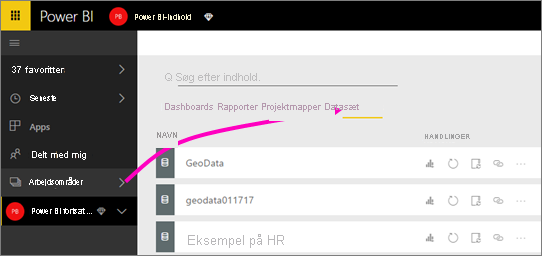
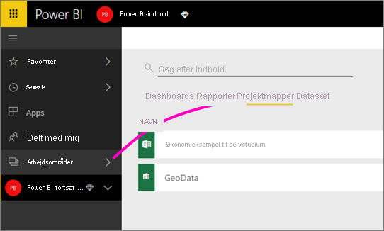

# Opret forbindelse til filer, der er gemt i OneDrive, til et klassisk arbejdsområde
Når du [opretter et *klassisk* arbejdsområde i Power bi](service-create-workspaces.md), opretter du også en Microsoft 365 gruppe med en tilknyttet OneDrive for Business. I denne artikel forklares det, hvordan du gemmer og opdaterer dine Excel-, CSV- og Power BI Desktop-filer på den pågældende OneDrive for Business. Disse opdateringer afspejles automatisk i dine Power BI-rapporter og på dine Power BI-dashboards, som er baseret på filerne.

> [!NOTE]
> Den *nye* Workspace-bruger ændrer relationen mellem Power bi arbejdsområder og Microsoft 365 grupper. Du opretter ikke automatisk en Microsoft 365-gruppe, hver gang du opretter et af de nye arbejdsområder. Du kan også [angive et arbejdsområde OneDrive for et nyt arbejdsområde](service-create-the-new-workspaces.md#set-a-workspace-onedrive).

Tilføjelse af filer til dit klassiske arbejdsområde er en proces med to trin: 

1. Først skal du [uploade filer til OneDrive for Business](#1-upload-files-to-the-onedrive-for-business-for-your-workspace) for dit arbejdsområde.
2. Derefter skal du [oprette forbindelse til disse filer fra Power BI](#2-import-excel-files-as-datasets-or-as-excel-online-workbooks).

> [!NOTE]
> Arbejdsområder er kun tilgængelige med en [Power BI Pro-licens](../fundamentals/service-features-license-type.md).
> 

## 1 Upload filer til OneDrive for Business for dit arbejdsområde
1. I Power BI-tjenesten skal du vælge pilen ud for Arbejdsområder > vælge ellipsen ( **…** ) ud for navnet på dit arbejdsområde. 
   
   
2. Vælg **Filer** for at åbne OneDrive for Business for dit arbejdsområde i Microsoft 365.
   
   > [!NOTE]
   > Hvis du ikke ser **Filer** i menuen til arbejdsområdet, skal du vælge **Medlemmer** for at åbne OneDrive for Business for dit arbejdsområde. Her skal du vælge **Filer**. Microsoft 365 konfigurerer en OneDrive-lagerplacering til din apps filer i gruppearbejdsområdet. Denne proces kan tage noget tid.
   > 
   > 
3. Her kan du uploade dine filer til OneDrive for Business for dit apparbejdsområde. Vælg **Upload**, og gå til dine filer.
   
   

## 2 Importér Excel-filer som datasæt eller Excel Online-projektmapper
Nu, hvor dine filer er i OneDrive for Business for dit arbejdsområde, står du over for et valg. Du kan: 

* [Importér dataene fra Excel-projektmappen som et datasæt](../connect-data/service-get-data-from-files.md). Brug derefter dataene til at oprette rapporter og dashboards, som du kan få vist i en webbrowser og på mobilenheder.
* Eller [oprette forbindelse til en hel Excel-projektmappe i Power BI](../connect-data/service-excel-workbook-files.md) og vise den præcis, som den vises i Excel Online.

### Importér eller opret forbindelse til filer i dit arbejdsområde
1. Skift til arbejdsområdet i Power BI, så navnet på arbejdsområdet er i øverste venstre hjørne. 
2. Vælg **Hent data** nederst i navigationsruden. 
   
   
3. Vælg **Hent** i feltet **Filer**.
   
   
4. Vælg **OneDrive** - *navnet på dit arbejdsområde*.
   
    
5. Markér den ønskede fil > **Opret forbindelse**.
   
    Det er her, du skal beslutte, om du vil [importere dataene fra Excel-projektmappen](../connect-data/service-get-data-from-files.md) eller [oprette forbindelse til hele Excel-projektmapper](../connect-data/service-excel-workbook-files.md).
6. Vælg **Importér** eller **Opret forbindelse**.
   
    
7. Hvis du vælger **Importér**, så vises projektmappen på fanen **Datasæt**. 
   
    
   
    Hvis du vælger **Opret forbindelse**, så er projektmappen på fanen **Projektmapper**.
   
    

## Næste trin
* [Opret apps og arbejdsområder i Power BI](../collaborate-share/service-create-distribute-apps.md)
* [Importér data fra Excel-projektmapper](../connect-data/service-get-data-from-files.md)
* [Opret forbindelse til hele Excel-projektmapper](../connect-data/service-excel-workbook-files.md
* Har du flere spørgsmål? [Prøv Power BI-community'et](https://community.powerbi.com/)
* Har du feedback? Besøg [Power BI Ideas](https://ideas.powerbi.com/forums/265200-power-bi)
