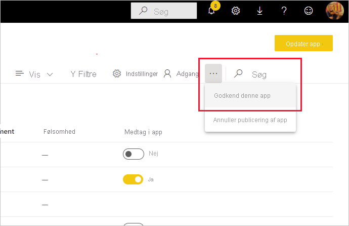

# Anbefal dit indhold

Power BI indeholder to metoder til at anbefale dit værdifulde indhold af høj kvalitet for at øge synligheden af det: **fremhævning** og **certificering**.

* **Fremhævning**: Fremhævning er en metode til at fremhæve det indhold, du mener er værdifuldt og værd at bruge for andre. Det opfordrer til samarbejde og spredning af indhold i en organisation.

    Enhver ejer af indhold og et hvilket som helst medlem med skriverettigheder til det arbejdsområde, hvor indholdet er placeret, kan fremhæve indholdet, når de mener, at det er godt nok til deling.

* **Certificering**: Certificering betyder, at indholdet opfylder organisationens kvalitetsstandarder og kan anses for at være pålideligt, autoritativt og klar til brug i hele organisationen.

    Det er kun [godkendte validatorer (defineret af Power BI-administratoren)](../admin/service-admin-setup-certification.md), der kan certificere indhold. Ejere af indhold, der gerne vil have deres indhold certificeret, men som ikke er autoriseret til at certificere det selv, skal følge deres organisations retningslinjer for at få deres indhold certificeret.

Det er i øjeblikket muligt at anbefale
* Datasæt
* Dataflow (prøveversion)
* Rapporter (prøveversion)
* Apps (prøveversion)

Denne artikel indeholde en beskrivelse af, hvordan du [fremhæver indhold](#promote-content), hvordan du [certificerer indhold](#certify-content), hvis du er en autoriseret validator, og hvordan du [anmoder om certificering](#request-content-certification), hvis du ikke er.

Se [Anbefaling: Fremhævning og certificering af Power BI-indhold](service-endorsement-overview.md) for at få mere at vide om anbefalinger.

## Fremhæv indhold

Hvis du vil fremhæve indhold, skal du have skriverettigheder til det arbejdsområde, hvor det indhold, du vil fremhæve, er placeret.

>[!NOTE]
>For at illustrere det er dialogboksen for anbefalinger af datasæt vist nedenfor. Dialogboksene for de andre indholdstyper er næsten identiske med de samme indstillinger for alternativknapper. 

1. Gå til [indstillingerne](#how-to-get-to-content-settings) for det indhold, du vil fremhæve.

1. Udvid afsnittet med anbefalinger, og vælg **Fremhævet**. Hvis du fremhæver et datasæt, skal du angive en kort beskrivelse af datasættet.

    

1. Vælg **Anvend**.

## Certificer indhold

Det er et stort ansvar at certificere indhold, og det er kun autoriserede brugere, der kan certificere indhold. Andre brugere kan [anmode om certificering af indhold](#request-content-certification). Dette afsnit indeholder en beskrivelse af, hvordan indhold certificeres.

>[!NOTE]
>For at illustrere det er dialogboksen for anbefalinger af datasæt vist nedenfor. Dialogboksene for de andre indholdstyper er næsten identiske med de samme indstillinger for alternativknapper. 

1. Du skal have skriverettigheder til det arbejdsområde, hvor det indhold, du vil certificere, er placeret. Du kan anmode om disse rettigheder fra ejeren af indholdet eller fra alle med administratorrettigheder til arbejdsområdet.

1. Gennemgå indholdet omhyggeligt, og fastlæg, om det opfylder organisationens certificeringsstandarder.

1. Hvis du beslutter dig for at certificere indholdet, skal du gå til det arbejdsområde, hvor det er placeret, og derefter åbne [indstillingerne](#how-to-get-to-content-settings) for det indhold, du vil certificere.

1. Udvid afsnittet med anbefalinger, og vælg **Certificeret**. 

    

1. Vælg **Anvend**.

## Anmod om certificering af indhold

Hvis du gerne vil have dit indhold certificeret, men ikke er autoriseret til at gøre det, skal du følge nedenstående trin.

>[!NOTE]
>For at illustrere det er dialogboksen for anbefalinger af datasæt vist nedenfor. Dialogboksene for de andre indholdstyper er næsten identiske med de samme indstillinger for alternativknapper. 

1. Gå til det arbejdsområde, hvor det indhold, du vil have certificeret, er placeret, og åbn derefter [indstillingerne](#how-to-get-to-content-settings) for det pågældende indhold.

1. Udvid afsnittet med anbefalinger. Knappen **Certificeret** er nedtonet, da du ikke er autoriseret til at certificere indhold. Klik på linket om, hvordan du får dit indhold certificeret.

    
    
    >[!NOTE]
    >Hvis du har klikket på linket ovenfor, men blev dirigeret tilbage til denne note, betyder det, at din Power BI-administrator ikke har gjort nogen oplysninger tilgængelige. I dette tilfælde skal du kontakte Power BI-administratoren direkte.

## Sådan hentes indholdsindstillinger

Dialogboksen Anbefaling tilgås via indstillingerne for det indhold, du vil anbefale. Følg nedenstående vejledning for at få vist indstillingerne for hver indholdstype.

* **Datasæt**: I listevisning skal du holde markøren over det datasæt, du vil anbefale. Klik på **Flere indstillinger (...)** , og vælg derefter **Indstillinger** i den viste menu.
* **Dataflow** (prøveversion): I listevisning skal du holde markøren over det dataflow, du vil anbefale. Klik på **Flere indstillinger (...)** , og vælg derefter **Indstillinger** i den viste menu.

* **Rapporter** (prøveversion): I listevisning skal du holde markøren over den rapport, du vil anbefale. Klik på **Flere indstillinger (...)** , og vælg derefter **Indstillinger** i den viste menu. Alternativt kan du vælge **Filer > Indstillinger**, hvis rapporten er åben.

* **Apps** (prøveversion): Gå til apparbejdsområdet, klik på **Flere indstillinger (...)** på menulinjen, og vælg **Anbefal denne app**.

    

## Næste trin

* [Læs mere om anbefaling af indhold](service-endorsement-overview.md)
* [Aktivér indholdscertificering](../admin/service-admin-setup-certification.md) (Power BI-administratorer)
* Har du spørgsmål? [Prøv at spørge Power BI-community'et](https://community.powerbi.com/)
