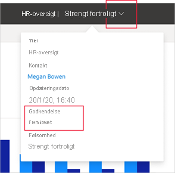

# Anbefaling – fremhævning og certificering af Power BI-indhold

## Oversigt over anbefaling

Organisationer har ofte store mængder Power BI-indhold tilgængeligt, som deres Power BI-brugere kan dele og genbruge, og det kan være svært at identificere pålideligt, autoritativt indhold. Anbefaling er en metode til at gøre det nemmere for brugerne at finde det indhold af høj kvalitet, de har brug for. Anbefalet indhold er tydeligt markeret både i Power BI og andre steder, hvor brugerne kigger efter Power BI-indhold (f.eks. Excel). Det prioriteres også i nogle søgninger, og du kan sortere efter det på nogle lister.

Der er to typer anbefalinger: **fremhævning** og **certificering**.

* **Fremhævning**: Fremhævning giver brugerne mulighed for at fremhæve indhold, som de mener er værdifuldt, værd at bruge og klar til brug for andre. Det opfordrer til samarbejdsmæssig spredning af indhold i en organisation.

    Enhver ejer af indhold eller et hvilket som helst medlem med skriverettigheder til det arbejdsområde, hvor indholdet er placeret, kan blot fremhæve indholdet, når de mener, at det er godt nok til deling.

    [Få mere at vide om, hvordan du fremhæver dit indhold](service-endorse-content.md#promote-content).

* **Certificering**: Certificering betyder, at indholdet opfylder organisationens kvalitetsstandarder og kan anses for at være pålideligt, autoritativt indhold, der er klar til brug i hele organisationen.

    Det er kun en [udvalgt gruppe validatorer (defineret af Power BI-administratoren)](../admin/service-admin-setup-certification.md), der er autoriseret til at certificere indhold. Ejere af indhold, der gerne vil have deres indhold certificeret, men som ikke er autoriseret til at certificere det selv, skal følge deres organisations retningslinjer for at få deres indhold certificeret.

    Få mere at vide om, hvordan du [certificerer indhold](service-endorse-content.md#certify-content) eller [anmoder om certificering](service-endorse-content.md#request-content-certification).

    **Certificering er kun tilgængelig, hvis en Power BI-administrator har [aktiveret og konfigureret](../admin/service-admin-setup-certification.md) det for din organisation**.

Nedenstående billede viser, hvordan anbefalet indhold (fremhævet og certificeret) er tydeligt markeret, når du søger efter et datasæt at basere en rapport på.

## Indholdstyper, der kan anbefales
Power BI understøtter i øjeblikket anbefalinger af:
* Datasæt
* Dataflow (prøveversion)
* Rapporter (prøveversion)
* Apps (prøveversion)

## Identificering af anbefalet indhold

Anbefalet indhold er markeret med badges og ikoner på lister, kort og andre steder både i Power BI og steder såsom Excel, hvor det er muligt at finde Power BI-indhold. Følgende badges og ikoner identificerer anbefalet indhold.

|Badge|Ikon|
|---------|---------|
|||
|||
|||

Du kan desuden se anbefalingsstatussen via overskriften, hvis du er i en rapport eller en app.
* Certificering er angivet både i overskriften og på rullelisten i overskriften, hvor du også kan se, hvem der udførte certificeringen.

    

* Fremhævning er kun angivet på rullelisten i overskriften.
 
    

## Beslutning om at anbefale en app eller en rapport

Anbefaling er beregnet til at blive brugt til de indholdselementer (apps, rapporter, datasæt og dataflow), som du gerne vil have, at folk skal finde, bruge og evt. dele igen.

Når du deler data med en bred målgruppe, er en bedste praksis i Power BI at dele disse data via en app. Hvis du følger denne bedste praksis, ønsker du, at folk nemt kan finde denne app. I så fald bør du anbefale appen. 

Men hvis du stadig finder det nyttigt at dele rapporter direkte, bør du anbefale selve rapporten. 

Uanset om du deler en rapport eller en app, er det en god idé også at anbefale datasættene, hvis de underliggende datasæt er rene og klar til at blive delt. Det samme gælder for dataflow.  

## Næste trin

* [Fremhæv eller certificer Power BI-indhold](service-endorse-content.md)
* [Aktivér certificering for din organisation](../admin/service-admin-setup-certification.md) (Power BI-administratorer)
* Har du spørgsmål? [Prøv at spørge Power BI-community'et](https://community.powerbi.com/)