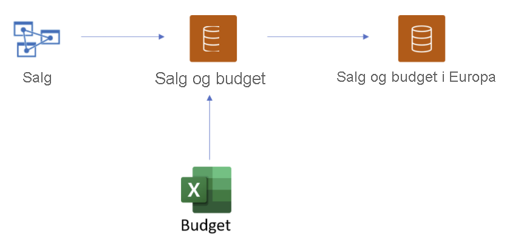
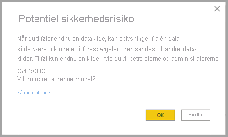
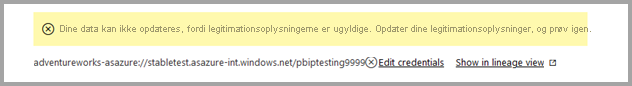
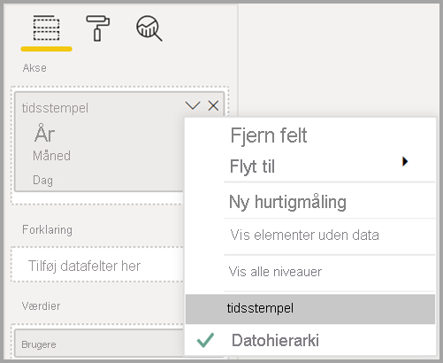

# Brug af DirectQuery til Power BI-datasæt og Azure Analysis Services (prøveversion)

Med **DirectQuery til Power BI-datasæt og Azure Analysis Services (AAS)** kan du bruge DirectQuery til at oprette forbindelse til AAS- eller Power BI-datasæt, og hvis du vil, kan du kombinere det med andre DirectQuery-data og importerede data. Rapportforfattere, der gerne vil kombinere dataene fra deres semantiske virksomhedsmodel med andre data, de ejer, f.eks. et Excel-regneark, eller som gerne vil tilpasse eller forbedre metadataene fra deres semantiske virksomhedsmodel, vil især synes, at denne funktion er nyttig.

## Aktiver prøveversionsfunktionen

Da funktionaliteten i øjeblikket er en prøveversion, skal du først aktivere den. Det gør du ved at gå til **Filer > Indstillinger > Indstillinger** i Power BI Desktop og under afsnittet **Prøveversionsfunktioner** markere afkrydsningsfeltet **DirectQuery til Power BI-datasæt og Analysis Services** for at aktivere denne prøveversionsfunktion. Du skal måske genstarte Power BI Desktop, før ændringen træder i kraft.

## Brug af DirectQuery til direkte forbindelser

Brug af DirectQuery til Power BI-datasæt og Azure Analysis Services kræver, at din rapport har en lokal model. Du kan starte fra en direkte forbindelse og tilføje eller opgradere til en lokal model, eller du kan starte med en DirectQuery-forbindelse eller importerede data, som automatisk opretter en lokal model i din rapport.

Hvis du vil se, hvilke forbindelser der bruges i din model, skal du kontrollere statuslinjen i nederste højre hjørne af Power BI Desktop. Hvis du kun har oprettet forbindelse til en Azure Analysis Services-kilde, får du vist en meddelelse, som ligner følgende billede:

Hvis du har forbindelse til et Power BI-datasæt, kan du se en meddelelse, der fortæller dig, hvilket Power BI-datasæt du har forbindelse til:

Hvis du vil tilpasse metadataene for felter i dit direkte forbundne datasæt, skal du vælge **Foretag ændringer af denne model** på statuslinjen. Alternativt kan du klikke på knappen **Foretag ændringer af denne model** på båndet, som vist på følgende billede. I **Rapportvisning**: knappen **Foretag ændringer af denne model** under fanen **Udformning**. I Modelvisning findes knappen under fanen **Hjem**.

Når du klikker på knappen, vises en dialogboks, der bekræfter tilføjelsen af en lokal model. Vælg **Tilføj en lokal model** for at aktivere oprettelse af nye kolonner eller ændring af metadataene for felter fra Power BI-datasæt eller Azure Analysis Services. På følgende billede vises den dialogboks, der kommer frem. 

Når du har oprettet en direkte forbindelse til en Analysis Services-kilde, er der ingen lokal model. Hvis du vil bruge DirectQuery til direkte forbundne kilder, f.eks Power BI-datasæt og Azure Analysis Services, skal du føje en lokal model til din rapport. Når du publicerer en rapport med en lokal model til Power BI-tjenesten, publiceres der også et datasæt for denne lokale model.

## Sammenkædning

Datasæt og de datasæt og modeller, de er baseret på, danner en *kæde*. Denne proces, der kaldes **sammenkædning**, giver dig mulighed for at publicere en rapport og et datasæt, der er baseret på andre Power BI-datasæt. En funktion, som tidligere ikke var mulig.

Forestil dig for eksempel, at dine kollegaer publicerer et Power BI-datasæt kaldet *Salg og budget*, der er baseret på en Azure Analysis Services-model kaldet *Salg*, og at de kombinerer det med et Excel-ark kaldet *Budget*.

Når du publicerer en ny rapport (og et datasæt) kaldet *Salg og budget for Europa*, der er baseret på Power BI-datasættet *Salg og budget*, som din kollega har publiceret, og du foretager yderligere ændringer eller udvidelser, mens du gør det, føjer du reelt set en rapport og et datasæt til en kæde bestående af tre led, som startede med Azure Analysis Services-modellen *Salg* og slutter med dit Power BI-datasæt *Salg og budget for Europa*. På følgende billede er denne sammenkædningsproces visualiseret.

Kæden på det forrige billede består af tre led, hvilket er den maksimale længde i denne prøveperiode. Det er ikke muligt at forlænge en kæde ud over tre led, og det medfører fejl.

## Sikkerhedsadvarsel

Hvis du bruger funktionen **DirectQuery til Power BI-datasæt og Azure Analysis Services (AAS)** , får du vist en dialogboks med en sikkerhedsadvarsel, som vist på følgende billede.

Data kan overføres fra én datakilde til en anden via push, hvilket er den samme sikkerhedsadvarsel som for at kombinere DirectQuery-kilder og importerede kilder i en datamodel. Hvis du vil vide mere om denne funktionsmåde, skal du se [Brug af sammensatte modeller i Power BI Desktop](../transform-model/desktop-composite-models.md).

## Funktioner og scenarier, du kan prøve

Følgende liste indeholder forslag til, hvordan du selv kan udforske **DirectQuery til Power BI-datasæt og Azure Analysis Services (AAS)** :

- Oprettelse af forbindelse til data fra forskellige kilder: Import (f.eks. filer), Power BI-datasæt, Azure Analysis Services
- Oprettelse af relationer mellem forskellige datakilder
- Skrivning af målinger, der bruger felter fra forskellige datakilder
- Oprettelse af nye kolonner til tabeller fra Power BI-datasæt for Azure Analysis Services
- Oprettelse af visualiseringer, der bruger kolonner fra forskellige datakilder

## Overvejelser og begrænsninger

Der er nogle få **overvejelser**, man skal gøre, når man bruger **DirectQuery til Power BI-datasæt og Azure Analysis Services (AAS)** :

- Hvis du opdaterer dine datakilder, og der er fejl med modstridende felt- eller tabelnavne, løser Power BI fejlene for dig.

- Hvis du vil oprette rapporter i Power BI-tjenesten i en sammensat model, der er baseret på et andet datasæt, skal alle legitimationsoplysninger være angivet. På siden med indstillinger til opdatering af legitimationsoplysninger vises følgende fejl for Azure Analysis Services-kilder, selvom legitimationsoplysningerne er angivet:
    
    
- Da det er forvirrende og forkert, er det noget, vi snart tager os af.

- Der anvendes regler for sikkerhed på rækkeniveau på den kilde, som de er defineret for, men de anvendes ikke på andre datasæt i modellen. Sikkerhed på rækkeniveau, der er defineret i rapporten, anvendes ikke på eksterne kilder, og sikkerhed på rækkeniveau, der er angivet på eksterne kilder, anvendes ikke på andre datakilder.

- Visningsmapper, KPI'er, datotabeller, sikkerhed på rækkeniveau og oversættelser importeres ikke fra kilden i denne prøveversion. Du kan stadig oprette visningsmapper i den lokale model.

- Du oplever måske en uventet funktionsmåde, når du bruger et datohierarki. Du løser dette problem ved at bruge en datokolonne i stedet. Når du har føjet et datohierarki til en visualisering, kan du skifte til en datokolonne ved at klikke på pil ned i feltnavnet og derefter klikke på navnet på feltet i stedet for at bruge *datohierarki*:

    

    Du kan finde flere oplysninger om brug af datokolonner i forhold til datohierarkier i denne artikel.

- Du kan måske se unyttige fejlmeddelelser, når du bruger funktioner med kunstig intelligens i en model, der har en DirectQuery-forbindelse til Azure Analysis Services. 

- Brug af ALLSELECTED med en DirectQuery-kilde resulterer i et ufuldstændigt resultat.

- Filtre og relationer:
    - Et filter, der anvendes fra en datakilde på en tabel fra en anden DirectQuery-kilde, kan kun angives for en enkelt kolonne

    - Det anbefales ikke at bruge krydsfiltrering af to tabeller i en DirectQuery-kilde ved at filtrere dem med en tabel uden for kilden, og det understøttes ikke.

    - Et filter kan kun berøre en tabel én gang. Anvendelse af det samme filter på en tabel to gange via en eller flere tabeller uden for DirectQuery-kilden understøttes ikke.

- I prøveperioden kan en kæde af modeller maksimalt bestå af tre led. Det er ikke muligt at forlænge kæden ud over tre led, og det medfører fejl. 

- Ved hjælp af værktøjer fra tredjepart kan der angives et flag for at *fraråde sammenkædning* på en model, hvilket forhindrer, at der oprettes en kæde, eller at den forlænges. Hvis du vil angive det, skal du kigger efter egenskaben *DiscourageCompositeModels* i en model. 

Der er også nogle få **begrænsninger**, du skal være opmærksom på:

- Parametre for database- og servernavne er deaktiveret i øjeblikket. 

- Definition af sikkerhed på rækkeniveau på tabeller fra en ekstern kilde understøttes ikke.

- Brug af SQL Server Analysis Services (SSAS) som en DirectQuery-kilde understøttes ikke i øjeblikket. 

- Brug af DirectQuery på datasæt fra "Mit arbejdsområde" understøttes ikke i øjeblikket. 

- Sletning af forbindelser til eksterne kilder, der bruger DirectQuery, understøttes ikke i øjeblikket.

- Brug af Power BI Embedded med datasæt, der indeholder en DirectQuery-forbindelse til et Power BI-datasæt eller en Azure Analysis Services model, understøttes ikke i øjeblikket.

- Formatering af strenge på kolonner og målinger fra en ekstern kilde importeres ikke til den sammensatte model.

- Beregningsgrupper på eksterne kilder understøttes ikke med udefinerede forespørgselsresultater.

- Nogle forespørgsler kan returnere forkerte resultater, når der er en relation mellem beregnede tabeller og tabeller i en ekstern kilde. Oprettelse af beregnede tabeller via et eksternt datasæt understøttes ikke, selvom det ikke er blokeret i grænsefladen i øjeblikket.

- Sortér efter kolonne understøttes ikke i øjeblikket.

- Automatisk sideopdatering understøttes kun i nogle scenarier, afhængigt af typen af datakilde. Se artiklen [Automatisk sideopdatering i Power BI](../create-reports/desktop-automatic-page-refresh.md) for at få flere oplysninger.

## Næste trin

Du kan finde flere oplysninger om DirectQuery i følgende ressourcer:

- [Brug DirectQuery i Power BI Desktop](desktop-use-directquery.md)
- [DirectQuery-modeller i Power BI Desktop](desktop-directquery-about.md)
- [Vejledning til DirectQuery-model i Power BI Desktop](../guidance/directquery-model-guidance.md)
- Har du spørgsmål? [Prøv at spørge Power BI-community'et](https://community.powerbi.com/)
