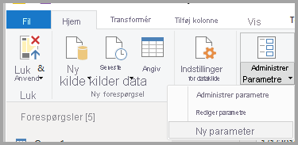
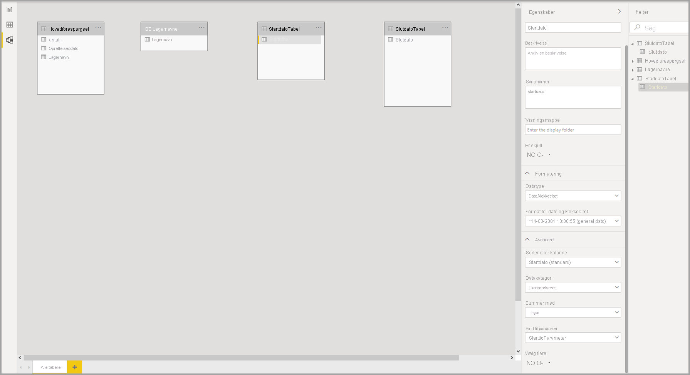
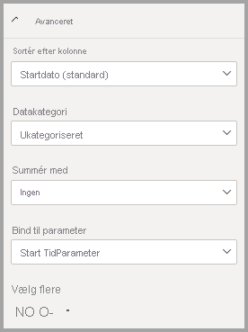
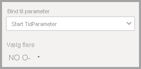
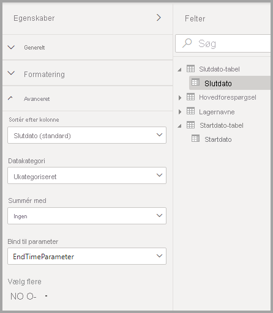

# <a name="dynamic-m-query-parameters-in-power-bi-desktop-preview"></a>Dynamiske M-forespørgselsparametre i Power BI Desktop (prøveversion)

Med **dynamiske M-forespørgselsparametre** kan modelforfattere give **læsere af rapporten** mulighed for at bruge filtre eller udsnit til at angive en eller flere værdier for en [M-forespørgselsparameter](/power-query/power-query-query-parameters), hvilket især kan være nyttigt til optimering af forespørgslers ydeevne. Med dynamiske M-forespørgselsparametre har modelforfatterne yderligere kontrol over, hvordan valgte filtre bliver indbygget i DirectQuery-kildeforespørgsler. 

Når modeludviklere forstår den forventede semantik for deres filtre, vil de ofte vide, hvordan de skal skrive effektive forespørgsler i forhold til deres datakilde, og dermed sikres det, at valgte filtre er indbygget i kildeforespørgsler på det rette tidspunkt for at give de tilsigtede resultater med forbedret ydeevne.

## <a name="enabling-dynamic-m-query-parameters"></a>Aktivering af dynamiske M-forespørgselsparametre

**Dynamiske M-forespørgselsparametre** er i øjeblikket tilgængelige som prøveversion og skal aktiveres, før de kan bruges. Vælg **Filer > Indstillinger > Indstillinger** , og vælg derefter **Prøveversionsfunktioner** i ruden til venstre. Her skal du kontrollere, at afkrydsningsfeltet **Dynamiske M-forespørgselsparametre** er markeret. Du skal genstarte Power BI Desktop, før ændringen træder i kraft.


Som en forudsætning for denne funktion skal du have oprettet en gyldig [M-forespørgselsparameter](/power-query/power-query-query-parameters), der skal refereres til i en eller flere direkte forespørgselstabeller. 

> [!NOTE]
> Husk at se afsnittet [Overvejelser og begrænsninger](#considerations-and-limitations) i denne artikel, da det ikke er alle DirectQuery-kilder, der understøttes med denne funktion.

Lad os gennemgå et eksempel på dynamisk overførsel af en **enkelt værdi** til en parameter:

1. I Power BI Desktop skal du starte **Power Query** under fanen **Data** og vælge **Nye parametre** under knappen **Administrer parametre** på båndet.

    

2. Udfyld derefter følgende oplysninger om parameteren.

    

3. Klik på **Ny** igen, hvis du vil tilføje flere parametre.

    

4. Når du har oprettet parametrene, kan du referere til dem i M-forespørgslen. Hvis du vil ændre M-forespørgslen, skal du åbne den avancerede editor, mens den forespørgsel, du vil redigere, er markeret:

    

5. Derefter skal du referere til parametrene i M-forespørgslen, der er fremhævet med gult på følgende billede. 

    

6. Nu, hvor du har oprettet parametrene og refereret til dem i M-forespørgslen, skal du oprette en tabel med en kolonne, der indeholder de mulige værdier, som er tilgængelige for denne parameter. Det gør det muligt at angive parametrene dynamisk baseret på det valgte filter. I dette eksempel ønsker vi, at parametrene *StartTime* og *EndTime* skal være dynamiske. Da disse parametre kræver en parameter af typen Dato/klokkeslæt, vil jeg generere datoinput, der kan bruges til at angive datoen for parameteren. Først opretter vi en ny tabel:

    

7. Her er den første tabel, jeg har oprettet for værdierne for parameteren *StartTime* :

    ```StartDateTable = CALENDAR (DATE(2016,1,1), DATE(2016,12,31))```

    

8. Her er den anden tabel, jeg har oprettet for værdierne for parameteren EndTime:

    ```EndDateTable = CALENDAR (DATE(2016,1,1), DATE(2016,12,31))```

    

    > [!NOTE]
    > Vi anbefaler, at du bruger et andet kolonnenavn, der ikke findes i en faktisk tabel. Hvis de har samme navn, anvendes den valgte værdi som et filter på den faktiske forespørgsel.

9. Nu, hvor tabellerne med feltet *Dato* er oprettet, kan vi binde de enkelte felter til en parameter. Når vi binder feltet til en parameter, betyder det grundlæggende, at den valgte værdi for feltet ændres, værdien overføres til parameteren, og forespørgslen opdateres, hvor der refereres til parameteren. Så hvis feltet skal bindes, skal du gå til fanen **Modellering** , vælge det netop oprettede felt og derefter gå til de **avancerede** egenskaber:

    > [!NOTE]
    > Kolonnens datatype skal stemme overens med M-parametertypen.

    

10. Vælg rullelisten under **Bind til parameter** , og vælg den parameter, du vil binde til feltet:

    

    Da dette eksempel bruger en enkelt værdi (hvor parameteren er indstillet til en enkelt værdi), skal du lade **Flere valg** være angivet til **Nej** , som er standard:

    

    Hvis dine use cases kræver flere valg (overførsel af flere værdier til en enkelt parameter), skal du skifte parameteren til **Ja** og sikre, at M-forespørgslen er konfigureret korrekt til at acceptere flere værdier i M-forespørgslen. Her er et eksempel på *RepoNameParameter* , som tillader flere værdier:

    

11. Du kan gentage disse trin, hvis du har andre felter, der skal bindes til andre parametre:

    

12. Til sidst kan du referere til dette felt i et udsnit eller som et filter:

    

Hvis den tilknyttede kolonne er indstillet til **Nej** for flere markeringer, skal du enten bruge tilstanden for en enkelt værdi i udsnittet eller kræve en enkelt værdi på filterkortet.

## <a name="potential-security-risk"></a>Potentiel sikkerhedsrisiko

Når du giver rapportlæsere mulighed for dynamisk at angive værdierne for M-forespørgselsparametrene, kan de muligvis få adgang til yderligere data eller udløse ændringer af kildesystemet ved hjælp af **indskydningsangreb** , afhængigt af hvordan der refereres til parametrene i M-forespørgslen, og hvilke værdier der overføres til den pågældende parameter.

Lad os f.eks. sige, at du har en Kusto-forespørgsel med parametre, der er oprettet på følgende måde:

```
Products
| where Category == [Parameter inserted here] & HasReleased == 'True'
 | project ReleaseDate, Name, Category, Region```
```

Du har muligvis ikke problemer med en venligsindet bruger, der overfører en passende værdi for parameteren, f.eks. *Spil* :

```
| where Category == 'Games' & HasReleased == 'True'
```

Men en hacker kan muligvis overføre en værdi, der ændrer forespørgslen, for at få adgang til flere data, f.eks. *'Spil'//* :

```
Products
| where Category == 'Games'// & HasReleased == 'True'
| project ReleaseDate, Name, Category, Region
```

I dette eksempel kan hackeren få adgang til oplysninger om spil, der endnu ikke er blevet frigivet, ved at ændre en del af forespørgslen til en kommentar.

**Sådan afhjælper du risikoen**

For at afhjælpe sikkerhedsrisikoen anbefales det, at du undgår strengsammenkædning af M-parameterværdier i forespørgslen.  Du skal i stedet bruge disse parameterværdier i M-handlinger, der kan foldes til kildeforespørgslen, så M-programmet og connectoren opretter den endelige forespørgsel. Hvis det er muligt, kan du bruge en mekanisme til overførsel af en parameter, der er indbygget i kildeforespørgselssproget og connectorerne. [Azure Data Explorer](/azure/data-explorer/kusto/query/queryparametersstatement?pivots=azuredataexplorer) har f.eks. indbygget funktionalitet til forespørgselsparametre, der er designet til at beskytte mod indskydningsangreb.

Her er nogle eksempler:

* Eksempel på brug af filtreringshandlinger til M-forespørgsler:
    ```
    Table.SelectRows(Source, (r) =\&gt; r[Columns] = Parameter)
    ```

* Eksempel, hvor parameteren erklæres i kildeforespørgslen (eller hvor parameterværdien sendes som input til en kildeforespørgselsfunktion):
    ```
    declare query\_parameters (Name of Parameter : Type of Parameter);
    ```

## <a name="considerations-and-limitations"></a>Overvejelser og begrænsninger

Der er visse overvejelser og begrænsninger i forbindelse med brugen af dynamiske M-forespørgselsparametre:

* En enkelt parameter kan ikke bindes til flere felter eller omvendt.
* Funktionen understøttes kun for M-baserede datakilder. Følgende DirectQuery-kilder understøttes ikke:
    * T-SQL-baserede datakilder: SQL Server, Azure SQL Database, Synapse SQL-grupper (også kaldet Azure SQL Data Warehouse) og Synapse SQL OnDemand-grupper
    * Live Connect-datakilder: Azure Analysis Services, SQL Server Analysis Services, Power BI-datasæt
    * Andre ikke-understøttede datakilder: Oracle, Teradata og relationel SAP Hana
    * Understøttes delvist via programmering af XMLA/TOM-slutpunkt: SAP BW og SAP Hana 


* Ikke-understøttede standardparametertyper er følgende:
  * En hvilken som helst
  * Varighed
  * Sand/falsk
  * Binær

* Ikke-understøttede filtre:
  * Udsnit eller filter for relativ tid
  * Relativ dato
  * Hierarkiudsnit
  * Filter med flere felter
  * Filter for udeladelse/Ikke filtre
  * Tværgående fremhævning
  * Detailudledningsfilter
  * Tværudledningsfilter
  * Top N-filter
* Ikke-understøttede handlinger:
  * Og
  * Indeholder
  * Mindre end
  * Større end
  * Starter med
  * Starter ikke med
  * Er ikke
  * Indeholder ikke
  * Markér alle
  * Er tom
  * Er ikke tom


## <a name="next-steps"></a>Næste trin

Du kan gøre mange forskellige ting med Power BI Desktop. Du kan finde flere oplysninger om funktionerne i følgende ressourcer:

* [Om brug af DirectQuery i Power BI](desktop-directquery-about.md)
* [Hvad er Power BI Desktop?](../fundamentals/desktop-what-is-desktop.md)
* [Oversigt over forespørgsler i Power BI Desktop](../transform-model/desktop-query-overview.md)
* [Datatyper i Power BI Desktop](desktop-data-types.md)
* [Udform og kombiner data med Power BI Desktop](desktop-shape-and-combine-data.md)
* [Almindelige forespørgselsopgaver i Power BI Desktop](../transform-model/desktop-common-query-tasks.md)