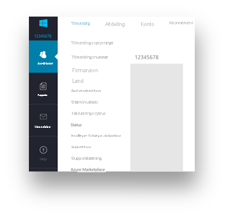
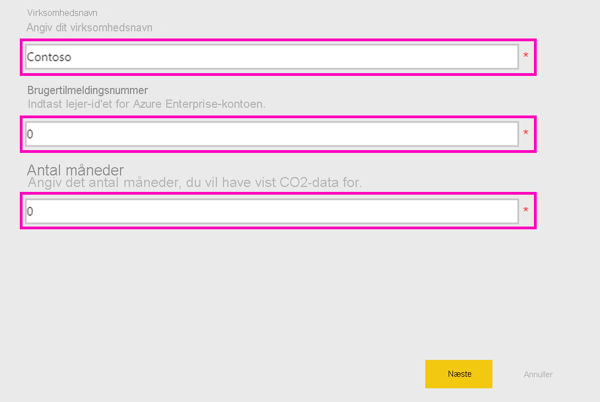
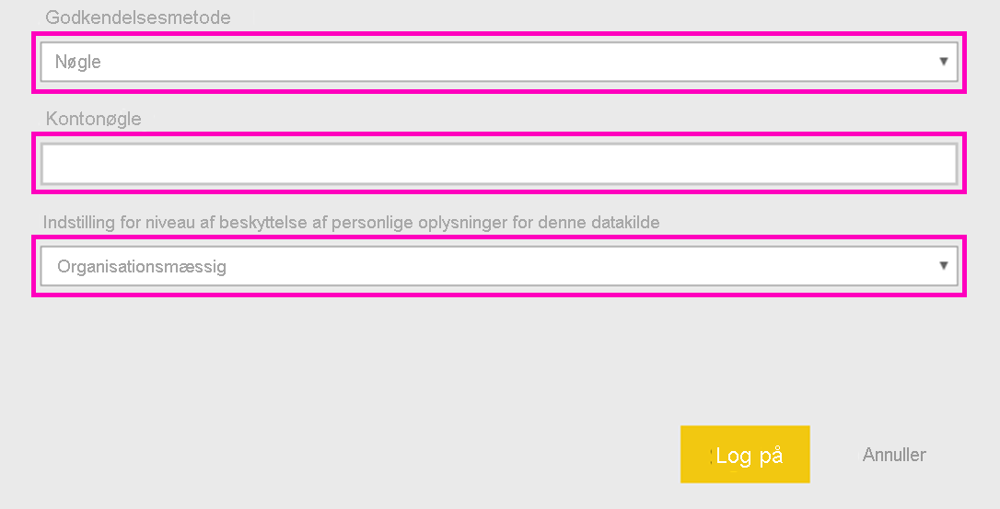
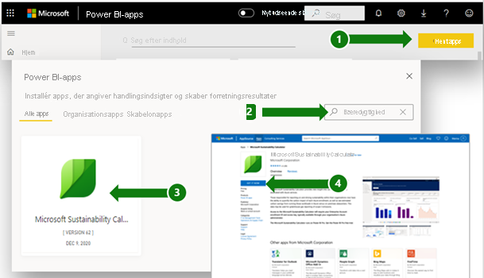
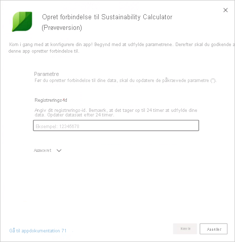
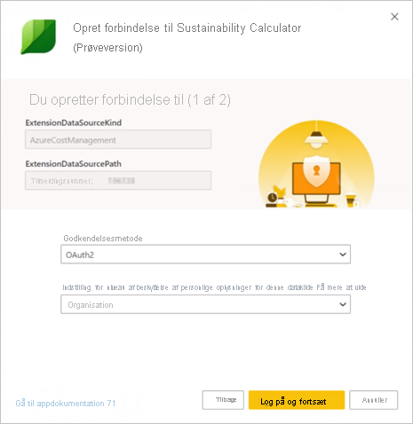
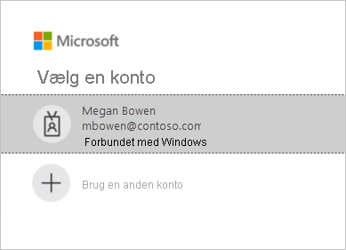

# Supportside til Microsoft Sustainability Calculator

Microsoft Sustainability Calculator giver ny indsigt i de data om kulstofemissioner, der er knyttet til Azure-tjenester. Personer, der er ansvarlige for at rapportere om og sikre bæredygtighed i deres organisationer, kan nu anslå kulstofpåvirkningen af hvert Azure-abonnement og se de anslåede kulstofbesparelser i forbindelse med at køre disse arbejdsbelastninger i Azure i forhold til datacentre i det lokale miljø. Disse data kan bruges til rapportering af drivhusgasser i forbindelse med anvendelsesområde 3-emissioner.

> [!NOTE]
> Denne version af connectoren understøtter kun tilmeldinger fra [Azure Enterprise-portalen](https://ea.azure.com). Tilmeldinger i Kina understøttes ikke i øjeblikket.

## Forudsætninger

Hvis du vil have adgang til Microsoft Sustainability Calculator, skal du bruge følgende oplysninger fra organisationens Azure-administrator:

- Lejer-id
- Adgangsnøgle
- Tilmeldingsnummer

Sådan finder du virksomhedens tilmeldingsnummer:

1. Log på [Azure Enterprise-portalen](https://ea.azure.com) som administrator.
2. Vælg **Active Directory** eller **Administrer** på navigationslinjen til venstre. Din virksomheds tilmeldingsnummer vil blive vist.

   

Sådan finder du din virksomheds adgangsnøgle:

1. Log på [Azure Enterprise-portalen](https://ea.azure.com) som administrator.
2. Vælg **Rapporter**, og vælg derefter **API-adgangsnøgle** for at hente den primære nøgle til kontotilmelding.

## Version af Sustainability Calculator fra januar 2020

### Sådan opretter du forbindelse

[!INCLUDE [powerbi-service-apps-get-more-apps](../includes/powerbi-service-apps-get-more-apps.md)]

3. Vælg **Microsoft Sustainability Calculator**, og vælg derefter **Hent nu**.

4. Vælg **Installér** under **Installér denne Power BI-app?** .

5. Vælg feltet **Microsoft Sustainability Calculator** i ruden **Apps**.

6. Under **Kom i gang med din nye app** skal du vælge **Opret forbindelse**.

   

7. Angiv **Virksomhedsnavn**, **Brugertilmeldingsnummer** og **Antal måneder**. Du kan finde oplysninger om, hvordan du får dit tilmeldingsnummer, under [Forudsætninger](#prerequisites). Vælg **Næste**.

   

8. Angiv følgende oplysninger:

   | Felt | Værdi |
   | --- | --- |
   | **Godkendelsesmetode** | Vælg **Nøgle**. |
   | **Kontonøgle** | Angiv din adgangsnøgle. |
   | **Indstilling for niveau for beskyttelse af personlige oplysninger for denne datakilde** | Vælg **Organisatorisk**. |

   

9. Vælg **Log på**.

10. Importprocessen starter automatisk. Når processen er fuldført, vises et nyt dashboard samt en ny rapport og model i **navigationsruden**. Vælg rapporten for at få vist de importerede data.

### Brug af appen

Sådan opdaterer du parametrene:

1. Naviger til indstillingerne for **Datasæt**, og åbn de indstillinger, der er forbundet med apparbejdsområdet.
2. Opdater **Virksomhedsnavn**, **Brugertilmeldingsnummer** eller **Antal måneder** efter behov.
3. Vælg **Opdater** for at genindlæse dataene med de nye parametre anvendt.

## Version af Sustainability Calculator (prøveversion) fra december 2020

Beregn dine cloudbaserede kulstofemissioner i dag med Microsoft Sustainability Calculator.

Et nøjagtigt kulstofregnskab kræver gode oplysninger fra partnere, forhandlere og leverandører. Microsoft Sustainability Calculator giver dig gennemsigtighed i de kulstofemissioner, der genereres af din brug af Azure og Microsoft Dynamics.

Microsofts kulstofregnskab spænder over alle tre områder af emissioner med en metodologi, der er valideret af Stanford University i 2018. Det bruger et ensartet og nøjagtigt kulstofregnskab til at sætte tal på, hvilken indvirkning Microsoft-cloudtjenester har på kundernes miljøpåvirkning. Microsoft er den eneste cloududbyder, der leverer denne form for gennemsigtighed til kunder, mens de udarbejder rapporter til frivillige eller obligatoriske rapporteringskrav.

### Inden du starter

Microsoft Sustainability Calculator kører på Power BI Pro. Hvis du ikke har Power BI Pro, kan du [hente en gratis prøveversion nu](https://powerbi.microsoft.com/power-bi-pro).

Du skal bruge dit Azure-tilmeldingsnummer. Hvis du ikke har det, kan du bede din organisations Azure-administrator om hjælp. Du kan finde flere oplysninger under [Forudsætninger](#prerequisites).

### Oprettelse af forbindelse til beregneren: Fem enkle trin til at udarbejde et kulstofregnskab

1. Download appen fra [AppSource](https://go.microsoft.com/fwlink/?linkid=2151690).

   

   Du kan også søge efter appen i Power BI.

   

2. Åbn programmet.

3. Angiv dit tilmeldingsnummer. Vælg **Opret forbindelse til dine data**, og angiv derefter dit tilmeldingsnummer. Du kan finde flere oplysninger om, hvordan du får dit tilmeldingsnummer, under [Forudsætninger](#prerequisites).

   

4. Opret forbindelse til din konto:
   - I **Du opretter forbindelse til (1 af 2)** under **Godkendelsesmetode** skal du vælge **OAuth2**, og under **Niveau for beskyttelse af personlige oplysninger for denne datakilde** skal du vælge **Organisatorisk**.

      
 
   - Vælg brugerkontoen.

      
       
   - I **Du opretter forbindelse til (2 af 2)** under **Godkendelsesmetode** skal du vælge **Anonym**, og under **Niveau for beskyttelse af personlige oplysninger for denne datakilde** skal du vælge **Organisatorisk**.

     
    
5. Vent på, at visningen oprettes, hvilket kan tage op til 24 timer.

### Yderligere ressourcer

- [Sådan gør du-video](https://go.microsoft.com/fwlink/?linkid=2151608)
- [Kulstoffordelene ved cloudcomputing: Et studie af Microsoft Cloud i et partnerskab med WSP](https://download.microsoft.com/download/7/3/9/739BC4AD-A855-436E-961D-9C95EB51DAF9/Microsoft_Cloud_Carbon_Study_2018.pdf)

### Ofte stillede spørgsmål

#### Appkonfiguration

**Jeg får vist en fejl, når jeg forbinder mine data til beregneren. Hvad kan jeg gøre?**

Først skal du i Azure Cost Management tjekke, om du har administratorrettigheder. Hvis du ikke har det, skal du bede administratoren om denne adgang. Kontrollér derefter, at du bruger det korrekte tilmeldingsnummer.

**Jeg har angivet mit tilmeldingsnummer, men virksomhedsdataene indlæses ikke. Hvad er problemet?**

Det kan tage op til 24 timer for Sustainability Calculator (offentlig prøveversion) at indlæse dine data. Vend tilbage efter 24 timer, og vælg knappen **Opdater** i Power BI.

**Forsøger Microsoft at overdrage ansvaret for emissionerne fra Microsoft til mig?**

Nej. Kulstofemissioner fra Azure-tjenester rapporteres som Microsofts anvendelsesområde 1- og 2-emissioner, hvilket er i overensstemmelse med branchestandarden [GHG-protokollen (Greenhouse Gas)](https://ghgprotocol.org/). GHG-protokollen definerer anvendelsesområde 3-emissioner som emissioner, som andre enheder udleder på dine vegne, og som derfor reelt tælles to gange. Microsoft Sustainability Calculator giver ny gennemsigtighed i dine anvendelsesområde 3-emissioner, som er forbundet med brugen af Azure-tjenester og i særdeleshed Anvendelsesområde 3, kategori 1 "Købte varer og tjenester".

**Hvorfor er mine emissioner fra brugen af Microsoft-cloudmiljøet så meget lavere, end de ville være, hvis jeg brugte en løsning i det lokale miljø?**

Microsoft udførte [et studie, som blev udgivet i 2018,](https://blogs.microsoft.com/on-the-issues/2018/05/17/microsoft-cloud-delivers-when-it-comes-to-energy-efficiency-and-carbon-emission-reductions-study-finds/) hvor forskellen mellem Microsoft-cloudmiljøet og lokale miljøer eller traditionelle datacentre blev evalueret. Resultaterne viser, at Azure Compute og Storage er mellem 52-79 % mere energibesparende end traditionelle virksomhedsdatacentre, afhængigt af hvilket specifikke alternativ i det lokale miljø der sammenlignes med – lav, mellem eller høj effektivitet. Når vi tager højde for vores køb af vedvarende energi, er Azure mellem 79-98 % mere kulstofeffektivt. Disse besparelser skyldes fire nøglefunktioner i Microsoft Cloud: Effektivitet af it-drift, effektivitet af it-udstyr, effektivitet af datacenterinfrastruktur og vedvarende elektricitet.

**Hvis Microsofts drift er kulstofneutral og drives af vedvarende energi, hvorfor er kundernes emissioner fra Azure-tjenesterne så ikke nul?**

Der er to primære årsager til, at kundernes emissioner fra Microsoft ikke er nul. Den første er relateret til GHG-regnskabspraksis, og den anden er relateret til grænsen for denne analyse. For at opnå kulstofneutral drift bruger Microsoft kulstofkompensation til at reducere visse emissionskilder såsom brændstofforbrænding på stedet til backupgeneratorer, kølemidler og vognparker. Dette reducerer Microsofts *netto* emissioner til nul. Beregneren rapporterer GHG-*brutto* emissioner før anvendelsen af denne kompensation, selvom mængden af anvendt kompensation og nettoemissioner rapporteres under fanen **GHG-rapportering** med henblik på yderligere gennemsigtighed. Den anden årsag er, at emissionskompensationen omfatter den energi, der bruges af internetudbydere uden for Microsofts driftsgrænse til at overføre data mellem Microsoft-datacentre og Azure-kunder, foruden den energi og de emissioner, der er forbundet med driften af Microsofts datacentre.

**Hvordan bruger jeg disse data, og hvor rapporterer jeg dem?**

Dine emissioner kan rapporteres som en del af din virksomheds indirekte anvendelsesområde 3-kulstofemissioner. Anvendelsesområde 3-emissioner offentliggøres ofte i rapporter om bæredygtighed, CDP-klimaændringer og andre rapporteringskanaler. Foruden de samlede emissioner er emissionsbesparelserne et tydeligt eksempel på, hvordan din virksomheds beslutning om at bruge Microsoft Azure-tjenester bidrager til globale emissionsreduktioner. For at kontekstualisere dette indikerer appen det antal kilometer, et køretøj sparer, som svarer til reduktionen i GHG-emissionerne baseret på beregningsfaktorer for EPA's ækvivalens fra januar 2020.

**Hvad kan jeg gøre for at reducere emissionerne yderligere?**

Ressource- og omkostningseffektivitet i Azure kan reducere miljøpåvirkningen af din brug af Azure. Ubrugte virtuelle maskiner er f.eks. spild, uanset om de er i cloudmiljøet eller i det lokale miljø. Tilpasning af virtuelle maskiner til den rette størrelse for at forbedre faktorer til udnyttelse af beregning reducerer energiforbruget pr. nyttige output, ligesom det gør med fysiske servere. [Azure Cost Management](https://docs.microsoft.com/azure/cost-management-billing/costs/cost-mgt-best-practices) giver dig de værktøjer, du skal bruge til at planlægge, analysere og reducere dit forbrug for at maksimere din cloudinvestering.

#### Metodologi

**Hvad er metodologien bag værktøjet?**

Microsoft Sustainability Calculator afspejler de specifikke cloudtjenester, der forbruges, samt de tilknyttede energikrav, effektiviteten af de datacentre, der leverer disse tjenester, brændstofmiks til elektricitet i områder, hvor disse datacentre drives, og Microsofts køb af vedvarende energi. Som en del af appens udvikling har metodologien og dens implementering gennemgået tredjepartsbekræftelse for at sikre, at den stemmer overens med World Resources Institute (WRI)/World Business Council for Sustainable Development (WBCSD), Greenhouse Gas (GHG) og Protocol Corporate Accounting and Reporting Standard. Omfanget af bekræftelsen blev udført i henhold til ISO 14064-3: Drivhusgasser – Del 3: Specifikation med vejledning til validering og bekræftelse af påstande om drivhusgasser, inklusive estimeringen af emissioner fra Azure-tjenester, men eksklusive estimeringen af emissioner i det lokale miljø givet den kontrafaktiske karakter af dette estimat. En mere detaljeret beskrivelse af kulstofberegningen er dokumenteret under fanen **Beregningsmetodologi** i værktøjet.

**Hvilke data er påkrævet for at beregne Azure-kulstofkompensationen? Tilgår I min virksomheds data?**

De estimerede kulstofberegninger udføres på baggrund af forbruget af Azure-tjenester, der tilgås ved hjælp af Azure-forbrugsomsætning. Calculator tilgår ingen af dine gemte kundedata. Forbrugsdataene kombineres med Microsofts energi- og kulstofsporingsdata for at beregne de estimerede emissioner, der er knyttet til dit forbrug af Azure-tjenester på baggrund af de datacentre, der leverer disse tjenester.

**Omfatter denne beregning alle Azure-tjenester og alle Azure-områder?**

Estimaterne omfatter alle Azure-tjenester i alle Azure-områder, der er knyttet til det lejer-id, der angives under konfigurationen.

#### Karakterisering af emissionerne i det lokale miljø

**Hvor henter Microsoft Sustainability Calculator data om mine emissioner og drift i det lokale miljø?**

Microsoft Sustainability Calculator henter ingen oplysninger om dine datacentre i det lokale miljø med *undtagelse* af dem, du angiver. Som beskrevet i de efterfølgende Ofte stillede spørgsmål stoler Microsoft Sustainability Calculator på brancheresearch og brugerinput om effektiviteten og energimikset af alternativer i det lokale miljø for at udvikle et estimat af emissioner i det lokale miljø.

**Hvilke formodninger er der i forhold til estimeringer i det lokale miljø? Stammer effektivitetsbesparelserne kun fra forbedringer af effektiviteten i strømforbruget?**

Effektivitet, der er forbundet med Microsoft-cloudtjenester, omfatter meget mere end forbedret effektivitet i strømforbruget. Mens Microsoft-datacentrene bestræber sig på at optimere effektiviteten i strømforbruget, stammer de primære forbedringer af effektiviteten fra effektivisering af it-drift (dynamisk klargøring, multitenancy, serverudnyttelse) og effektivitet i it-udstyr (skræddersyning af hardware til tjenester sikrer, at mere energi bruges til nyttig output) foruden effektivitet i datacenterinfrastruktur (forbedringer af effektiviteten i strømforbruget). Vores [studie fra 2018 ](https://blogs.microsoft.com/on-the-issues/2018/05/17/microsoft-cloud-delivers-when-it-comes-to-energy-efficiency-and-carbon-emission-reductions-study-finds/) sætter tal på disse besparelser sammenlignet med en række alternativer i det lokale miljø, der spænder fra datacentre med lav effektivitet til høj effektivitet. Disse fund bruges til at estimere det energiforbrug, der kræves af et tilsvarende datacenter i det lokale miljø for at levere de samme tjenester, som hver kunde forbruger i Microsoft-cloudmiljøet.

**Hvad er det formodede energimiks for infrastrukturen i det lokale miljø?**

Microsoft Sustainability Calculator estimerer som standard emissionerne i det lokale miljø baseret på mikset af vedvarende energi og ikke-vedvarende energi på ledningsnettet. Det formodes, at datacenteret i det lokale miljø er placeret på det samme ledningsnet som Microsofts datacentre. Men for kunder, der køber vedvarende elektricitet *foruden* det, der er på ledningsnettet (f.eks. via energiforsyningsaftaler), kan brugerne vælge procentdelen af vedvarende elektricitet, så justerer Microsoft Sustainability Calculator emissionerne i det lokale miljø tilsvarende.

**Hvornår skal jeg vælge lav, mellem eller høj for effektiviteten af infrastrukturen i det lokale miljø?**

Brugerne bør vælge den effektivitet, der bedst repræsenterer den udrulning i det lokale miljø, som de gerne vil sammenligne med, baseret på følgende udstyr og datacenter:

- **Lav**: Fysiske servere og direkte tilknyttet lager i små lokaliserede datacentre (500-1.999 kvadratfod)
- **Mellem**: Mikset af fysiske/virtualiserede servere og tilknyttet/dedikeret lager på mellemniveauet af interne datacenter (2.000-19.999 kvadratfod)
- **Høj**: Virtualiserede servere og dedikeret lager i avancerede interne datacenter (>20.000 kvadratfod)
