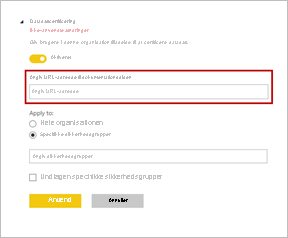

# Certificer datasæt – Power BI

Din organisation kan *certificere* datasæt, der er den autoritative kilde til vigtige oplysninger. Disse datasæt vises prominent, når designere af rapporten begynder at oprette en rapport og leder efter pålidelige data. Certificering kan være en yderst selektiv proces, hvor kun de mest værdifulde datasæt certificeres. Power BI-administratorer har en ny indstilling, så de nøje kan styre, hvem der kan certificere datasæt. Administratorer sikrer, at certificeringsprocessen resulterer i pålidelige og autoritative datasæt, der er udviklet til brug på tværs af organisationen.

Som ejer af et datasæt kan du anmode om certificering af et opprioriteret datasæt. En udvalgt gruppe af brugere, der er defineret under indstillingen **Certificering** for lejeren, beslutter, hvilke datasæt der skal certificeres. Navnet på den person, der har certificeret et datasæt, vises i et værktøjstip i søgningsoplevelsen for datasæt. Peg på mærkaten **Certificeret**, så kan du se det. Se [Konfigurer certificering af datasæt og dataflow](../admin/service-admin-setup-certification.md) for at få flere oplysninger.

Power BI indeholder to måder at *godkende* datasæt på. Ud over certificering er det *Opprioritering*. Som ejer af et datasæt kan du opprioritere dine datasæt, når de er klar til almindelig brug. Du kan finde flere oplysninger under [Fremhæv dit datasæt](service-datasets-promote.md). 

## Certificer et datasæt

Din Power BI-administrator kan angive en URL-adresse for linket **Få mere at vide** på siden med indstillingen **Godkendelse**.  De kan linke til dokumentation om certificeringsprocessen. Hvis de ikke angiver en destination for linket **Få mere at vide**, peger det som standard på denne artikel.

Det er naturligvis et stort ansvar at blive udnævnt til at være en, der kan certificere datasæt. Hvis en forfatter af et datasæt kontakter dig angående certificering af et datasæt, er det starten på din grundige gennemgang. Når du er overbevist om, at et datasæt er berettiget til certificering, kan du her se de sidste trin, du skal udføre.

1. Ejeren af datasættet skal give dig medlemstilladelser til det arbejdsområde, hvor datasættet er placeret.
1. Hvis din administrator har udnævnt dig til at være en, der kan certificere datasæt, er indstillingen **Certificeret** i afsnittet **Godkendelse** under **Indstillinger** for datasættet tilgængelig. Vælg **Certificeret**.
1. Vælg **Anvend**.

Læs mere om, hvordan administratorer [styrer brugen af datasæt på tværs af arbejdsområder](service-datasets-admin-across-workspaces.md).

## Næste trin

* [Konfigurer certificering af datasæt og dataflow](../admin/service-admin-setup-certification.md)
* [Brug af datasæt på tværs af arbejdsområder](service-datasets-across-workspaces.md)
* Har du spørgsmål? [Prøv at spørge Power BI-community'et](https://community.powerbi.com/)
