# Opret en skabelonapp i Power BI

Med Power BI-*skabelonappsene* kan Power BI-partnere udarbejde programmer i Power BI med kun lidt eller ingen kode og udrulle dem til Power BI-kunder.  Denne artikel indeholder en trinvis vejledning i oprettelse af en Power BI-skabelonapp.

Hvis du kan oprette Power BI-rapporter og -dashboards, kan du blive *udvikler af skabelonapps* og udarbejde og pakke analytisk indhold i en *app*. Du kan udrulle dit program til andre Power BI-lejere via alle tilgængelige platforme, f.eks. AppSource, eller ved at bruge den i din egen webtjeneste. Som udvikler kan du oprette en beskyttet analysepakke, som du kan distribuere.

Administratorer af Power BI-lejere styrer, hvem der kan oprette skabelonprogrammer i organisationen, og hvem der kan installere dem. Godkendte brugere kan installere dit skabelonprogram og derefter redigere det og distribuere det til Power BI-brugerne i deres organisation.

## Forudsætninger

Her er kravene til at udarbejde et skabelonprogram:  

- En [Power BI Pro-licens](../fundamentals/service-self-service-signup-for-power-bi.md)
- En [installation af Power BI Desktop](../fundamentals/desktop-get-the-desktop.md) (valgfrit)
- Kendskab til de [grundlæggende begreber i Power BI](../fundamentals/service-basic-concepts.md)
- Tilladelser til at dele en skabelonapp (du kan finde flere oplysninger i Power BI-[administrationsportalen, Skabelonappens indstillinger](../admin/service-admin-portal.md#template-apps-settings)

## Opret skabelonen for arbejdsområdet

Hvis du vil oprette et skabelonprogram, som du kan distribuere til andre Power BI-lejere, skal du oprette det i et af de nye arbejdsområder.

1. Vælg **Arbejdsområder** > **Opret et arbejdsområde** i Power BI-tjenesten.

    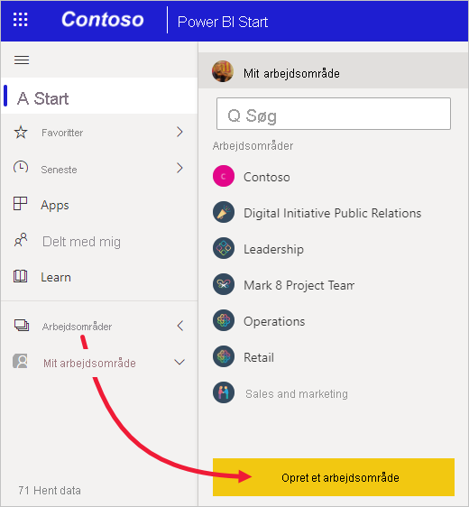

2. Angiv et navn, en beskrivelse (valgfrit) og et logobillede (valgfrit) for dit arbejdsområde i **Opret et arbejdsområde**.

    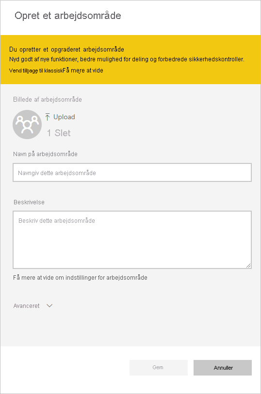

4. Udvid afsnittet **Avanceret**, og vælg **Udvikl en skabelonapp**.

    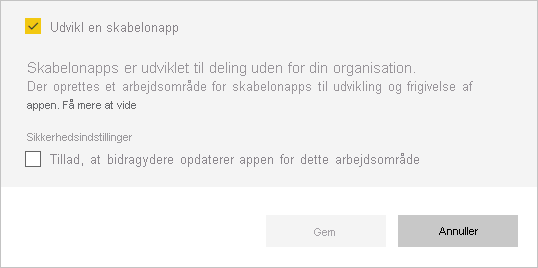

5. Vælg **Gem**.
>[!NOTE]
>Du skal have tilladelse fra din Power BI-administrator til at hæve skabelonprogrammer.

## Føj indhold til arbejdsområdet for skabelonapps

Som med et almindeligt Power BI-arbejdsområde er dit næste skridt at føje indhold til arbejdsområdet.  

- [Opret dit Power BI-indhold](index.yml) i dit arbejdsområde.

Hvis du bruger parametre i Power Query, skal du kontrollere, at de har veldefinerede typer (f.eks. Text). Typerne Any og Binary understøttes ikke.

[Tip til udarbejdelse af skabelonprogrammer i Power BI](service-template-apps-tips.md) indeholder forslag, der er værd at overveje, når du opretter rapporter og dashboards til dit skabelonprogram.

## Definer egenskaberne for skabelonappen

Nu, hvor du har indhold i dit arbejdsområde, er du klar til at pakke det i et skabelonprogram. Det første trin er at oprette et testskabelonprogram, som kun er tilgængeligt i din organisation på din lejer.

1. Vælg **Opret program** i arbejdsområdet for skabelonprogrammet.

    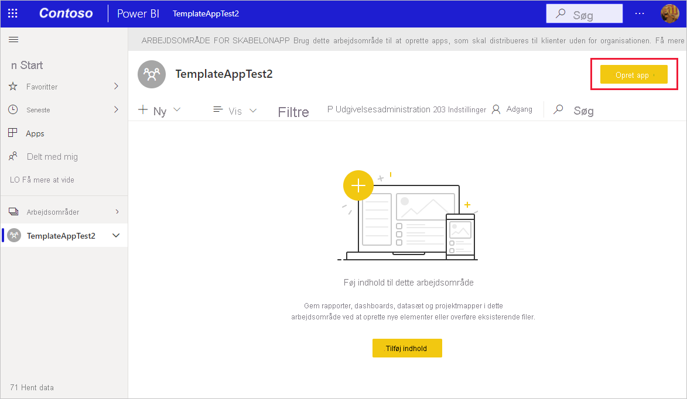

    Her udfylder du yderligere indstillinger for opbygning af din skabelonapp under seks faner:

    **Branding**

    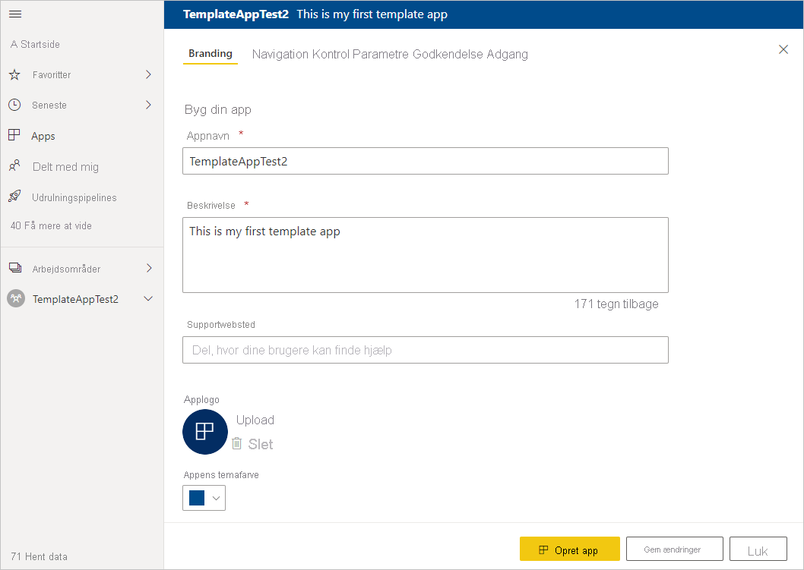
    - Appnavn
    - Beskrivelse
    - Supportwebsted (link præsenteres under programoplysningerne, efter skabelonprogrammet er blevet distribueret igen som organisationsprogram)
    - Programlogo (begrænsning på filstørrelsen på 45 K, 1:1 højde-bredde-forhold, formaterne .png .jpg og .jpeg)
    - Appens temafarve

    **Navigation**

    Aktivér **Ny navigationsgenerator**, hvor du kan definere navigationsruden i appen. Du kan finde flere oplysninger i artiklen [Design navigationsoplevelsen](../collaborate-share/service-create-distribute-apps.md#design-the-navigation-experience).

   
    
    **Programmets landingside:** Hvis du vælger at framelde navigationsgeneratoren, har du mulighed for at vælge appens landingsside. Angiv en rapport eller et dashboard som landingsside for dit program. Brug en landingsside, der giver det rette indtryk.

    **Kontrolelement**

    Angiv begrænsninger og restriktioner for appindhold for brugerne af din app. Du kan bruge dette kontrolelement til at beskytte immaterielle rettigheder i programmet.

    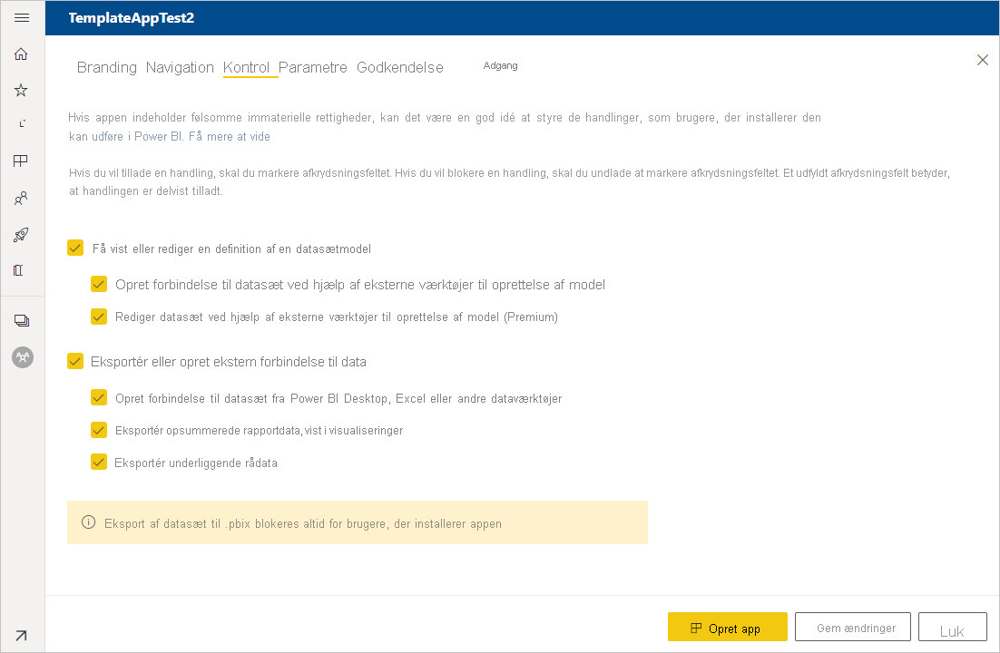

    >[!NOTE]
    >Eksport til .pbix-format blokeres altid for brugere, der installerer programmet.

    **Parametre**

    Parametre oprettes i den oprindelige pbix-fil (få mere at vide om [oprettelse af forespørgselsparametre](https://powerbi.microsoft.com/blog/deep-dive-into-query-parameters-and-power-bi-templates/)). Du kan bruge funktionerne under denne fane til at hjælpe appinstallationsprogrammet med at konfigurere appen efter installationen, når de opretter forbindelse til deres data.

    Under denne fane kan du også angive et link til appdokumentationen.

    

    Hver parameter har et navn og en beskrivelse, der kommer fra forespørgslen, og et værdifelt. Du har tre muligheder for at angive en værdi for parameteren under installationen.

    * Du kan kræve, at installationsprogrammet angiver en værdi. I det tilfælde angiver du et eksempel, som erstattes. Hvis du vil konfigurere en parameter på denne måde, skal du markere afkrydsningsfeltet **Påkrævet** og derefter angive et eksempel i tekstfeltet, der viser brugeren, hvilken type værdi der forventes. Eksempel:

       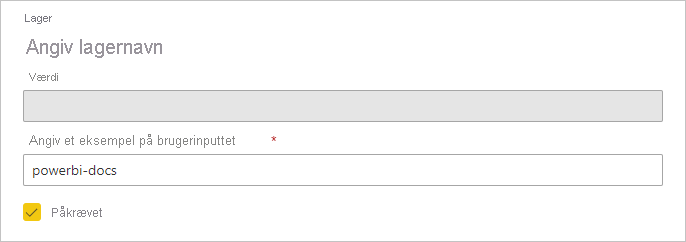

    * Du kan angive en forhåndsudfyldt værdi, som den bruger, der installerer appen, ikke kan ændre. En parameter, der er konfigureret på denne måde, er skjult for den person, der installerer appen. Du bør kun bruge denne metode, hvis du er sikker på, at den forhåndsudfyldte værdi er gyldig for alle brugere. Ellers skal du bruge den første metode, der er nævnt ovenfor, som kræver input fra brugeren.

       Hvis du vil konfigurere en parameter på denne måde, skal du angive værdien i tekstfeltet **Værdi** og derefter klikke på låseikonet. Det bevirker, at værdien ikke kan ændres. Eksempel:

       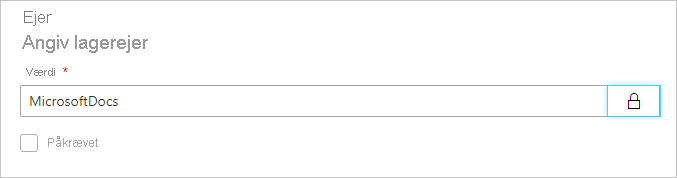

    * Du kan angive en standardværdi, som brugeren kan ændre under installationen. Hvis du vil konfigurere en parameter på denne måde, skal du angive værdien i tekstfeltet **Værdi** og lade låseikonet være ulåst. Eksempel:

      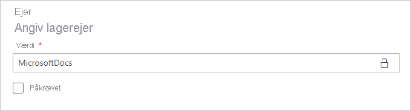

    **Godkendelse**
    
    Under denne fane skal du vælge den godkendelsesmetode, der skal bruges. De indstillinger, der er tilgængelige, afhænger af de datakildetyper, der bruges.

    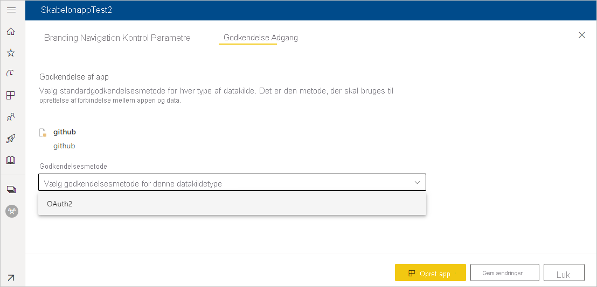

    Niveauet for beskyttelse af personlige oplysninger konfigureres automatisk:
   * Enkelt datakilde: Automatisk konfigureret som privat.
   * Multianonym datakilde: Automatisk konfigureret som offentlig.

    **Access**
    
    I testfasen kan du bestemme, hvilke andre personer i din organisation der kan installere og teste din app. Bare rolig, du kan altid vende tilbage og ændre disse indstillinger senere. Indstillingen påvirker ikke adgangen til den distribuerede skabelonapp.

    

2. Vælg **Opret program**.

    Du får vist en meddelelse om, at testprogrammet er klar med et link til at kopiere og dele med testerne af dit program.

    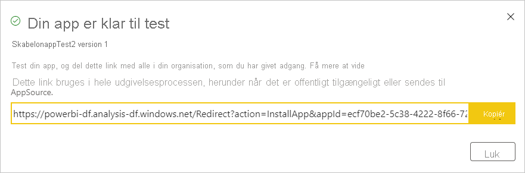

    Du har også udført det første trin i processen for udgivelsesadministration, der er som følger.

## Administrer udgivelsen af skabelonprogrammet

Før du udgiver dette skabelonprogram offentligt, skal du sikre, at det er klar. Power BI indeholder ruden Udgivelsesadministration, hvor du kan følge og undersøge den fulde sti til udgivelse af programmet. Du kan også udløse overgangen fra fase til fase. De almindelige faser er:

- Opret et testprogram: kun til test i din organisation.
- Hæv testpakken til præproduktionsfasen: test uden for organisationen.
- Hæv præproduktionspakken til produktion: produktionsversion.
- Slet en pakke, eller start forfra fra den forrige fase.

URL-adressen ændres ikke, når du flytter mellem udgivelsesfaser. Opprioritering påvirker ikke selve URL-adressen.

Lad os gennemgå faserne:

1. Vælg **Udgivelsesadministration** i skabelonen for arbejdsområdet.

    

2. Vælg **Hent link**, hvis du oprettede testappen i afsnittet **Opret testskabelonappen** ovenfor (det bevirker, at den gule prik ud for **Test** allerede er udfyldt).

    Hvis du endnu ikke har oprettet appen, skal du vælge **Opret app**. Du vender derved tilbage til processen til oprettelse af skabelonapps.

    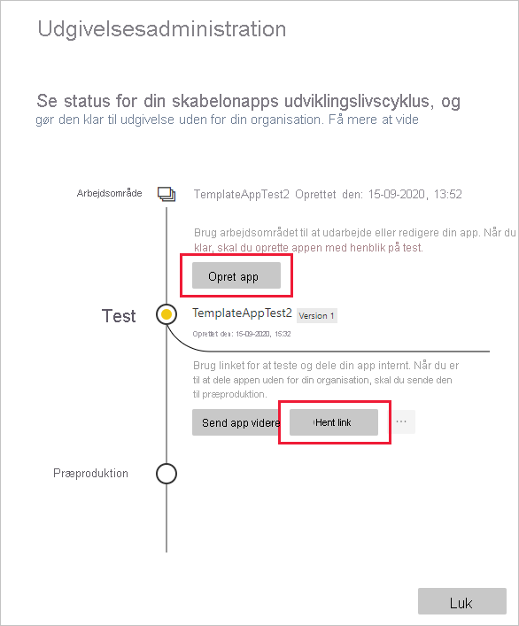

4. Du tester oplevelsen af programinstallationen ved at kopiere linket i meddelelsesvinduet og indsætte det i et nyt browservindue.

    Herfra følger du den samme fremgangsmåde som dine kunder. Se [Installér og distribuer skabelonapps i din organisation](service-template-apps-install-distribute.md).

5. Vælg **Installér** i dialogboksen.

    Når installationen er fuldført, får du vist en meddelelse om, at det nye program er klar.

6. Vælg **Gå til program**.
7. Under **Kom i gang med dit nye program** kan du se programmet, som dine kunder vil se det.

    
8. Vælg **Udforsk program** for at bekræfte testprogrammet sammen med eksempeldataene.
9. Hvis du vil foretage ændringer, skal du vende tilbage til programmet i det oprindelige arbejdsområde. Opdater testprogrammet, indtil du er tilfreds.
10. Når du er klar til at hæve dit program til præproduktion med henblik på yderligere test uden for din lejer, skal du gå tilbage til ruden **Udgivelsesadministration** og vælge **Hæv program**.

    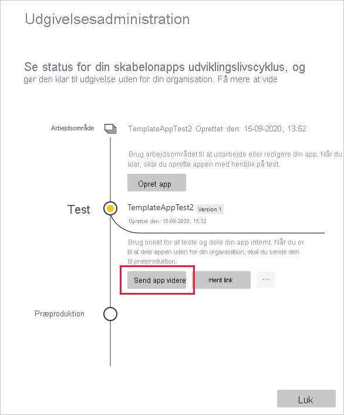
    >[!NOTE]
    > Når programmet er hævet, bliver det offentligt tilgængelige uden for organisationen.

    Hvis du ikke kan se denne indstilling, skal du kontakte din Power BI-administrator, som skal give dig [tilladelse til at udvikle skabelonprogrammer](../admin/service-admin-portal.md#template-apps-settings) på administrationsportalen.
11. Vælg **Hæv** for at bekræfte dit valg.
12. Kopiér denne nye URL-adresse for at dele den uden for din lejer med henblik på test. Dette link er også det, du sender for at begynde processen med at distribuere dit program på AppSource ved at oprette et [nyt tilbud på Partnercenter](https://docs.microsoft.com/azure/marketplace/partner-center-portal/create-power-bi-app-offer). Send kun links til præproduktion til Partnercenter. Du kan først hæve denne pakke til produktion i Power BI, når appen er blevet godkendt, og du har fået en meddelelse om, at den er udgivet i AppSource.
13. Når programmet er klar til produktion eller deling via AppSource, skal du gå tilbage til ruden **Udgivelsesadministration** og vælge **Hæv program** ud for **Præproduktion**.
14. Vælg **Hæv** for at bekræfte dit valg.

    Programmet er nu i produktion og klar til distribution.

    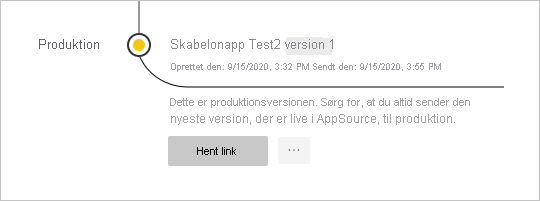

Hvis du vil gøre dit program tilgængeligt for tusindvis af Power BI-brugere i hele verden, opfordrer vi dig til at sende det til AppSource. Du kan se yderligere oplysninger under [Power BI-programtilbud](https://docs.microsoft.com/azure/marketplace/partner-center-portal/create-power-bi-app-offer).

## Næste trin

Se, hvordan dine kunder kan interagere med dit skabelonprogram under [Installér, tilpas og distribuer skabelonprogrammer i din organisation](service-template-apps-install-distribute.md).

Du kan se yderligere oplysninger om, hvordan du distribuerer dit program under [Power BI-programtilbud](https://docs.microsoft.com/azure/marketplace/partner-center-portal/create-power-bi-app-offer).
