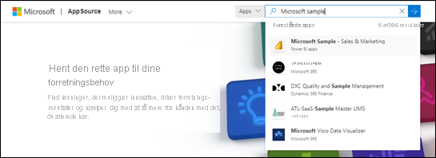

# Installér og brug appeksemplet Sales & Marketing i Power BI-tjenesten

[!INCLUDE[consumer-appliesto-yyny](../includes/consumer-appliesto-yyny.md)]

Nu, hvor du har en [grundlæggende forståelse af, hvordan du henter Power BI-indhold](end-user-app-view.md), skal vi bruge Microsoft AppSource til at hente Sales & Marketing-skabelonappen. Marketing & Sales-skabelonappen indeholder eksempeldata, som du kan bruge til at udforske Power BI-tjenesten. Lige præcis denne app har ét dashboard og flere rapportsider. 

> [!IMPORTANT]
> Hvis du installerer denne app fra Microsoft AppSource, kræver det, at du har en **Power BI Pro**-licens.  Du kan finde flere oplysninger under [licenser](end-user-license.md).

## Hent appen fra Microsoft AppSource

1. Åbn [https://appsource.microsoft.com](https://appsource.microsoft.com).

   

1. I søgefeltet skal du angive **Microsoft-eksempel** og vælge **Microsoft-eksempel – Sales & Marketing**. 

    

1. Du kan også gennemse oversigten og anmeldelserne og se på billederne.  Vælg derefter **Hent det nu**.

   

1. Bekræft, at du vil installere denne app.

   

5. Der vises en meddelelse i Power BI-tjenesten, når appen er blevet installeret. Vælg **Gå til program**. Eller vælg selve appen på dit **Apps**-lærred. Afhængigt af hvordan designeren oprettede appen, vises enten appdashboardet eller apprapporten.

    

7.  Denne skabelonapp er konfigureret til at åbne dashboardet. *Appdesigneren* kunne have konfigureret, at appen skulle åbne en af rapportsiderne i stedet.  

    

## Interager med dashboards og rapporter i appen
Brug lidt tid på at udforske dataene i de dashboards og rapporter, der udgør appen. Du har adgang til alle almindelige Power BI-interaktioner som filtrering, fremhævning, sortering og analyse.  Er du stadig lidt forvirret over forskellen mellem dashboards og rapporter?  Læs [artiklen om dashboards](end-user-dashboards.md) og [artiklen om rapporter](end-user-reports.md).  

## Næste trin
* [Tilbage til oversigten over apps](end-user-apps.md)    
* [Få vist en Power BI-rapport](end-user-report-open.md)    
* [Andre måder, indhold deles med dig på](end-user-shared-with-me.md)
