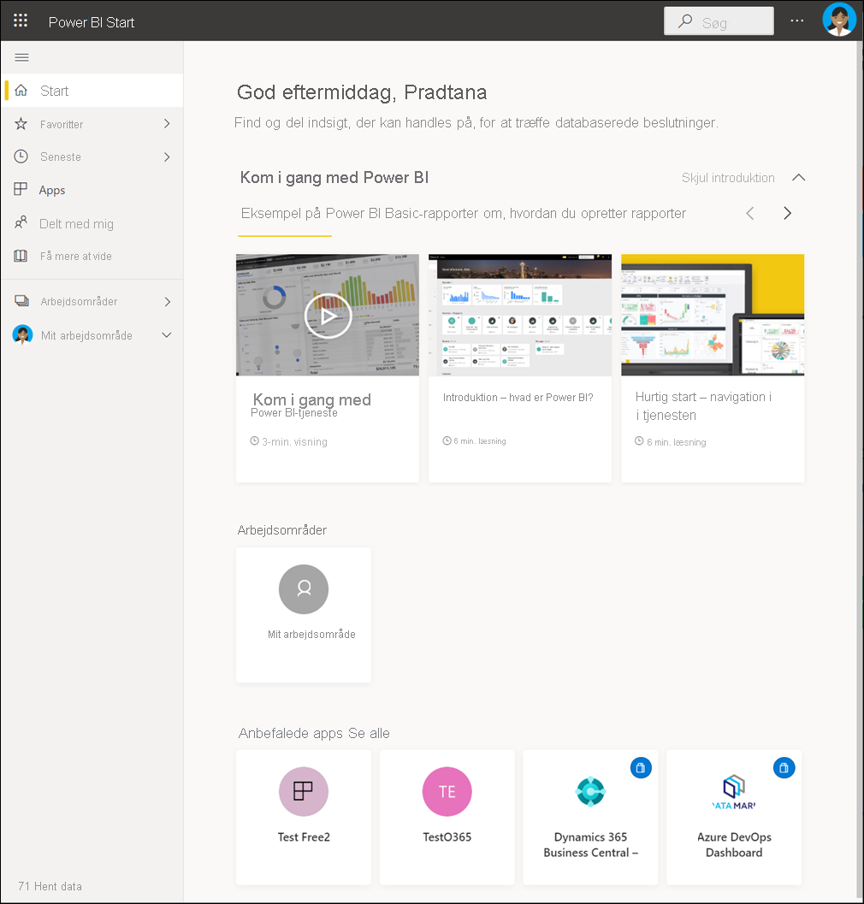
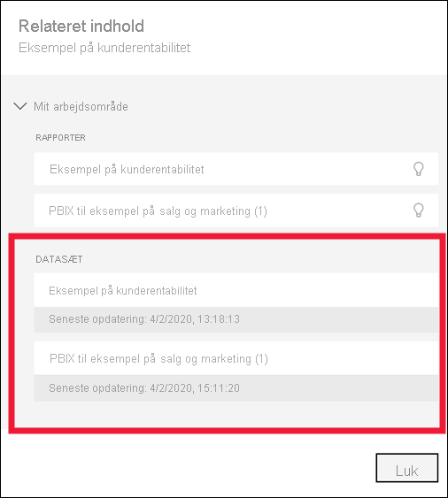
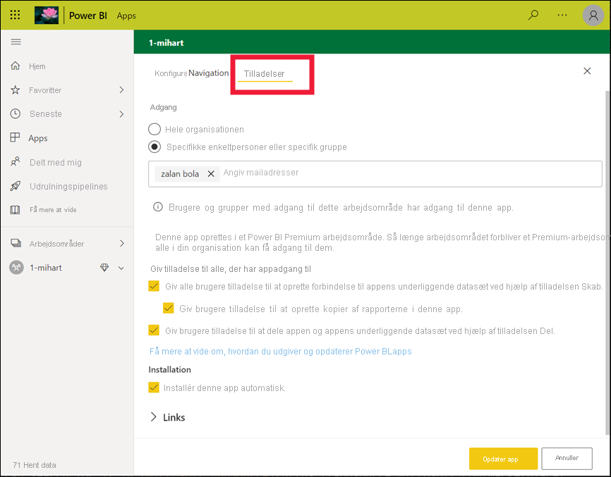
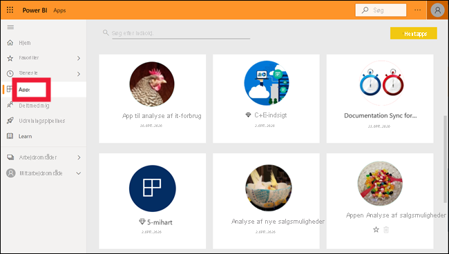

# Grundlæggende begreber for forbrugere af Power BI-tjenesten

[!INCLUDE[consumer-appliesto-ynnm](../includes/consumer-appliesto-ynnm.md)]

[!INCLUDE [power-bi-service-new-look-include](../includes/power-bi-service-new-look-include.md)]

Denne artikel forudsætter, at du allerede har læst [Oversigt over Power BI](../fundamentals/power-bi-overview.md) og har identificeret dig selv som [Power BI-erhvervsbruger](end-user-consumer.md). *Erhvervsbrugere* modtager Power BI-indhold, f.eks. dashboards, rapporter og apps, fra kollegaer. *Erhvervsbrugere* arbejder med Power BI-tjenesten (app.powerbi.com), som er den webbaserede version af Power BI.

Hvis du skal modtage indhold fra andre, kræves en af følgende:
- En Power BI Pro-brugerlicens
- Din organisation har et Power BI Premium-abonnement, og indholdet skal deles med dig fra en Power BI Premium-kapacitet. [Slå dine licens- og abonnementstyper op](end-user-license.md).

Du vil uden tvivl høre begrebet "Power BI Desktop" eller bare "Desktop". Det er det enkeltstående værktøj, der bruges af *designere*, som bygger og deler dashboards og rapporter med dig. Det er vigtigt at vide, at der findes andre Power BI-værktøjer. Så længe du er erhvervsbruger**, skal du kun arbejde med Power BI-tjenesten. Denne artikel drejer sig kun om Power BI-tjenesten.

## Terminologi og begreber

Denne artikel er ikke en visuel gennemgang af Power BI, og den er heller ikke et praktisk selvstudium. Artiklen byder i stedet på en oversigt, som hjælper dig med at blive fortrolig med Power BI-terminologien og -begreberne. Du lærer sproget og karakteristikaene at kende. Du kan få en præsentation af Power BI-tjenesten, og hvordan du navigerer i den, i [Hurtig start – Navigation i Power BI-tjenesten](end-user-experience.md).

## Åbn Power BI-tjenesten første gang

De fleste Power BI-*erhvervsbrugere* får Power BI-tjenesten, fordi 1) deres virksomhed køber licenser, og 2) en administrator tildeler disse licenser til medarbejdere.

Du kommer i gang ved at åbne en browser og skrive **app.powerbi.com**. Første gang, du åbner Power BI-tjenesten, vil du se noget i stil med følgende:

I takt med at du bruger Power BI-tjenesten, kan du tilpasse det, du ser, når du åbner webstedet. Nogle personer foretrækker for eksempel, at Power BI åbner med **startsiden**, mens andre har et favoritdashboard, de vil have vist først. Bare rolig, i disse to artikler viser vi dig, hvordan du tilpasser din oplevelse.

- [Introduktion til Power BI Start og global søgning](https://powerbi.microsoft.com/blog/introducing-power-bi-home-and-global-search)

- [Udvalgte dashboards i Power BI-tjenesten](end-user-featured.md)

Før vi fortsætter, skal vi lige vende tilbage og tale om de byggesten, der udgør Power BI-tjenesten.

_______________________________________________________

## Power BI-indhold

### Introduktion til byggestenene

For en Power BI-*erhvervsbruger* er de fem byggesten: **_visualiseringer_**, **_dashboards_**, **_rapporter_**, **_apps_** og **_datasæt_** . Disse omtales nogle gange som *Power BI-* **_indhold_** *Indhold* findes i **_arbejdsområder_**. En typisk arbejdsproces omfatter alle byggestenene: En Power BI-*designer* (gul i nedenstående diagram) indsamler data fra *datasæt*, overfører dem til Power BI med henblik på analyse, opretter *rapporter* med mange *visualiseringer*, der fremhæver interessante fakta og indsigt, fastgør visualiseringerne fra rapporter til et *dashboard* og deler rapporter og dashboards med *erhvervsbrugere* som dig (sort i nedenstående diagram). *Designeren* deler dem i form af dashboards, rapporter eller apps.

Kort fortalt:

-  en **_visualisering_** (eller *visual*) er en form for diagram, der er bygget af Power BI-*designere*. I visualiseringerne vises dataene fra *rapporter* og *datasæt*. *Designere* udarbejder typisk visualiseringerne i Power BI Desktop.

    Du kan finde flere oplysninger i [Interager med visualiseringer i rapporter, på dashboards og i programmer](end-user-visualizations.md).

-  Et *datasæt* er en objektbeholder for data. Det kan f.eks. være en Excel-fil fra Verdenssundhedsorganisationen. Det kan også være en virksomhedsejet database over kunder, eller det kan være en Salesforce-fil. Datasæt administreres af *designere*.

-  Et *dashboard* er en enkelt skærm med interaktive visualiseringer, tekst og grafik. På et dashboard samles dine vigtigste metrikværdier på én skærm for at fortælle en historie eller svare på spørgsmål. Dashboardindholdet stammer fra en eller flere rapporter og et eller flere datasæt.

    Du kan finde flere oplysninger i [Dashboards til erhvervsbrugere af Power BI-tjenesten](end-user-dashboards.md).

-  En *rapport* er en eller flere sider med interaktive visualiseringer, tekst og grafik, der tilsammen udgør en enkelt rapport. Power BI baserer en rapport på et enkelt datasæt. *Designeren* organiserer ofte rapporter, så de behandler et enkelt interesseområde eller besvarer et enkelt spørgsmål.

    Du kan finde flere oplysninger i [Rapporter i Power BI](end-user-reports.md).

-  *Designere* kan bruge en *app* til at samle og dele relaterede dashboards og rapporter samlet. *Erhvervsbrugere* modtager nogle apps automatisk, men kan søge efter andre apps, der er oprettet af kollegaer eller af community'et. Køreklare apps er f.eks. tilgængelige for eksterne tjenester, som du allerede bruger, såsom Google Analytics og Microsoft Dynamics CRM.

For at gøre det helt klart: Hvis du er ny bruger, og det er første gang, du logger på Power BI-tjenesten, kan du sikkert ikke se delte dashboards, apps eller rapporter endnu.

_______________________________________________________

## Datasæt

Et *datasæt* er en samling af data, som *designere* importerer eller opretter forbindelse til og derefter bruger til at oprette rapporter og dashboards. Som *erhvervsbruger* interagerer du ikke direkte med datasæt, men det er stadig rart at forstå, hvordan de passer ind i den større sammenhæng.  

Hvert datasæt repræsenterer en enkelt datakilde. Kilden kunne f.eks. være en Excel-projektmappe på OneDrive, et lokal SQL Server Analysis Services-datasæt i tabelformat eller et Salesforce-datasæt. Power BI understøtter mange forskellige datakilder.

Når en designer deler en app med dig, kan du se, hvilke datasæt der bruges, ved at åbne **Relateret indhold**.  Du kan ikke tilføje eller ændre noget i datasættet. Men hvis designeren giver dig tilladelser, kan du downloade rapporten, se efter [indsigt i dataene](end-user-insights.md) eller endda [oprette din egen rapport](../create-reports/service-report-create-new.md) baseret på datasættet.  

Ét datasæt ...

- Kan bruges igen og igen af en rapportdesigner til at oprette dashboards og rapporter

- Kan bruges til at oprette forskellige rapporter

- Visualiseringer fra dette ene datasæt kan vises på mange forskellige dashboards

  

Videre til næste byggesten: visualiseringer.

_______________________________________________________

## Visualiseringer

Visualiseringer (også kaldet visuals) viser indsigter, som Power BI registrerer i dataene. Visualiseringer gør det nemmere at fortolke indsigt, da du opfatter et billede hurtigere end et regneark fyldt med tal.

Her er blot nogle af de visualiseringer, du kan støde på i Power BI: vandfald, bånd, træstruktur, cirkel, tragtformet, kort, punkt og måler.

   

Se den [fulde liste over visualiseringer, der er inkluderet i Power BI](end-user-visual-type.md).

Særlige visualiseringer, der kaldes *brugerdefinerede visualiseringer*, er tilgængelige via community'et. Hvis du modtager en rapport med en visualisering, du ikke genkender, er det sandsynligvis en brugerdefineret visualisering. Hvis du har brug for hjælp til at forstå den brugerdefinerede visualisering, kan du slå navnet på *designeren* af rapporten eller dashboardet op og kontakte vedkommende. Du kan finde kontaktoplysninger ved at vælge titlen på den øverste menulinje.

Én visualisering i en rapport...

- Kan vises flere gange i den samme rapport

- Kan vises i mange forskellige dashboards

_______________________________________________________

## Rapporter

En Power BI-rapport er en eller flere sider med visualiseringer, grafik og tekst. Alle visualiseringerne i en rapport stammer fra et enkelt datasæt. *Designere* udarbejder rapporter og deler dem med andre – enten enkeltvist eller som en del af en app.  *Erhvervsbrugere* [interagerer typisk med rapporter i *læsevisning*](end-user-reading-view.md).

Én rapport...

- Kan være knyttet til flere dashboards (felter, der er fastgjort fra den ene rapport kan vises på flere dashboards).

- Kan oprettes ved hjælp af data fra kun ét datasæt.  

- Kan være en del af flere apps.

  

_______________________________________________________

## Dashboards

Et dashboard repræsenterer en brugerdefineret grafisk visning af nogle undersæt af de underliggende datasæt. *Designere* udarbejder dashboards og deler dem med *erhvervsbrugere* – enten enkeltvist eller som en del af en app. Et dashboard er et enkelt lærred, der indeholder *felter*, grafik og tekst.

  

Et felt er en gengivelse af en visualisering, som en *designer* *fastgør* f.eks. fra en rapport til et dashboard. Hvert fastgjorte felt viser en [visualisering](end-user-visualizations.md), som en designer har oprettet ud fra et datasæt og fastgjort til det pågældende dashboard. Et felt kan også indeholde en hel rapportside og data til livestreaming eller en video. *Designere* har mange forskellige måder at føje felter til dashboards på – alt for mange til at dække dem alle i denne oversigtsartikel. Du kan få mere at vide i [Dashboard-felter i Power BI](end-user-tiles.md).

*Erhvervsbrugere* kan ikke redigere dashboards. En forbruger kan derimod tilføje kommentarer, få vist relaterede data, angive det som favorit, abonnere og meget mere.

Hvad er nogle formål med dashboards?  Her er nogle få:

- for hurtigt at se alle de oplysninger, der er nødvendige for at træffe beslutninger

- for at overvåge de vigtigste oplysninger om virksomheden

- for at sikre, at alle kollegaer er opdateret og får vist og bruger de samme oplysninger

- at overvåge tilstanden for et produkt eller en virksomhed, en afdeling eller marketingkampagne osv.

- for at oprette en tilpasset visning af et større dashboard – alle de målepunkter, der betyder noget for dig

**ÉT** dashboard...

- kan vise visualiseringer fra mange forskellige datasæt

- kan vise visualiseringer fra mange forskellige rapporter

- kan vise visualiseringer, der er fastgjort fra andre funktioner (f.eks. Excel)

  

_______________________________________________________

## Apps

Disse samlinger af dashboards og rapporter organiserer relateret indhold sammen i en enkelt pakke. Power BI-*designere* udarbejder dem i arbejdsområder og deler apps med enkeltpersoner, grupper, en hel organisation eller offentligheden. Som *erhvervsbruger* kan du være sikker på, at du og dine kollegaer arbejder med de samme oplysninger – en og samme version af sandheden.

Nogle gange deles appens arbejdsområde, og der kan være mange personer, der samarbejder i og opdaterer både arbejdsområdet og appen. Omfanget af det, du kan foretage dig med en app, bestemmes af de tilladelser og den adgang, du har fået.

> [!NOTE]
> Brug af appen kræver en Power BI Pro-licens, eller at appens arbejdsområde er gemt i en Premium-kapacitet. [Få mere at vide om licenser](end-user-license.md).

Det er nemt at finde og installere apps i [Power BI-tjenesten](https://powerbi.com) og på din mobilenhed. Når du har installeret en app, behøver du ikke at huske navnene på mange forskellige dashboards og rapporter. De er alle samlet i én app, i din browser eller på din mobilenhed.

Denne app har to dashboards og to rapporter, der udgør en enkelt app. Hvis du vælger pilen til højre for et rapportnavn, får du vist en liste over sider, der udgør rapporten.

Når appen opdateres, får du automatisk vist ændringerne. Designeren styrer også tidsplanen for, hvor ofte dataene opdateres i Power BI. Du behøver ikke tænke på at holde dem opdateret.

Du kan hente apps på forskellige måder:

- Appdesigneren kan installere appen automatisk på din Power BI-konto.

- Appdesigneren kan sende dig et direkte link til en app.

- Du kan søge i Power BI-tjenesten efter de apps, der er gjort tilgængelige for dig fra din organisation eller fra community'et. Du kan også besøge [Microsoft AppSource](https://appsource.microsoft.com/marketplace/apps?product=power-bi), hvor du kan se alle de apps, du kan bruge.

I Power BI på din mobilenhed kan du kun installere apps fra et direkte link og ikke fra AppSource. Hvis appdesigneren installerer appen automatisk, kan du se den på din liste over apps.

Når du har installeret appen, skal du blot vælge den på listen over apps og vælge, hvilket dashboard eller hvilken rapport du vil åbne og udforske først.

Jeg håber, at denne artikel har givet dig en forståelse for de byggesten, der udgør Power BI-tjenesten for erhvervsbrugere.

## Næste trin

- Gennemse og angiv bogmærke for [ordlisten](end-user-glossary.md)

- Få en [præsentation af Power BI-tjenesten](end-user-experience.md)

- Læs [oversigten over Power BI, der er skrevet specielt til erhvervsbrugere](end-user-consumer.md)

- Se en video, hvor Will gennemgår de grundlæggende begreber og præsenterer Power BI-tjenesten.

    <iframe width="560" height="315" src="https://www.youtube.com/embed/B2vd4MQrz4M" frameborder="0" allowfullscreen></iframe>
