# Hurtig introduktion – Navigation i Power BI-tjenesten

[!INCLUDE [power-bi-service-new-look-include](../includes/power-bi-service-new-look-include.md)]

Nu, hvor du kender de [grundlæggende funktioner i Power BI](end-user-basic-concepts.md), kan vi se nærmere på **Power BI-tjenesten**. Som nævnt i forrige artikel bruger kollegaer i dit team muligvis al deres tid i **Power BI Desktop** på at kombinere data og oprette rapporter, dashboards og apps for andre. De er *designere*. Du måske bruger al din tid i Power BI-tjenesten på at se på og interagere med indhold, der er oprettet af andre, dvs. at du har oplevelsen som **forbruger**. Du er *erhvervsbruger*. Denne hurtige start er for *erhvervsbrugere*. 

   
 
## Forudsætninger

- Hvis du ikke er tilmeldt Power BI, skal du [tilmelde dig en gratis prøveversion](https://app.powerbi.com/signupredirect?pbi_source=web), før du begynder.

- Læs om [grundlæggende begreber i Power BI-tjenesten](end-user-basic-concepts.md)

- Hvis du vil have vist Power BI-indhold (rapporter, dashboards, apps), der er oprettet af *designere*, kræver det, at en af to betingelser er opfyldt:
    - en Power BI Pro-licens
    - at din organisation har et Power BI Premium-abonnement, og at indholdet skal deles med dig fra Premium-kapacitet.    
    [Få mere at vide om licenser og abonnementer](end-user-license.md).     

    I forbindelse med denne hurtige start kræver vi ikke, at nogen af disse betingelser er opfyldt. Microsoft har gjort eksempelindhold tilgængeligt direkte fra grænsefladen i Power BI-tjenesten. Vi bruger dette eksempelindhold til at lære at bruge Power BI-tjenesten. 

## Åbn Power BI-tjenesten

Åbn først Power BI-tjenesten (app.powerbi.com). 
1. Hvis navigationsruden til venstre er skjult, skal du vælge ikonet navigationsrude  for at udvide den. 

1. Vælg **Hent data** i nederste venstre hjørne. Vi tager nogle eksempeldata, som vi bruger til vores præsentation af Power BI-tjenesten. Vi giver dig alle mulige former for eksempeldata, som du kan udforske, og i dette eksempel bruger vi dataene om marketing og salg. 

   

1. Når skærmen **Hent data** er åbnet, skal du vælge **Eksempler**.

   

1. Vælg **Salg og marketing** > **Opret forbindelse**. 

   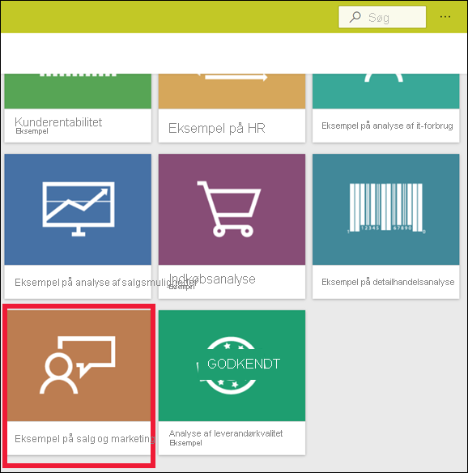

5. Power BI-tjenesten installerer eksemplet i **Mit arbejdsområde**.  **Mit arbejdsområde** er din private sandkasse til læring og eksperimentering.  Det er kun dig, der kan se indholdet i **Mit arbejdsområde**. Eksemplet omfatter ét dashboard, én rapport og ét datasæt. *Erhvervsbrugere* modtager typisk ikke datasæt, men dette eksempel er designet til alle brugere, og det indeholder ét.

    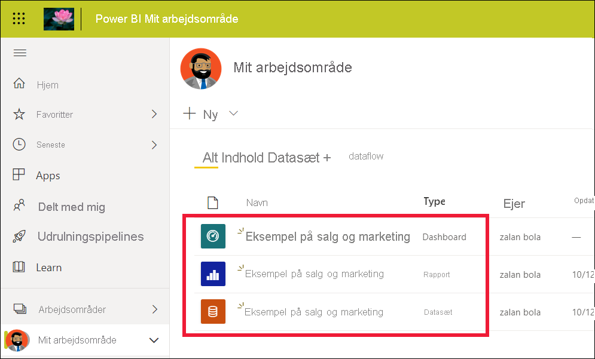

    Som *erhvervsbruger* vil størstedelen af det indhold, der deles med dig, ikke give direkte adgang til de underliggende datasæt. Da Power BI-eksemplerne er oprettet til alle Power BI-kunder, er datasættene dog inkluderet her.   

    Du kan få mere at vide om eksempler under [Hent eksempler til Power BI](../create-reports/sample-datasets.md).

## Få vist indhold (dashboards og rapporter)
Indhold er organiseret i forhold til et arbejdsområde. Hver erhvervsbruger har mindst ét arbejdsområde, og det kaldes **Mit arbejdsområde**. Når *designer*kollegaer deler indhold med dig, får du muligvis flere arbejdsområder.  Hvis en *designer* f.eks. giver dig adgangstilladelse til et af sine arbejdsområder, vises det pågældende arbejdsområde på dit Power BI-websted.  

I **Mit arbejdsområde** gemmes alt det indhold, du ejer og opretter. Tænk på det som din personlige sandkasse eller arbejdsområde til dit eget indhold. For mange Power BI-*erhvervsbrugere* vil **Mit arbejdsområde** blive ved med at være tomt, fordi deres job ikke involverer oprettelse af nyt indhold.  *Erhvervsbrugere* forbruger pr. definition data, som er oprettet af andre, og de bruger disse data til at træffe forretningsbeslutninger. Hvis du opretter indhold, kan du overveje at læse [Power BI-artiklerne til *rapportdesignere*](../index.yml) i stedet for.

Et arbejdsområde er meget mere end blot en simpel liste over indhold. På denne side kan du få meget mere at vide om arbejdsområdets dashboards og rapporter. Brug et par minutter på at identificere indholdsejeren, datoen for seneste opdatering, dataenes følsomhed og eventuelle godkendelser. Vælg **Flere handlinger (...)** for at få vist en liste over handlinger for dashboardet og rapporten.   

Du kan finde flere oplysninger under [Arbejdsområder](end-user-workspaces.md).

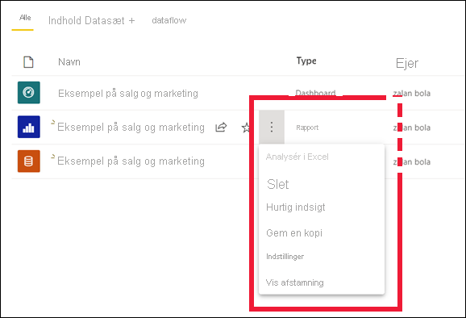

Et arbejdsområde er også en af adgangsvejene til dine data. Fra et arbejdsområde kan du åbne et dashboard eller en rapport ved at vælge elementet på listen.  Du kan angive et dashboard eller en rapport som favorit ved at holde markøren over elementet og vælge stjerneikonet. Hvis *designeren* har givet dig [delingstilladelser](end-user-shared-with-me.md), kan du også dele herfra. 

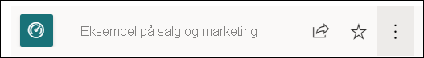

1. Vælg navnet på dashboardet for at åbne det. Dashboards er noget, der adskiller Power BI-tjenesten fra Power BI Desktop. [Få mere at vide om dashboards](end-user-dashboards.md)

    

2. De handlinger, du kan udføre på et dashboard, vises på den øverste menulinje.    

    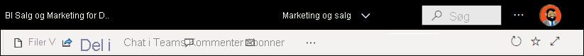

3. Peg på et dashboardfelt, og vælg **Flere indstillinger (...)** for at se de indstillinger, du kan bruge til at interagere med det pågældende felt.

    

4. Vælg et dashboardfelt for at åbne den rapport, der blev brugt til at oprette det pågældende felt. Rapporten åbnes på den side, der indeholder den visualisering, der findes på feltet. Her har jeg valgt dashboardfeltet med træstrukturen. Power BI-tjenesten åbner rapportsiden **Kategori ÅTD**.

    

    Rapporter indeholder flere afsnit. Til venstre kan du klikke på en liste over rapportsider. Langs toppen findes menulinjen med de handlinger, du kan udføre i rapporten.  De tilgængelige indstillinger afhænger af den rolle og tilladelse, som rapport*designeren* har tildelt til dig. Til højre vises ruden **Filtre**. Og det midterste lærred indeholder selve rapporten. På samme måde som for dashboardet er der handlinger, som du kan udføre for hele rapporten, for de enkelte visualiseringer og også for en enkelt rapportside. 

    Få mere at vide om rapporter under [Power BI-rapporter](end-user-reports.md).

## Brug af den venstre navigationsrude
Navigationsruden bliver mere nyttig, efterhånden som kollegaer deler indhold med dig. I dette afsnit af Hurtig start vil vi ikke kigge på eksemplet *Salg og marketing*, men i stedet på et dashboard og en rapport, der tilhører en Power BI-*erhvervsbruger*, som har en stor mængde delt indhold.

1. **Startsiden** er standardlandingssiden, når du logger på Power BI-tjenesten. Startsiden er et godt sted at starte og en anden måde at navigere i dit indhold på. Indhold på startsiden er organiseret efter favorit, seneste, hyppige og udvalgte. Startsiden viser også dine seneste arbejdsområder og apps. Du skal bare vælge et element for at åbne det.

    Start samler søgnings- og sorteringsværktøjer, navigationsrude og et lærred med *kort*, som du kan vælge for at åbne dashboards, rapporter og apps. I begyndelsen har du måske ikke så mange kort på dit lærred på Start, men det ændrer sig, i takt med at du begynder at bruge Power BI sammen med dine kolleger. Dit lærred for startsiden opdateres også med de anbefalede indholds- og læringsressourcer.

   

    Du kan få mere at vide under [Power BI Start](end-user-home.md)

2. Både **Favoritter** og **Seneste** har pile. Vælg en pil for hurtigt at se de fem øverste favoritter eller de fem senest besøgte indholdsområder. I pop op-vinduet skal du vælge indhold for at åbne det. 

   

    Hvis du vil se en komplet liste over favoritter eller seneste, skal du vælge ordet eller ikonet. Disse indholdslister indeholder flere oplysninger om rapporter, apps og dashboards.

    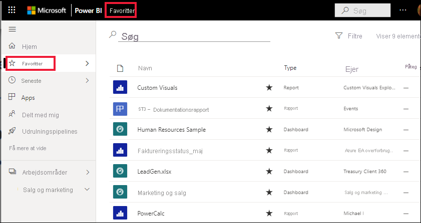

    Du kan få mere at vide under [Seneste i Power BI](end-user-recent.md) og [Favoritter i Power BI](end-user-recent.md).

4. Vælg **Apps** for at få vist alle de apps, der er blevet delt med dig, eller som du har installeret. Og vælg **Delt med mig** for at få vist dashboards og rapporter, der er delt med dig. Da du lige er gået i gang med Power BI-tjenesten, er disse indholdsområder tomme. 

    Få mere at vide om [Apps](end-user-apps.md) og [Delt med mig](end-user-shared-with-me.md).

### Søg og sortér indholdet
Når du er ny bruger af Power BI-tjenesten, har du kun lidt indhold. Men når kollegaer begynder at dele indhold med dig, og du begynder at downloade apps, kan du få en lang liste med indhold. Det er i den situation, at søgning og sortering er meget praktisk.

Søgefunktionen er tilgængelig næsten overalt i Power BI-tjenesten. Se blot efter søgefeltet eller søgeikonet med et forstørrelsesglas.    

I søgefeltet skal du skrive hele eller en del af navnet på et dashboard, en rapport, en projektmappe, en app eller en ejer. Power BI søger i hele dit indhold.

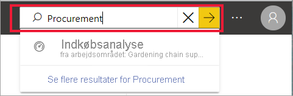

Der er også mange måder at sortere indhold på. Hold markøren over kolonneoverskrifterne, og se efter pile, der angiver, at kolonnen kan sorteres. Ikke alle kolonner kan sorteres. 

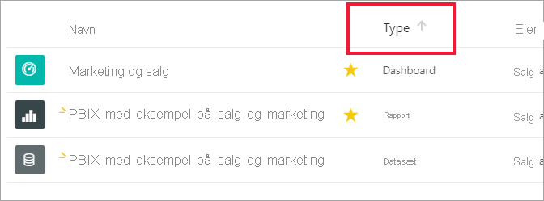

Du kan også kigge efter søge**filtrene**, som findes tæt på det øverste højre hjørne af dine indholdslister. Find hurtigt indhold ved at vælge blandt indholdstyper, ejere eller andre tilgængelige felter.

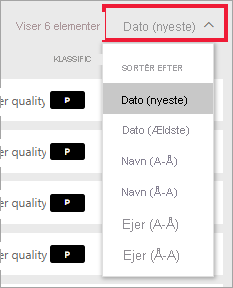

Hvis du vil vide mere, kan du se [Power BI-navigation: søg og sortér](end-user-search-sort.md)

## Find ejeren
Og vi afslutter denne hurtige start med et nyttigt tip. Hvis du har spørgsmål om et dashboard, en rapport eller en app – kan du slå ejeren op. Åbn indholdet, og vælg rullelisten med titler for at få vist ejeren. Ejeren kan være en person eller en gruppe.

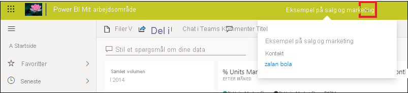

## Fjern ressourcer
Når du er færdig med denne hurtige introduktion, kan du slette dashboardet, rapporten og datasættet fra eksemplet, hvis du vil.

1. Åbn Power BI-tjenesten (app.powerbi.com), og log på.    
2. Åbn Power BI Start, rul ned, og vælg **Mit arbejdsområde**.      

3. Hold markøren over dashboardet, rapporten eller datasættet, og vælg **Flere indstillinger (...)**  >  **Slet**. Gentag, indtil alle tre elementer er fjernet.

    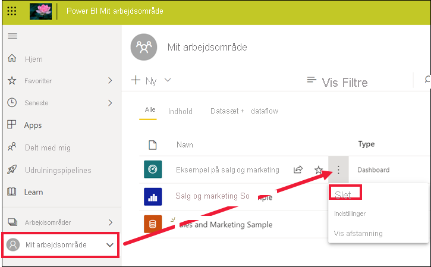

## De næste trin

> [!div class="nextstepaction"]
> [Læsevisning i Power BI-tjenesten](end-user-reading-view.md)
