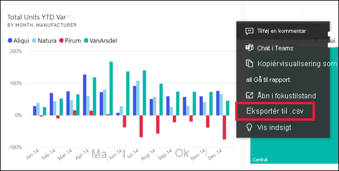
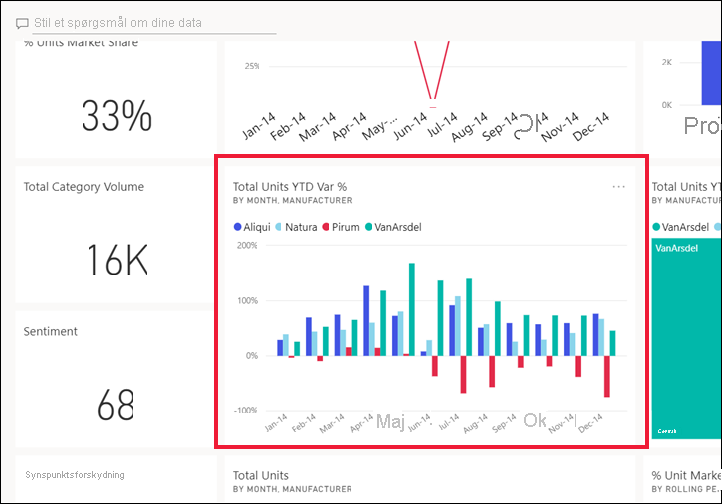
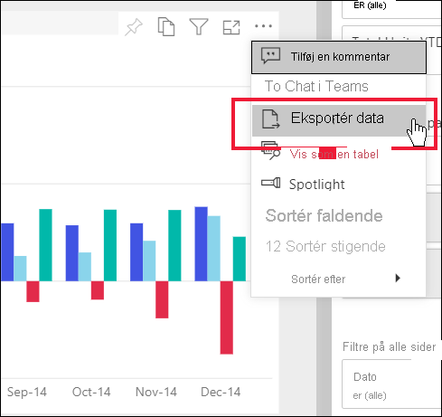
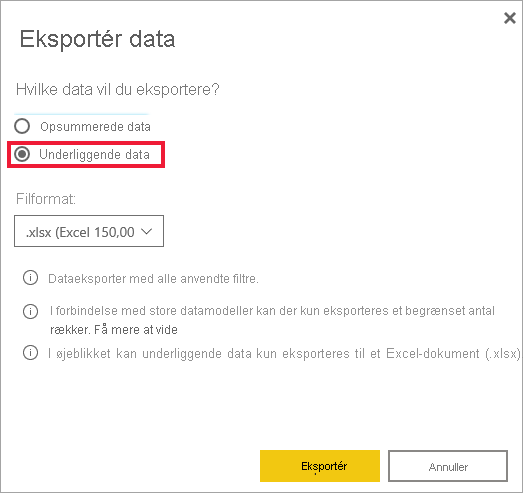

# Eksportér data fra et visuelt element

[!INCLUDE[consumer-appliesto-yyny](../includes/consumer-appliesto-yyny.md)]

Hvis du vil se de data, der bruges til at oprette en visualisering, [kan du få vist disse data i Power BI](end-user-show-data.md) eller eksportere dem til Excel. I denne artikel kan du se, hvordan du eksporterer til Excel.

Eksport af data til Excel kræver en Power BI Pro licens, eller for at dashboardet eller rapporten kan deles med dig ved hjælp af Premium-kapacitet. Du kan få mere at vide under [Hvilken licens har jeg?](end-user-license.md). 

> [!IMPORTANT]
> Hvis du ikke kan eksportere til Excel, er det muligt, at rapportens forfatter eller din Power BI administrator har deaktiveret denne funktion. Dette gøres ofte for at beskytte private data.

## Eksportér data fra en visualisering på et dashboard

1. Start på et Power BI-dashboard. Her bruger vi dashboardet fra appen ***Marketing- og salgseksempel** _. Du kan [downloade denne app fra AppSource.com](https://appsource.microsoft.com/en-us/product/power-bi/microsoft-retail-analysis-sample.salesandmarketingsample).

    

2. Hold over en visualisering for at få vist _ *Flere indstillinger** (...), og klik for at få vist handlingsmenuen.

    

3. Vælg **Eksportér til .csv**.

4. Den næste handling afhænger af, hvilken browser du bruger. Du bliver muligvis bedt om at gemme filen, eller du kan måske se et link til den eksporterede fil nederst i browseren. Eksporten gemmes som standard i din lokale Downloads-mappe. 

    

5. Åbn filen i Excel. 

    > [!NOTE]
    > Hvis du ikke har tilladelse til dataene, kan du ikke eksportere til eller åbne i Excel. Kontakt ejeren af dashboardet eller din Power BI administrator for at anmode om eksporttilladelser. 

    

## Eksportér data fra et visuelt element i en rapport
Du kan eksportere data fra en visualisering i en rapport i .csv- eller .xlsx-format (Excel). 

1. Vælg et felt på et dashboard for at åbne den underliggende rapport.  I dette eksempel vælger vi den samme visualisering som ovenfor, *Varians i % for Enheder i alt ÅTD*. 

    

    Da dette felt blev oprettet fra rapporten med *salgs- og marketingeksemplet*, er det denne rapport, der åbnes. Og den åbnes på den side, som indeholder den valgt feltvisualisering. 

2. Vælg dit visual i rapporten. Bemærk ruden **Filtre** til højre. Der er anvendt filtre på denne visualisering. Hvis du vil vide mere om filtre, skal du se [Brug filtre i en rapport](end-user-report-filter.md).

    

3. Vælg **Flere indstillinger (...)** i øverste højre hjørne af visualiseringen. Vælg **Eksportér data**.

    

4. Du kan se mulighederne for at eksportere enten opsummerede data eller underliggende data. Hvis du bruger appen med *salgs- og marketingeksemplet*, er **underliggende data** deaktiveret. Der kræves yderligere tilladelser for at se flere data, end der vises i visualiseringen (underliggende data). Disse tilladelser beskytter dataene, så de ikke bliver vist korrekt, bruges igen eller deles med andre end den ønskede målgruppe.

    **Opsummerede data**: Vælg denne indstilling, hvis du vil eksportere data for det, du i øjeblikket ser i visualiseringen.  I denne type eksport vises kun de data, der blev brugt til at oprette den aktuelle tilstand af visualiseringen. Hvis der er anvendt filtre på visualiseringen, vil de data, du eksporterer, også blive filtreret. For denne visualisering indeholder eksporten f.eks. kun data for 2014 og det centrale område og kun data for fire af producenterne: VanArsdel, Natura, Aliqui og Pirum. Hvis din visualisering har samlinger (sum, gennemsnit osv.), samles eksporten også. 
  

    **Underliggende data**: Vælg denne indstilling, hvis du vil eksportere data for det, du ser i visualiseringen, **og** yderligere data fra det underliggende datasæt.  Dette kan omfatte data, der findes i datasættet, men som ikke bruges i visualiseringen. Hvis der er anvendt filtre på visualiseringen, vil de data, du eksporterer, også blive filtreret.  Hvis din visualisering har sammenlægninger (sum, gennemsnit osv.), fjerner eksporten sammenlægningen. Dvs. at dataene udjævnes. 

    

5. Den næste handling afhænger af, hvilken browser du bruger. Du bliver muligvis bedt om at gemme filen, eller du kan måske se et link til den eksporterede fil nederst i browseren. Hvis du bruger Power BI-appen i Microsoft Teams, gemmes den eksporterede fil i din lokale Downloads-mappe. 

    

    > [!NOTE]
    > Hvis du ikke har tilladelse til dataene, kan du ikke eksportere til eller åbne i Excel. Kontakt rapport ejeren eller din Power BI administrator for at anmode om eksporttilladelser. 

6. Åbn filen i Excel. Sammenlign mængden af data, der eksporteres til det, vi eksporterede fra det samme visuelle element på dashboardet. Forskellen er, at denne eksport omfatter **underliggende data**. 

    

## Overvejelser og fejlfinding
Der er mange overvejelser i forbindelse med eksport til Excel. Dette er en af disse funktioner, som rapport designere og Power BI administratorer kan deaktivere for enkeltpersoner eller endda for hele organisationen. Det gør det for at sikre, at private data ikke vises i den forkerte målgruppe. 

Hvis du finder ud af, at du ikke kan bruge denne funktion, skal du kontakte ejeren af rapporten og administratoren for at forstå, hvorfor du ikke kan eksportere data fra en bestemt Visual eller fra alle visuelle elementer. Det kan være, at denne funktion er blevet deaktiveret med det samme, og måske kan de aktivere den for dig.  Andre gange kan der være særlige årsager til, at eksport ikke fungerer.  Det kan være relateret til tilladelser, dataindhold, datatype, visualiseringstype, hvordan designer navngivne felter og meget mere. Når du kontakter rapport ejeren eller administratoren, kan du henvise til disse artikler: [administrator lejerindstillinger](../guidance/admin-tenant-settings.md), [sikkerhed på rækkeniveau](../admin/service-admin-rls.md)og [data beskyttelse](../admin/service-security-data-protection-overview.md).

- Der er en grænse for det antal rækker, der kan eksporteres til Excel.  For. xlsx-filer er grænsen 150.000 rækker.  For. csv-filer er grænsen 30.000 rækker. 

- Datasættet kan have RLS (rollebaseret sikkerhed) anvendt på dataene. Det betyder, at nogle data kan være skjult fra dig, da det ikke er relevant for dig at se dem.  Hvis du f. eks. er personlige leder, kan HR-datasættet have anvendt RLS, der kun giver dig mulighed for at se data for medarbejdere, der rapporterer direkte til dig. 

- Visse typer visualiseringer understøttes ikke. Det omfatter brugerdefinerede visuelle elementer, R-visualiseringer og meget mere. 

## Næste trin

[Vis de data, der er brugt til oprettelse af en visualisering](end-user-show-data.md)