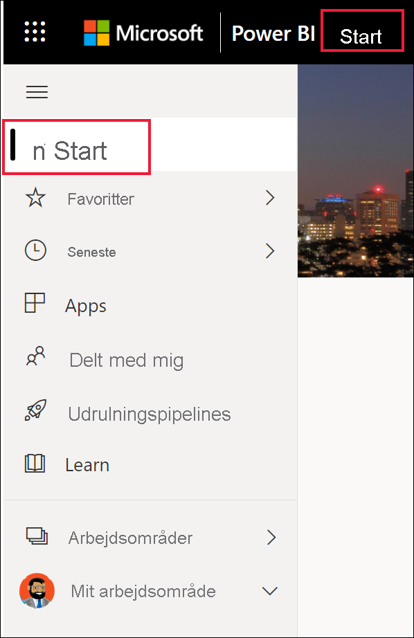
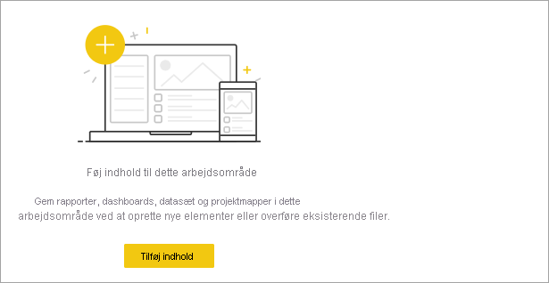
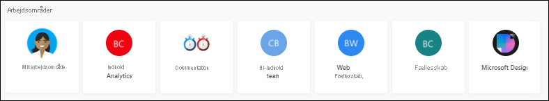
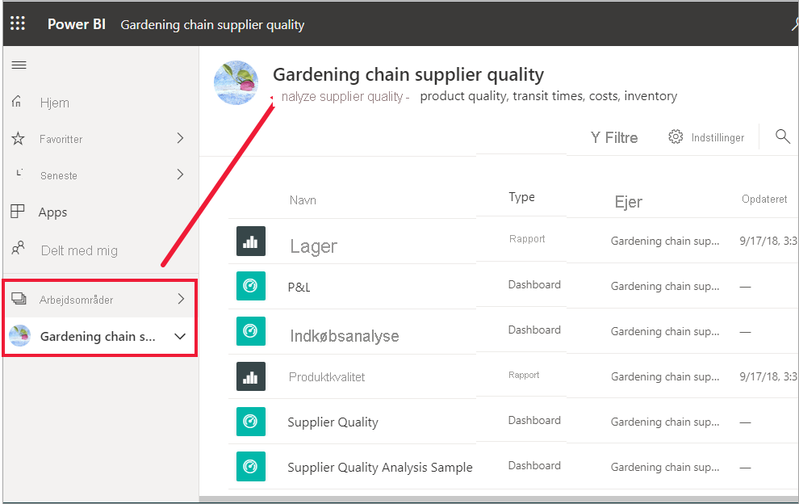
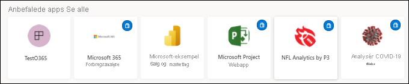
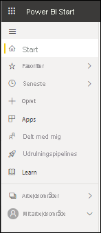

# Find dine dashboards, rapporter og apps

[!INCLUDE[consumer-appliesto-yynn](../includes/consumer-appliesto-yynn.md)]
I Power BI henviser begrebet *indhold* til apps, dashboards og rapporter. Indhold oprettes af Power BI-*designere*, der deler det med kolleger som dig. Dit indhold er tilgængeligt og kan ses i Power BI-tjenesten, og det bedste sted at begynde med at arbejde i Power BI er fra **startsiden** for Power BI.

## Udforsk Power BI Start
Når du er logget på Power BI-tjenesten, skal du vælge **Startside** i navigationsruden. 

Lærredet på startsiden vises i Power BI som vist på følgende billede. Startsidens layout og indhold i hjemmet er forskelligt for alle brugere. Senere i denne artikel vil vi se startsiden for en helt ny bruger og for en meget erfaren bruger. 
 

I Power BI Start kan du finde og få vist dit indhold på tre forskellige måder. De giver alle tre adgang til den samme indholdspulje, men er bare forskellige måder at komme til indholdet på. I nogle tilfælde vil søgningen være den nemmeste og hurtigste måde at finde noget på, men andre gange er det smartest at vælge et *kort* på lærredet for startsiden.

- Lærredet på startsiden giver dig mulighed for at se og organisere dit foretrukne, hyppigst anvendte, nyeste og anbefalede indhold sammen med apps og arbejdsområder.  Hvis du er ny bruger af Power BI-tjenesten, har du også et introduktionsafsnit. Vælg et kort eller et element på en liste for at åbne det.
- I venstre side findes navigationsruden. Markér  til udvidelse af navigationsruden. I navigationsruden er det samme indhold organiseret lidt anderledes, dvs. efter Favoritter, Seneste, Apps og Delt med mig. Herfra kan du få vist lister med indhold og vælge den, der skal åbnes.
- I øverste højre hjørne giver det globale søgefelt dig mulighed for at søge efter indhold efter titel, navn eller nøgleord.

I følgende emner gennemgås de enkelte muligheder for at søge efter og få vist indhold.

## Lærred på startsiden
Du kan se alt det indhold, du har tilladelse til at bruge, på lærredet for startsiden. Dit lærred for startsiden opdateres også med de anbefalede indholds- og læringsressourcer. I begyndelsen har du måske ikke så meget indhold på lærredet på startsiden, men det ændrer sig, i takt med at du begynder at bruge Power BI sammen med dine kolleger.

 
Når du arbejder i Power BI-tjenesten, modtager du dashboards, rapporter og apps fra kolleger, og Power BI Start bliver efterhånden fyldt ud. Med tiden kan den komme til at ligne nedenstående startside.

 
I de næste par emner ser vi nærmere på startsiden for en erfaren bruger oppefra og ned.

## Det vigtigste indhold lige ved hånden

### Favoritter og hyppige
Dette øverste afsnit indeholder links til det indhold, du besøger oftest, eller som du har mærket som [udvalgt eller favorit](end-user-favorite.md). Læg mærke til, at flere kort er forsynet med sorte stjerner – de er altså blevet markeret som favoritter. 

Derudover kan du mærke indhold som [fremhævet](end-user-featured.md). Vælg det dashboard eller den rapport, du forventer at se oftest, og angiv det som dit *foretrukne* indhold. Hver gang du åbner Power BI-tjenesten, bliver dit udvalgte dashboard vist først. 

### Udvalgt
Afsnittet **Udvalgt** består af indhold, som administratoren har *fremhævet* på fanen Hjem. Dette er normalt indhold, der er vigtigt for dig, og som du kan bruge til at udføre dit arbejde. I dette eksempel inkluderer det udvalgte indhold målepunkter til at spore succes.

### Seneste, Delt med mig og Mine apps
Det næste afsnit er en faneopdelt liste. 
- **Seneste** er det indhold, du har besøgt for nylig. Bemærk tidsstemplet på de enkelte elementer. 
- Kolleger deler apps med dig, men de kan også dele individuelle dashboards og rapporter. I afsnittet **Delt med mig** finder du dashboards og rapporter, som dine kolleger har delt med dig. 
- I afsnittet **Mine apps** vises de apps, der er blevet delt med dig, eller som du har [downloadet fra AppSource](end-user-apps.md). De nyeste apps vises her. 

### Arbejdsområder
Alle brugere af Power BI-tjenesten har et **Mit arbejdsområde**. Der er kun indhold i **Mit arbejdsområde**, hvis du har downloadet Microsoft-eksempler eller oprettet dine egne dashboards, rapporter eller apps. For mange *forretningsbrugere* er **Mit arbejdsområde** tomt og forbliver tomt. Hvis du er en helt ny bruger, skal du kun have ét arbejdsområde, nemlig **Mit arbejdsområde** 

Hvis du vælger dette ene arbejdsområde, kan du se, at det er tomt.

Hver gang du [downloader en app](end-user-app-marketing.md), eller en [app deles med dig](end-user-apps.md), oprettes der et nyt arbejdsområde. Med tiden kan du have mere end ét arbejdsområde. Du åbner et *apparbejdsområde* ved at vælge det på lærredet for startsiden. 

Appen åbnes på dit lærred, og du kan se navnet på arbejdsområdet i din navigationsrude. I arbejdsområder opdeler Power BI-tjenesten indholdet efter type: dashboards og rapporter. I nogle tilfælde har du også projektmapper og datasæt. Når du vælger et arbejdsområde, får du vist denne opdeling. I dette eksempel indeholder arbejdsområdet **Kædeleverandør til havearbejde** fire dashboards og to rapporter.

### Anbefalede apps
På basis af din aktivitet og dine kontoindstillinger viser Power BI et sæt anbefalede apps. Når du vælger en app, åbner kortet appen. Apps med det blå ikon er [skabelonapps](../connect-data/service-template-apps-overview.md).

 
### Læringsressourcer til at komme i gang
Hvilke ressourcer der vises, afhænger af dine aktiviteter og indstillinger og af Power BI-administratoren. Hvis du er ny bruger, vises afsnittet Introduktion øverst på startsiden. Hvis du er ny bruger, og du ikke længere vil have vist Introduktion øverst på startsiden, skal du vælge **Fastgør til bund**.
 
## Udforsk navigationsruden

Ved hjælp af navigationsruden klassificeres dit indhold på måder, der hjælper dig med hurtigt at finde det, du har brug for.  

Brug navigationsruden til at finde og flytte mellem dashboards, rapporter og apps. I nogle tilfælde er brugen af navigationslinjen den hurtigste måde at få adgang til indhold på. Navigationsruden er der, når du åbner landingssiden for startsiden, og forbliver der, efterhånden som du åbner andre områder i Power BI-tjenesten. Du kan skjule den ved at vælge ikonet Skjul  .
  
I navigationsruden organiseres dit indhold i objektbeholdere, der svarer til dem, du allerede har set på lærredet for startsiden: Favoritter, Seneste, Apps, Delt med mig og arbejdsområder. Ved hjælp af pop op-vinduer kan du vælge kun at få vist det nyeste indhold i hver af disse objektbeholdere, eller du kan navigere til indholdslister for at se alt indhold for de enkelte beholderkategorier.
 
- Vælg overskriften for at åbne et af disse indholdsafsnit og få vist en liste over alle elementer.
- Hvis du vil se de nyeste elementer i de enkelte objektbeholdere, skal du vælge pop op-vinduet ( **>** ).

    

 
Du kan også bruge navigationsruden til hurtigt at finde det ønskede indhold. Indhold er organiseret på en måde, der ligner lærredet for startsiden, men det vises på lister i stedet for på kort. 

## Søg i alt dit indhold
Nogle gange er den hurtigste måde at finde dit indhold på at søge efter det. Du har måske opdaget, at et dashboard, du ikke har brugt i et stykke tid, ikke vises på dit lærred for startsiden. Eller måske kommer du i tanke om, at din kollega, Aaron, har delt noget med dig, men du kan ikke huske, hvad han kaldte det, eller hvilken type indhold han delte, eller om det var et dashboard eller en rapport. Eller du kan have så meget indhold, at det er nemmere at søge efter det end at rulle eller sortere. 
 
Søgefeltet er placeret øverst til højre på startsidens menulinje. Du kan angive hele eller dele af navnet på dette dashboard og søge efter det. Du kan også angive dine kollegers navne og søge efter indhold, de har delt med dig. Søgningen er begrænset til at søge efter forekomster i alt det indhold, du ejer eller har adgang til.

## Næste trin
Oversigt over [grundlæggende begreber i Power BI](end-user-basic-concepts.md)

Indhold vises som enten et *kort* eller en liste. Kort har en titel og et ikon. Når du vælger et kort, åbnes det pågældende indhold.