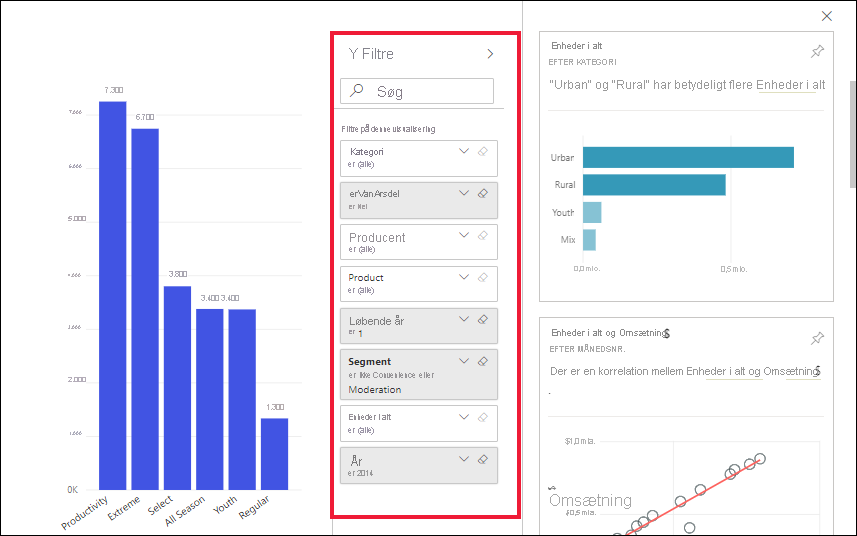

# Få vist dataindsigt på dashboardfelter med Power BI

[!INCLUDE[consumer-appliesto-yyny](../includes/consumer-appliesto-yyny.md)]

Hvert enkelt [visualiseringsfelt](end-user-tiles.md) på dashboardet er en indgang til at udforske data. Når du vælger et felt, åbnes en rapport, eller [Spørgsmål og svar åbnes](end-user-q-and-a.md), hvor du kan filtrere, sortere og fordybe dig i datasættet bag rapporten. Når du kører indsigt, udfører Power BI denne udforskning af data for dig.

Kør indsigt for at generere interessante interaktive visualiseringer på baggrund af dine data. Indsigt kan køres på et bestemt dashboardfelt, og du kan tilmed køre indsigt for en indsigt.

Funktionen Quick Insights er baseret på et voksende [sæt avancerede analytiske algoritmer](end-user-insight-types.md), der er udviklet sammen med Microsoft Research, som vi vil fortsætte med at bruge for at gøre det muligt for flere personer at finde indsigter i deres data på nye og intuitive måder.

## Kør indsigt på et dashboardfelt
Når du kører indsigt på et dashboardfelt, søger Power BI kun i de data, der bruges til at oprette dette enkelte dashboardfelt. 

1. [Åbn et dashboard](end-user-dashboards.md).
2. Peg på et felt. vælg **Flere indstillinger** (...), og vælg **Vis indsigt**. 

    

3. Feltet åbnes i [Fokustilstand](end-user-focus.md) med indsigtskortene vist langs højre.    
   
        
4. Er der en indsigt, der vækker din interesse? Vælg indsigtskortet for at udforske mere. Den valgte indsigt vises til venstre, og nye indsigtskort, som udelukkende er baseret på dataene i den enkelte indsigt, vises til højre.    

 ## Interager med indsigtskortene
Når du har åbnet en indsigt, kan du fortsætte med at udforske.

   * Filtrer visualiseringen på lærredet.  Du kan få vist filtrene ved at vælge pilen i det øverste højre hjørne for at udvide ruden Filtre.

      
   
   * Kør indsigt på selve indsigtskortet. Dette kaldes ofte **relateret indsigt**. Vælg et indsigtskort for at aktivere det. Det flyttes til venstre side af rapportlærredet, og nye kort, som udelukkende er baseret på dataene i den enkelte indsigt, vises til højre.
   
      
   
     
Vælg **Afslut Fokustilstand** i øverste venstre hjørne for at vende tilbage til din rapport.

## Overvejelser og fejlfinding
- **Vis indsigter** fungerer ikke med alle typer af dashboardfelter. Det er f.eks. ikke tilgængeligt for brugerdefinerede Power BI-visuals.<!--[Power BI visuals](end-user-custom-visuals.md)-->

## Næste trin

Kør indsigt på visualiseringer i rapporter [ved hjælp af funktionen Analysér](end-user-analyze-visuals.md)    
Få mere at vide om de [tilgængelige typer indsigter](end-user-insight-types.md)

