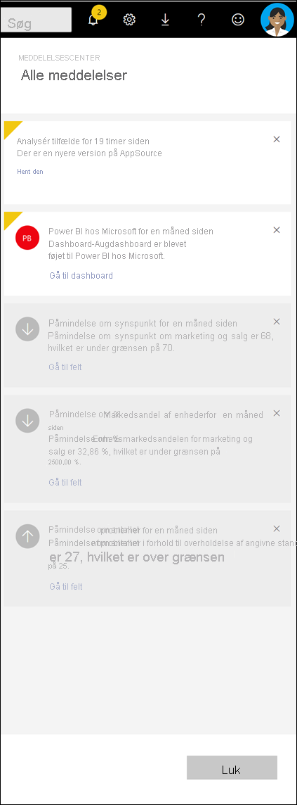

# Få vist Power BI-meddelelser

[!INCLUDE[consumer-appliesto-yynn](../includes/consumer-appliesto-yynn.md)]

Power BI-tjeneste holder styr på hændelser, der er opstået, siden den sidste gang du loggede på. Dette omfatter opdateringer til apps, vigtige beskeder, der er blevet udløst på dashboards, oplysninger om Power BI hændelser og møder og nyt indhold, der er føjet til arbejdsområder. En sekventiel liste over disse hændelser gemmes i dit *meddelelses Center*. 

Når du er klar til at gennemse dine meddelelser, skal du vælge klokke ikonet  . Dine meddelelser er angivet med de fleste nyere øverst. De viste elementer vises i grå, og de elementer, der ikke vises, fremhæves og har et gult hjørne.   

Se, hvordan Amanda gennemser, administrerer og besvarer meddelelser. Følg derefter vejledningen under videoen for selv at prøve det.    

> [!NOTE]
> I denne video vises en ældre version af Power BI-tjenesten. 

<iframe width="560" height="315" src="https://www.youtube.com/embed/bZMSv5KAlcE" frameborder="0" allowfullscreen></iframe>

## Se dine meddelelser
Når du logger på Power BI, føjes nye meddelelser, du har modtaget, mens du var offline, til dit feed. Hvis du har nye beskeder, viser Power BI en gul boble med antallet af nye elementer oven over ikonet for meddelelses centeret. Da meddelelses centeret er en del af den Power BI-tjeneste øverste menulinje, kan du åbne dine beskeder fra de fleste områder af Power BI-tjeneste, herunder: hjem, seneste, dashboards, rapporter, apps, arbejdsområder og Power BI spørgsmål&en skærm.

Der sendes meddelelser til dig af flere årsager, og ofte sendes der også en meddelelse til dig via mail. 
- Når en app er blevet opdateret, og den nyere version er tilgængelig
- Når der er føjet nyt indhold (f. eks. Dashboard, rapport) til et arbejdsområde
- Når der udløses [en besked](end-user-alerts.md) (beskeder kan angives i Power bi-tjeneste og også i Power bi mobile apps.))
- og meget mere

   
1. Vælg ikonet klokke på menulinjen Power BI-tjeneste. I dette eksempel har brugeren to nye meddelelser siden sidste gang, de åbnede meddelelses centeret.
   
   
2. Meddelelser vises med de nyeste øverst, og ulæste meddelelser er fremhævet. Meddelelser gemmes i 90 dage, medmindre du sletter dem hurtigere, eller når de når den maksimale grænse på 100.
   
   

3. Læs meddelelsen, og Udfør en handling. De fleste meddelelser indeholder et eller flere aktive links.  Nedenstående eksempel indeholder et link til et dashboard.

   

1. Når du ikke længere har brug for en meddelelse, skal du afvise den ved at vælge ikonet X.    

 
## Sådan annullerer du en meddelelse
Nogle meddelelser sendes automatisk af Power BI-tjeneste. Andre meddelelser oprettes af dine kollegaer eller af dig. Alle meddelelser kan slettes fra meddelelses centeret før du har læst dem. Hvis du f. eks. modtager bestemte meddelelser, eller hvis du ikke har brug for flere oplysninger, kan du annullere leveringen. 

For meddelelser, der er oprettet af dig eller dine kolleger, kan du annullere meddelelserne uden at slette det indhold, der refereres til. Hvis du f. eks. vil stoppe med at modtage en besked, hver gang din "det samlede daglige salg" er højere end $100, skal du [redigere eller annullere beskeden](end-user-alerts.md) fra dashboardet. Hvis din kollega har oprettet besked beskeden, kan du kontakte vedkommende og bede om at blive fjernet.

## Næste trin
* [Databeskeder i Power BI-tjenesten](end-user-alerts.md)
* [Indstil databeskeder i iPhone-appen (Power BI til iOS)](mobile/mobile-set-data-alerts-in-the-mobile-apps.md)
* [Indstil databeskeder i Power BI-mobilappen til Windows 10](mobile/mobile-set-data-alerts-in-the-mobile-apps.md)
* Har du flere spørgsmål? [Prøv at spørge Power BI-community'et](https://community.powerbi.com/)

