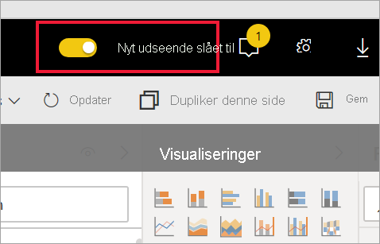
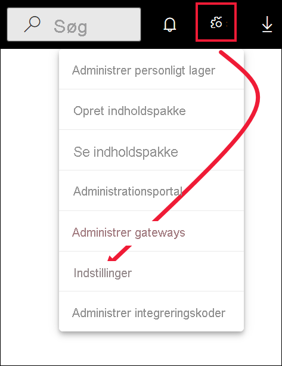

# Tilmeld dig prøveversionsfunktioner i Power BI-tjenesten

[!INCLUDE[consumer-appliesto-yynn](../includes/consumer-appliesto-yynn.md)]

## Hvad er *prøveversionsfunktioner*?
I takt med at vi foretager forbedringer af Power BI-tjenesten, frigiver vi nogle nye funktioner som *prøveversionsfunktioner*. Prøveversionsfunktioner kan slås til og fra, hvilket giver dig mulighed for at prøve dem.

Nogle prøveversionsfunktioner kan slås til og fra via dit Power BI-dashboard, din startside eller selve rapporten. Prøveversionsfunktionen **Nyt udseende** kan slås til og fra på Power BI-menulinjen, der vises over Hjem, rapporter og dashboards. 

   

Mens andre prøveversionsfunktioner bliver tilgængelige i menuen *Indstillinger*. I denne artikel kan du se, hvordan du får adgang til prøveversionsfunktioner via menuen Indstillinger.

## Find prøveversioner, og aktivér (deaktiver) dem
1. Åbn menuen Indstillinger ved at vælge tandhjulsikonet i øverste højre hjørne af Power BI-skærmen, og vælg **Indstillinger**.
   
   .
2. Vælg fanen **Generelt**. Hvis der er en prøveversion, kan du enten se en indstilling for **prøveversion** eller også vises en prøveversion til venstre.  I dette eksempel er der en prøveversion for ArcGIS Maps. 
   
   
3. Vælg alternativknappen **Til**, eller markér afkrydsningsfeltet for at prøve den nye oplevelse. Vælg derefter **Anvend**.
4. Du deaktiverer prøveversionsfunktioner ved at følge trin 1-3 ovenfor og vælge **Fra** i trin 3 eller ved at fjerne markeringen i afkrydsningsfeltet og vælge **Anvend**.

Har du spørgsmål eller feedback? [Besøg Power BI-communityforummet](https://community.powerbi.com/t5/Navigation-Preview-Forum/bd-p/NavigationPreview).

