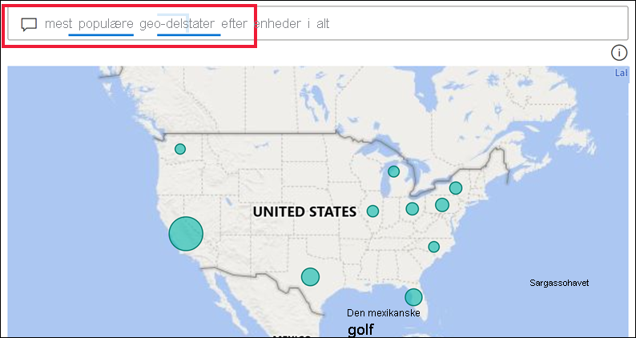
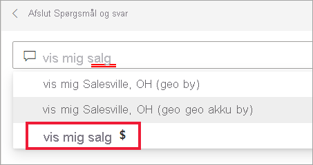
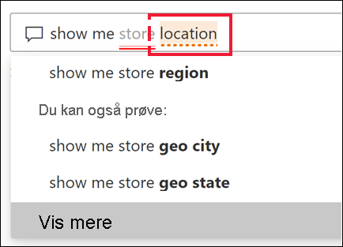
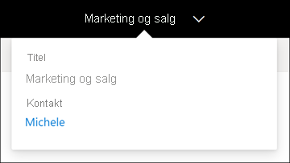
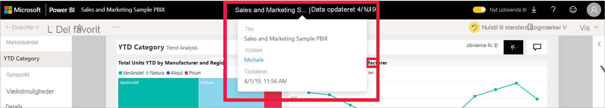

# Spørgsmål og svar til Power BI-erhvervsbrugere

[!INCLUDE[consumer-appliesto-yyny](../includes/consumer-appliesto-yyny.md)]

[!INCLUDE [power-bi-service-new-look-include](../includes/power-bi-service-new-look-include.md)]

## Hvad er Spørgsmål og svar?
Den hurtigste måde at få svar ud af dine data på er nogle gange at stille et spørgsmål på et naturligt sprog. For eksempel "Hvad var den samlede omsætning sidste år".

Brug Spørgsmål og svar til at udforske dine data ved hjælp af intuitive funktioner på et naturligt sprog, og få svar i form af diagrammer og grafer. Spørgsmål og svar adskiller sig fra en søgemaskine – Spørgsmål og svar giver kun resultater om dataene i Power BI.

## Hvilken visualisering bruger Spørgsmål og svar?
Spørgsmål og svar vælger den bedste visualisering baseret på de data, der bliver vist. Nogle gange er data i det eller de underliggende datasæt defineret som en bestemt type eller kategori, og det hjælper Spørgsmål og svar med at vide, hvordan de skal vises. Hvis data f.eks. er defineret som en datotype, er det mere sandsynligt, at de vises som et kurvediagram. For data, der er kategoriseret som en by, er det mere sandsynligt, at de vises som et kort.

Du kan også fortælle Spørgsmål og svar, hvilken visualisering der skal bruges, ved at føje den til dit spørgsmål. Men husk, at det ikke altid er muligt for Spørgsmål og svar at vise dataene i den ønskede visualiseringstype. Spørgsmål og svar viser en prompt med en liste over visualiseringstyper, du kan arbejde med.

## Hvor kan jeg bruge Spørgsmål og svar?
Du finder Spørgsmål og svar på dashboards i Power BI-tjenesten og nederst på dashboardet i Power BI Mobil. Medmindre designeren har givet dig redigeringstilladelser, kan du bruge Spørgsmål og svar til at udforske data, men ikke gemme visualiseringer, der er oprettet ved hjælp af Spørgsmål og svar.

Du finder også Spørgsmål og svar i rapporter, hvis *designeren* af rapporten har tilføjet en [visualisering til Spørgsmål og svar](../visuals/power-bi-visualization-q-and-a.md).   

## Spørgsmål og svar på dashboards

**Spørgsmål og svar til Power BI** er tilgængelig med en Pro- eller Premium-licens.  [Spørgsmål og svar i Power BI-mobilapps](mobile/mobile-apps-ios-qna.md) og [Spørgsmål og svar med Power BI Embedded](../developer/embedded/qanda.md) behandles i særskilte artikler. På nuværende tidspunkt understøtter **Spørgsmål og svar i Power BI** kun besvarelse af spørgsmål på et naturligt sprog på engelsk, men der findes en prøveversion til spansk, som kan aktiveres af Power BI-administratoren.

At stille spørgsmålet er kun begyndelsen.  Nyd det, mens du suser gennem dine data og tilpasser eller udvider dit spørgsmål, opdager pålidelige nye oplysninger, fokuserer på detaljer og zoomer ud for at få et større overblik. Du bliver henrykt over de nye indblik og opdagelser, du gør.

Oplevelsen er virkelig interaktiv ... og hurtig! Med lager i hukommelsen som drivkraft får du næsten øjeblikkeligt svar.

## Brug Spørgsmål og svar på et dashboard i Power BI-tjenesten
I Power BI-tjenesten (app.powerbi.com) indeholder et dashboard felter, der er fastgjort fra et eller flere datasæt, så du kan stille spørgsmål om alle dataene, der er indeholdt i alle disse datasæt. Hvis du vil se, hvilke rapporter og datasæt der blev brugt til at oprette dashboardet, skal du vælge **Få vist relateret indhold** på rullelisten **Flere handlinger**.

## Hvordan starter jeg?
Først skal du blive bekendt med indholdet. Se nærmere på visualiseringerne på dashboardet og i rapporten. Få en fornemmelse af typen og rækken af data, der er tilgængelig for dig. 

Eksempel:

* Hvis en visualiserings aksemærkater og værdier omfatter "salg", "konto", "måned" og "muligheder", kan du med sikkerhed stille spørgsmål som: "Hvilken *konto* har den højeste *mulighed*, eller vis *salg* efter måned som et liggende søjlediagram."

* Hvis du har data om et websteds ydeevne i Google Analytics, kan du spørge Spørgsmål og svar om, hvor meget tid der er brugt på en webside, antallet af entydige besøg på siden og brugerengagement. Eller hvis du forespørger på demografiske data, kan du stille spørgsmål om alder og indkomst i husholdningen efter placering.

Når du er fortrolig med dataene, kan du vende tilbage til dashboardet og placere markøren i spørgsmålsfeltet. Dette åbner skærmen Spørgsmål og svar.

 

Selv inden du begynder at skrive, viser Spørgsmål og svar en ny skærm med forslag som hjælp til at udforme dit spørgsmål. Du får vist udtryk og spørgsmål, der indeholder navnene på tabellerne i de underliggende datasæt, og du kan muligvis tilmed se *udvalgte* spørgsmål, der er oprettet af ejeren af datasættet.

Du kan vælge et af dem for at føje dem til feltet med spørgsmål og derefter tilpasse dem, så de finder et bestemt svar. 

 

Power BI kan også hjælpe dig med at stille spørgsmål ved hjælp af funktioner som prompter, automatisk fuldførelse og tip til visuals. Power BI omfatter denne hjælp til spørgsmål og svar i dashboards og i visualiseringen til Spørgsmål og svar. Disse funktioner beskrives nærmere nedenfor i afsnittet [Opret en visualisering til Spørgsmål og svar ved at skrive en forespørgsel på et naturligt sprog](#create-a-visual-using-your-own-qa-question)

## Visualiseringen til Spørgsmål og svar i Power BI-rapporter

Visualiseringen til Spørgsmål og svar giver dig mulighed for at stille spørgsmål på et naturligt sprog og få svar i form af en visualisering. Visualiseringen til Spørgsmål og svar fungerer som en hvilken som helst anden visualisering i en rapport. Den kan krydsfiltreres/-fremhæves, og den understøtter også bogmærker og kommentarer. 

Du kan identificere en visualisering til Spørgsmål og svar på spørgsmålsfeltet øverst. Det er her, du angiver eller skriver spørgsmål ved hjælp af et naturligt sprog. Visualiseringen til Spørgsmål og svar kan bruges igen og igen til at stille spørgsmål om dine data. Når du forlader rapporten, nulstilles visualiseringen til Spørgsmål og svar til standardindstillingen. 

## Brug Spørgsmål og svar 
Hvis du vil bruge Spørgsmål og svar på et dashboard eller bruge visualiseringen til Spørgsmål og svar i en rapport, skal du enten vælge et af de foreslåede spørgsmål eller skrive dit eget spørgsmål på et naturligt sprog. 

### Opret en visualisering ved hjælp af et foreslået spørgsmål

Her har vi valgt **de mest populære geo-stater efter samlet antal enheder**. Power BI gør sit bedste for at vælge den visualiseringstype, der skal bruges. I dette tilfælde er det et grundlæggende kort.

Men du kan fortælle Power BI, hvilken visualiseringstype du vil bruge, ved at føje den til din forespørgsel på et naturligt sprog. Vær opmærksom på, at det ikke er alle visualiseringstyper, der vil fungere eller give mening for dine data. Disse data ville f.eks. ikke resultere i et meningsfyldt punktdiagram. Men de fungerer som et kartogram.

Hvis du er usikker på, hvilken type spørgsmål du skal stille, eller hvilken terminologi du skal bruge, skal du udvide **Vis alle forslag** eller gennemse de andre visualiseringer i rapporten. På den måde bliver du bekendt med begreberne og indholdet i datasættet.

### Opret en visualisering ved hjælp af dit eget spørgsmål i Spørgsmål og svar

1. Skriv dit spørgsmål i feltet til Spørgsmål og svar ved hjælp af et naturligt sprog. I takt med at du skriver dit spørgsmål, hjælper Power BI dig med autofuldførelse, tip til visuals og feedback.

    **Autofuldførelse** – I takt med at du skriver dit spørgsmål, kan Spørgsmål og svar i Power BI vise relevante og kontekstafhængige forslag, der kan hjælpe dig med hurtigt at blive produktiv med et naturligt sprog. I takt med at du skriver, får du øjeblikkelig feedback og resultater. Oplevelsen svarer til at skrive i en søgemaskine.

    I dette eksempel vil vi bruge det sidste forslag. 

    

    **Ubrudte og stiplede understregninger** – I Spørgsmål og svar i Power BI Q & vises der ord med understregninger, så du kan se, hvilke ord der blev genkendt eller ikke genkendt i Power BI. 

    En ubrudt blå understregning angiver, at ordet blev genkendt i Power BI. I eksemplet nedenfor kan du se, at udtrykkene **sales fact sentiment** og **region** genkendes af Spørgsmål og svar.

    

    Et rød dobbeltunderstregning angiver et ord, som slet ikke genkendes af Power BI. Et eksempel kan være brugen af ordet "geografi", selvom det ikke findes nogen steder i dataene. Ordet findes i den danske ordbog, men det markeres med en rød understregning i Spørgsmål og svar. Spørgsmål og svar i Power BI kan ikke oprette en visualisering og foreslår, at du beder Rapportdesigner om at tilføje ordet.  

    

    Hvis der er usikkerhed omkring et ord i Power BI, vises der en stiplet understregning. Vælg ordet for at se en liste over forslag. Et eksempel kunne være ordet "Placering". Flere felter kan indeholde ordet "Placering", så systemet beder dig om at vælge det felt, du mener.  

    

    
    
    Spørgsmål og svar i Power BI genkender ord, der betyder det samme, takket være integrationen med Bing og Office. Ordet understreges i Spørgsmål og svar, så du ved, at det ikke er et direkte match

    

    **Forslag** – I takt med at du skriver mere af spørgsmålet, giver Power BI dig besked, hvis spørgsmålet ikke er forstået, og forsøger at hjælpe. I eksemplet nedenfor vises der forslag til to forskellige felter, der genkendes som 'VanArsdel' i Power BI. 

    

    Når du har valgt Power BI's korrektion, kan du se, at alle ord er genkendt og understreget med blåt. Dine resultater vises som et kurvediagram. 

    

    Du kan dog ændre kurvediagrammet til en anden visualiseringstype.  

    

## Overvejelser og fejlfinding

**Spørgsmål**: Jeg kan ikke se Spørgsmål og svar på dette dashboard.    
**Svar 1**: Hvis du ikke kan se et spørgsmålsfelt, skal du starte med at kontrollere dine indstillinger. Det gør du ved at vælge tandhjulsikonet i øverste højre hjørne af Power BI-værktøjslinjen eller i rullemenuen **Flere indstillinger (...).   

Vælg derefter **Indstillinger** > **Dashboards**. Kontrollér, at der er en markering ud for **Vis søgefeltet for Spørgsmål og svar på dette dashboard**.    
  

**Svar 2:** Nogle gange har du ikke adgang til indstillingerne. Hvis ejeren af dashboardet eller din administrator har slået Spørgsmål og svar fra, kan du spørge vedkommende, om det er OK at slå det til igen. Hvis du vil slå ejeren op, skal du vælge dashboardets navn på den øverste menulinje.

    

**Spørgsmål**: Jeg får ikke de resultater, jeg gerne vil se, når jeg skriver et spørgsmål.    
**Svar**: Vælg muligheden for at kontakte ejeren af rapporten eller dashboardet. Du kan gøre dette direkte fra siden Dashboard til Spørgsmål og svar eller visualisering til Spørgsmål og svar. Du kan også slå ejeren op i Power BI-headeren.  Ejeren kan gøre mange ting for at forbedre resultaterne i Spørgsmål og svar. Ejeren kan f.eks. omdøbe kolonner i datasættet, så der bruges begreber, som er nemme at forstå (`CustomerFirstName` i stedet for `CustFN`). Da ejeren kender datasættet virkelig godt, kan vedkommende også komme med nyttige spørgsmål og føje dem til foreslåede spørgsmål i Spørgsmål og svar.

## Beskyttelse af personlige oplysninger

Microsoft kan bruge dine spørgsmål til at forbedre Power BI. Gennemse [Microsofts erklæring om beskyttelse af personlige oplysninger](https://go.microsoft.com/fwlink/?LinkId=521839) for at få flere oplysninger.

## Næste trin
Du kan få mere at vide om, hvordan en visualisering til Spørgsmål og svar oprettes og administreres af *designeren* af rapporten, i [Visualiseringstype til Spørgsmål og svar](../visuals/power-bi-visualization-q-and-a.md).
