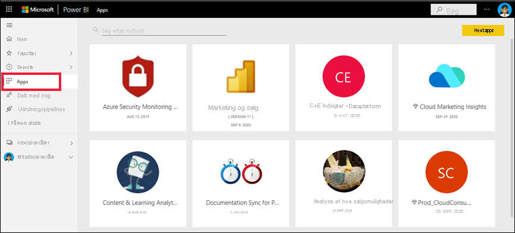
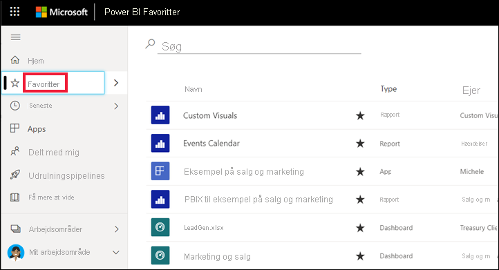
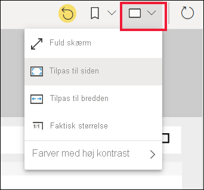

# Hurtig start: Få mere at vide om Power BI-funktionalitet til *virksomhedsbrugere*

[!INCLUDE[consumer-appliesto-ynny](../includes/consumer-appliesto-ynny.md)]

I denne hurtige introduktion får du mere at vide om, hvordan du interagerer med Power BI for at få datadrevet forretningsindsigt. Denne artikel er ikke beregnet som en detaljeret gennemgang, men mere som en hurtig gennemgang af mange af de handlinger, der er tilgængelige til Power BI-**virksomhedsbrugere**.

Hvis du ikke er tilmeldt Power BI, kan du [tilmelde dig en gratis prøveversion](https://app.powerbi.com/signupredirect?pbi_source=web), før du begynder.

## Hvad er Power BI? 
Power BI er en samling af softwaretjenester, apps og forbindelser, der arbejder sammen for at forvandle usammenhængende data til faste, visuelt fordybende og interaktive indsigter. Uanset om dataene er et enkelt Excel-regneark eller en samling data fra forskellige datakilder, så giver Power BI dig let adgang til at oprette forbindelse til dine datakilder, visualisere (eller granske) vigtige elementer og dele indholdet med alle. 

Åbn Power BI-tjenesten i en browser eller på en mobilenhed. Du og dine kolleger arbejder fra de samme apps, dashboards og rapporter, der er tillid til, som opdateres automatisk, så du altid arbejder med det nyeste indhold.   

## Læsevisning
Der er to muligheder for at interagere med rapporter i Power BI-tjenesten: Redigeringsvisning og Læsevisning.  Hvis du er *virksomhedsbruger*, er det mere sandsynligt, at du bruger Læsevisning, når du bruger rapporter, der er oprettet af andre. Redigeringsvisning bruges af *rapportdesignere*, der opretter rapporterne og deler dem med dig. Læsevisning er din måde at udforske og interagere med rapporter på, som er oprettet af kolleger. 

Selv i Læsevisning er indholdet ikke statisk. Du kan se nærmere på dataene, se efter tendenser, få indsigt og anden business intelligence. Opdel indholdet, og stil selv spørgsmål til det med dine egne ord. Eller læn dig tilbage, og lad dine data finde interessant indsigt for dig: Give dig besked, når data ændres, og sende rapporter til dig via mail efter en tidsplan, som du har angivet. Alle dine data, når som helst, i cloudmiljøet eller i det lokale miljø og fra alle enheder. 

Læs videre for at få mere at vide om dem og meget mere.

## Power BI-indhold
Når vi bruger termen "indhold" i Power BI, henviser vi til rapporter, dashboards og apps. Det er de byggesten, du skal bruge til at udforske dine data og træffe forretningsbeslutninger. 

> [!NOTE]
> Dashboards, rapporter og apps kan også vises og deles på mobilenheder.

###  Apps

En *app* er en Power BI-indholdstype, der kombinerer relaterede dashboards og rapporter på ét sted. En app kan have et eller flere dashboards og en eller flere rapporter, der alle er samlet. Apps oprettes af Power BI-*designere*, der distribuerer og deler apps med *virksomhedsbrugere* som dig. 

En måde at få vist dine apps på er ved at vælge **Apps** i navigationsruden og vælge en app, der skal åbnes.

Du kan få mere at vide om visning af apps i [Power BI-apps](end-user-apps.md)

### Rapporter

En Power BI-rapport er en visning med flere perspektiver af et datasæt med visualiseringer, som repræsenterer forskellige resultater og indsigter fra dette datasæt. En rapport kan indeholde en enkelt visualisering eller sider fulde af visualiseringer. Rapporter oprettes af Power BI-*designere*, der distribuerer og deler rapporterne med *virksomhedsbrugere* som dig.

Hvis du vil vide, hvordan du får vist rapporter, skal du se [Power BI-rapporter](end-user-reports.md)

### Dashboards

Et Power BI-dashboard er en enkelt side, der ofte kaldes et lærred, hvor der bruges visualiseringer til at fortælle en historie. Da det er begrænset til én side, indeholder et dashboard, der er godt designet, kun de vigtigste elementer fra historien.

De visualiseringer, du kan se på dashboardet, kaldes felter og er fastgjort til dashboardet af rapport*designerne*. I de fleste tilfælde kommer du til den rapportside, hvor visualiseringen blev oprettet, når du vælger et felt. 

Hvis du vil vide mere at vide om, hvordan du får vist dashboards, skal du se [Power BI-dashboards](end-user-dashboards.md)
 
## Interager i Power BI-tjenesten

### Samarbejd med kollegaer
Spring mailen over. Tilføj en personlig kommentar, eller start en samtale med kolleger om et dashboard direkte på dashboardet. Kommentarfunktionen er bare én af de måder, du kan samarbejde med sine kolleger på. 

Få mere at vide om [kommentering](end-user-comment.md)

### Læn dig tilbage, og lad Power BI gøre arbejdet
To af de måder, Power BI-tjenesten udfører arbejdet for dig på, er med abonnementer og beskeder. 

#### Abonner på et dashboard (eller en rapport)
Det er ikke nødvendigt at åbne Power BI for at overvåge et dashboard.  Du kan abonnere i stedet for, så Power BI mailer dig et snapshot af det pågældende dashboard iht. en tidsplan, du har angivet. 

 Få mere at vide om [Power BI-abonnementer](end-user-subscribe.md)

#### Få beskeder, når dine data når en tærskel
Dine data er online, og dine visualiseringer opdateres automatisk for at afspejle dette. Hvis du vil have besked, når data kommer over eller under en tærskel, du har angivet, skal du bruge databeskeder. Beskeder fungerer på målere, KPI'er og kort.    

Power BI sender dig en mail, når værdien kommer over eller under den grænse, du har angivet.  

Få mere at vide om [Power BI-advarsler](end-user-alerts.md)

### Brug Spørgsmål og svar til at stille spørgsmål på et naturligt sprog
Den hurtigste måde at få svar ud af dine data på er nogle gange at stille et spørgsmål på et naturligt sprog. Spørgefeltet i Spørgsmål og svar er placeret øverst i dit dashboard. Eksempel: "vis mig antallet af store salgsmuligheder efter salgsfase som en tragt." 

Få mere at vide om [Power BI Spørgsmål og svar](end-user-q-and-a.md)

### Få vist detaljer på en visualisering
Visualiseringer består af datapunkter, og ved at holde musen over et datapunkt kan du få vist detaljerne.

### Gør et dashboard til favorit
Når du gør indhold til en *favorit*, kan du få adgang til det via [Hjem](end-user-home.md) og navigationsruden. Navigationsruden er synlig fra næsten alle områder i Power BI-tjenesten. Favoritter er normalt de dashboards, rapportsider og apps, du besøger oftest.

Hvis du vil gemme indhold som en favorit, skal du vælge stjerneikonet i øverste højre hjørne i Power BI-tjenesten. 
   

Hvis du vil se dine favoritter, skal du vælge **Favoritter** i navigationsruden.

Se nærmere på de andre handlinger, der er tilgængelige på menulinjen.  Vi dækker ikke alle disse i denne artikel, men vi dækker dem i andre artikler.  Få mere at vide ved at bruge indholdsfortegnelsen til Power BI eller **søgefeltet**. 

Få mere at vide om [foretrukne og udvalgte](end-user-favorite.md)

### Tilpas visningsdimensionerne
Rapporter vises på mange forskellige enheder med forskellig skærmstørrelse og størrelsesforhold.  Standardgengivelsen er måske ikke lige det, du ønsker at se på din enhed.  

Hvis du vil justere, skal du vælge ikonet **Vis** på den øverste højre menulinje og vælge en af visningsindstillingerne. 

### Se, hvordan alle visualiseringerne på en side er forbundet
Foretag tværgående fremhævning og tværgående filtrering af de relaterede visualiseringer på en rapportside. De visuelle effekter på en enkelt rapportside er alle indbyrdes "forbundet".  Det betyder, at hvis du vælger én eller flere værdier i en visualisering, ændres andre visualiseringer, der bruger den samme værdi, på baggrund af din markering.

> 

Få mere at vide om [visuelle interaktioner](end-user-interactions.md)

<!-- ###  Open the **Selection** pane
Easily navigate between the visualizations on the report page. 

1. Select **View > Selection pane** to open the Selection pane. Toggle **Selection pane** to On.

    

2. The Selection pane opens on your report canvas. Select a visual from the list to make it active.

     -->

### Zoom ind på individuelle visuelle elementer
Peg på en visuel gengivelse, vælg ikonet **Fokuseringstilstand**, og . Når du får vist en visualisering i fokuseringstilstand, udvides den, så den fylder hele rapportlærredet som vist nedenfor.

Vælg **Fuld skærm** fra rullelisten Vis for at få vist den samme visualisering uden forstyrrende menulinjer, filterruder med mere.   

Få mere at vide om [fokustilstand og fuldskærmsvisning](end-user-focus.md)

### Sortér en visualisering
Visualiseringer på en rapportside kan sorteres og gemmes sammen med dine anvendte ændringer. 

Hold over en visualisering for at gøre den aktiv, og vælg **Flere indstillinger** (...) for at åbne sorteringsindstillingerne.

 

Få mere at vide om [sortering af visualiseringer](end-user-search-sort.md)

### Få vist de data, der bruges til at oprette en visualisering
En Power BI-visualisering oprettes vha. data fra underliggende datasæt. Hvis du vil se bag kulisserne, kan du i Power BI *få vist* de data, der bruges til at oprette visualiseringen. Når du vælger **Vis som en tabel**, vises dataene under (eller ud for) visualiseringen i Power BI.

Mens en visualisering er aktiv, skal du vælge **Flere indstillinger** (...) og vælge **Vis som en tabel**.
   
   

### Eksportér data til Excel
Ud over at vise de data, der bruges til at oprette en visualisering, kan du også eksportere dataene og få dem vist i Microsoft Excel. Når du eksporterer til Excel, opretter du et separat dokument, et regneark, som ikke er en del af Power BI. De ændringer, du foretager i Excel-filen, påvirker ikke dataene i Power BI. Power BI giver dig fleksibilitet, uanset om du vil se nærmere på dataene eller bruge dataene i et andet program eller til et andet formål.

<!-- Exporting isn't limited to individual visuals; you can export entire reports to PowerPoint or PDF to share with your colleagues.

 -->

Dette har været et hurtigt overblik over nogle af de ting, *virksomhedsbrugere* kan udføre med Power BI-tjenesten.  

## Fjern ressourcer
- Hvis du har oprettet forbindelse til en app, skal du via navigationsruden vælge **Apps** for at åbne indholdslisten Apps. Hold markøren over den app, du vil slette, og vælg affaldsspandsikonet.

- Hvis du har importeret eller oprettet forbindelse til en eksempelrapport i Power BI skal du åbne **Mit arbejdsområde** i navigationsruden. Ved hjælp af fanerne øverst skal du finde dashboardet, rapporten og datasættet og vælge affaldsspandsikonet for hver enkelt.

## Næste trin
[Power BI til virksomhedsbrugere](end-user-consumer.md)

