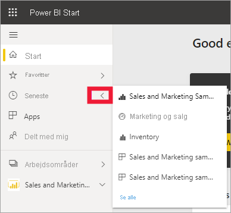
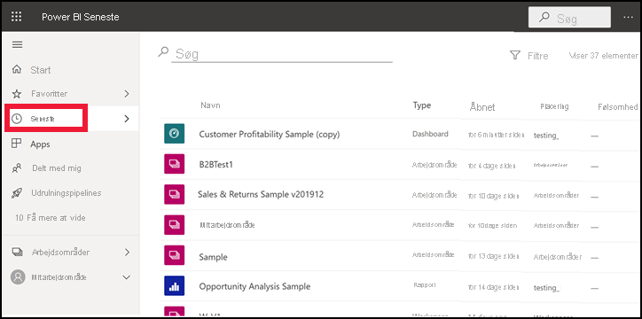

# **Seneste** indhold i Power BI-tjenesten

[!INCLUDE[consumer-appliesto-yyny](../includes/consumer-appliesto-yyny.md)]

**Seneste indhold** er de seneste elementer, du har fået vist i Power BI-tjenesten. Dette omfatter: dashboards, rapporter, apps og projektmapper. Når du vælger **Seneste** på navigationslinjen, vises dette indhold i faldende rækkefølge efter dato i Power BI.  Hvis du vil ændre sorteringsrækkefølgen, skal du vælge en af overskrifterne og vælge stigende eller faldende.

Bemærk, at to elementer er [favoritter](end-user-favorite.md), hvilket vises med et stjerneikon. Og et enkelt element, Eksempel på kunderentabilitet, er gemt i [Premium-kapacitet](end-user-license.md).

## Se dine fem nyeste

Hvis du kun vil se de fem elementer, du senest har besøgt, skal du vælge pilen til højre for **Seneste** i navigationsruden.  Her skal du vælge indhold for at åbne det. 

## Se alt dit seneste indhold

Hvis du har mere end fem elementer, du har besøgt for nylig, skal du vælge **Se alle** for at åbne skærmen **Seneste**. Som vi gjorde i starten af denne artikel, kan du springe over pop op-vinduet og åbne skærmbilledet **Seneste** ved at vælge ordet **Seneste** eller det tilhørende ikon  fra navigationsruden.

## Søg efter og sortér din liste over det seneste indhold

Hvis dine lister bliver lange, kan du [bruge søgefeltet og sortering til at finde det, du har brug for](end-user-search-sort.md). Hvis du vil finde ud af, om en kolonne kan sorteres, skal du holde over den for at se, om der vises en pil. Hvis du i dette eksempel peger på **Type** vises der en pil – dit seneste indhold kan sorteres alfabetisk efter indholdstype. 

Se Amanda demonstrere, hvordan indholdslisterne for **Seneste** udfyldes i Power BI-tjenesten, og følg derefter den trinvise vejledning under videoen for at prøve det selv.

<iframe width="560" height="315" src="https://www.youtube.com/embed/G26dr2PsEpk" frameborder="0" allowfullscreen></iframe>

> [!NOTE]
> I denne video bruges en ældre version af Power BI-tjenesten.

<!--
## Actions available from the **Recent** content list
The actions available to you will depend on the settings assigned by the content *designer*. Some of your options may include:
* Select the star icon to [favorite a dashboard, report, or app](end-user-favorite.md) .
* Some dashboards and reports can be re-shared  .
* [Open the report in Excel](end-user-export.md)  
* [View insights](end-user-insights.md) that Power BI finds in the data . -->

## Næste trin
[Power BI-tjenesteapps](end-user-apps.md)

Har du flere spørgsmål? [Prøv at spørge Power BI-community'et](https://community.powerbi.com/)

