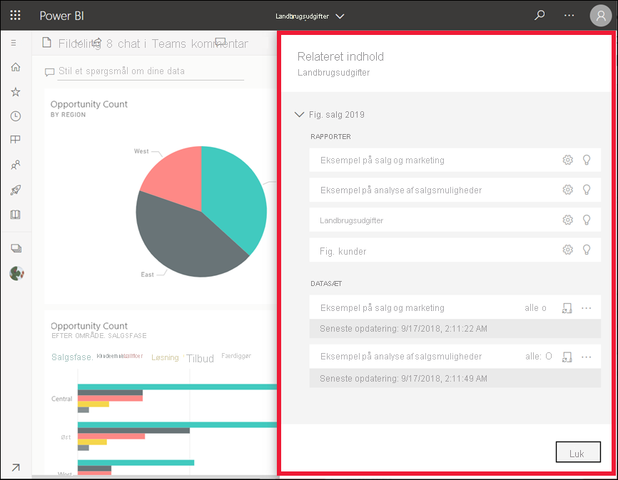
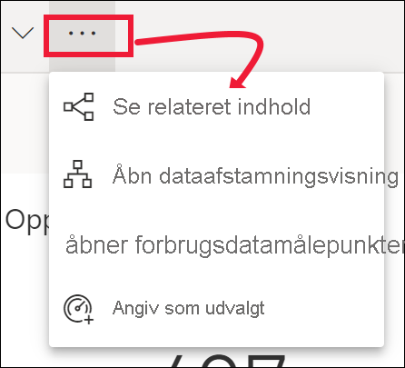

# Se relateret indhold i Power BI-tjenesten

[!INCLUDE[consumer-appliesto-yyny](../includes/consumer-appliesto-yyny.md)]

[!INCLUDE [power-bi-service-new-look-include](../includes/power-bi-service-new-look-include.md)]

Ruden **Relateret indhold** viser, hvordan din Power BI-tjenestes indhold – dashboards, rapporter og datasæt – er forbundet. Ruden **Relateret indhold** er også startstedet til at udføre en handling. Herfra kan du gøre forskellige ting, f.eks. at åbne et dashboard, åbne en rapport, generere indsigt, analysere dataene i Excel m.m.  

I Power BI-tjenesten er rapporter baseret på datasæt, rapportens visualiseringer er fastgjort til dashboards, og dashboardets visualiseringer linker tilbage til rapporter. Men hvordan ved du, hvilke dashboards der er vært for visualiseringer fra din marketingrapport? Og hvordan finder du disse dashboards? Bruger dashboardet Indkøb visualiseringer fra mere end ét datasæt? Hvis det er tilfældet, hvad hedder de så, og hvordan kan du åbne og redigere dem? Bruges dit HR-datasæt overhovedet i nogen rapporter eller på nogen dashboards? Eller kan det flyttes, uden at det medfører brudte links? Denne slags spørgsmål kan du få svar i ruden **Relateret indhold**.  Ruden viser ikke kun relateret indhold, den gør det også muligt for dig at udføre handlinger på indholdet og let navigere mellem relateret indhold.

> [!NOTE]
> Funktionen Relateret indhold virker ikke med streamingdatasæt.
> 
> 

## Se relateret indhold for et dashboard eller en rapport
Se Will få vist relateret indhold for et dashboard. Følg derefter de trinvise instruktioner under videoen for selv at prøve det med eksemplet på indkøbsanalyse.

> [!NOTE]
> Denne video er baseret på en tidligere version af Power BI-tjenesten. 

<iframe width="560" height="315" src="https://www.youtube.com/embed/B2vd4MQrz4M#t=3m05s" frameborder="0" allowfullscreen></iframe>

Med et dashboard eller en rapport åben skal du vælge **Flere indstillinger** (...) på menulinjen og vælge **Se relateret indhold** på rullelisten.

Ruden **Relateret indhold** åbnes. I forbindelse med et dashboard vises alle de rapporter, der har visualiseringer fastgjort til dashboardet, og deres tilknyttede datasæt i ruden. For dette dashboard er der kun fastgjort visualiseringer fra én rapport, og den rapport er kun baseret på ét datasæt. Hvis du ser på billedet i starten af denne artikel, kan du se relateret indhold for et dashboard, der har visualiseringer fastgjort fra fire rapporter, og to datasæt.

Herfra kan du udføre handlinger direkte ud fra det relaterede indhold, afhængigt af dine tilladelser.  Vælg f.eks. navnet på en rapport eller et dashboard for at åbne den eller det.  For en angivet rapport kan du vælge et ikon for at åbne og redigere indstillingerne for rapporten, [få indsigt](end-user-insights.md) og meget mere. For et datasæt kan du gennemse den seneste opdateringsdato og det seneste opdateringstidspunkt, [analysere i Excel](../collaborate-share/service-analyze-in-excel.md), [få indsigt](end-user-insights.md), opdatere og meget mere.  

<!-- ## See related content for a dataset
You'll need at least *view* permissions to a dataset to open the **Related content** pane. In this example, we're using the [Procurement Analysis sample](../create-reports/sample-procurement.md).

From the nav pane, locate the **Workspaces** heading and select a workspace from the list. If you have content in a workspace, it will display in the canvas to the right. 

In a workspace, select the **Datasets** tab and locate the **See related** icon .

Select the icon to open the **Related content** pane.

From here, you can take direct action on the related content. For example, select a dashboard or report name to open it.  For any dashboard in the list, select an icon to [share the dashboard with others](../collaborate-share/service-share-dashboards.md) or to open the **Settings** window for the dashboard. For a report, select an icon to [analyze in Excel](../collaborate-share/service-analyze-in-excel.md), [rename](../create-reports/service-rename.md), or [get insights](end-user-insights.md).  -->

## Begrænsninger og fejlfinding
* Hvis du ikke kan se "Se relateret", skal du i stedet kigge efter . Vælg ikonet for at åbne ruden **Relateret indhold**.
* Hvis du vil åbne relateret indhold for en rapport, skal du være i [Læsevisning](end-user-reading-view.md).
* Funktionen til relateret indhold fungerer ikke til streaming af datasæt.

## Næste trin
* [Introduktion til Power BI-tjenesten](../fundamentals/service-get-started.md)
* Har du flere spørgsmål? [Prøv at spørge Power BI-community'et](https://community.powerbi.com/)
