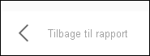

# Vis data med Power BI-rapporter

[!INCLUDE[consumer-appliesto-yyny](../includes/consumer-appliesto-yyny.md)]

[!INCLUDE [power-bi-service-new-look-include](../includes/power-bi-service-new-look-include.md)]

En Power BI-visualisering oprettes vha. data fra underliggende datasæt. Hvis du er interesseret i et kig bag kulissen, kan du med Power BI-tjenesten *få vist* de data, der bruges til at oprette en visualisering i en rapport. Når du vælger **Vis som en tabel**, vises dataene under (eller ud for) visualiseringen i Power BI.

På et dashboard kan du få vist de underliggende data ved at bruge [Eksportér til Excel](end-user-export.md)

## Vis de data, der bruges til at oprette en visualisering i en rapport
1. [Åbn en rapport](end-user-report-open.md) i Power BI-tjenesten, og vælg en visualisering.  
2. Hvis du vil have vist de underliggende data for visualiseringen, skal du vælge **Flere indstillinger** (...) og vælge **Vis som en tabel**.
   
   
3. Som standard vises dataene under visualiseringen.
   
   

4. Hvis du vil ændre retningen, skal du vælge lodret layout  i øverste højre hjørne af visualiseringen.
   
   

Vælg **Tilbage til rapporten** i øverste venstre hjørne for at vende tilbage til rapporten. 

   

## Næste trin
[Visualiseringer i Power BI-rapporter](../visuals/power-bi-report-visualizations.md)    
[Power BI-rapporter](end-user-reports.md)    
