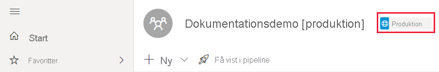

# Fejlfinding af udrulningspipelines

Brug denne artikel til at foretage fejlfinding af problemer i udrulningspipelines.

## Generelt

### Hvad er udrulningspipelines i Power BI?

Hvis du vil vide mere om udrulningspipelines i Power BI, kan du se [Oversigt over udrulningspipelines](deployment-pipelines-overview.md).

### Hvordan kommer jeg i gang med udrulningspipelines?

Kom i gang med udrulningspipelines ved hjælp af [Instruktioner i at komme i gang](deployment-pipelines-get-started.md).

### Hvorfor kan jeg ikke se knappen til udrulningspipelines?

Hvis følgende betingelser ikke er opfyldt, kan du ikke se knappen til udrulningspipelines.

* Du har en af følgende Premium-licenser:

    * Du er Power BI [Pro-bruger](../admin/service-admin-purchasing-power-bi-pro.md) og er medlem af en organisation, der har Premium-kapacitet.

    * [Premium pr. bruger](../admin/service-premium-per-user-faq.md).

* Du er administrator af [en ny arbejdsområdeoplevelse](../collaborate-share/service-create-the-new-workspaces.md).

### Hvorfor kan jeg ikke se koden for pipielinefasen i mit arbejdsområde?

Udrulningspipelines viser en kode for pipelinefasen i de arbejdsområder, der er knyttet til en pipeline. Koder for *udviklings-* og *testfaser* er altid synlige. Du kan dog kun se koden for *produktion*, hvis du har [adgang til pipelinen](deployment-pipelines-process.md#user-with-pipeline-access), eller hvis du er [administrator af arbejdsområdet](deployment-pipelines-process.md#workspace-admin).

> [!div class="mx-imgBorder"]
> 

## Licensering

### Hvilke licenser kræves der for at arbejde med udrulningspipelines?

Hvis du vil bruge udrulningspipelines, skal du have en af følgende licenser:

* En [Pro-bruger](../admin/service-admin-purchasing-power-bi-pro.md)-licens med et arbejdsområde, der er placeret på en [Premium-kapacitet](../admin/service-premium-what-is.md).

* [Premium pr. bruger](../admin/service-premium-per-user-faq.md).

Du kan finde flere oplysninger under [Adgang til udrulningspipelines](deployment-pipelines-get-started.md#accessing-deployment-pipelines).

### Hvilken type kapacitet kan jeg tildele til et arbejdsområde i en pipeline?

Alle arbejdsområder i en udrulningspipeline skal være placeret inden for en kapacitet, for at pipelinen kan fungere. Du kan dog bruge forskellige kapaciteter til forskellige arbejdsområder i en pipeline. Du kan også bruge forskellige kapacitetstyper til forskellige arbejdsområder i den samme pipeline.

I forbindelse med udvikling og test kan du bruge en A- eller EM-kapacitet sammen med en Power BI Pro-konto til hver bruger. Du kan også bruge en Premium pr. bruger til hver bruger i udviklings- og testfasen.

I forbindelse med produktionsarbejdsområder har du brug for en P-kapacitet. Hvis du er en ISV, der distribuerer indhold via integrerede programmer, kan du også bruge en A- eller EM-kapacitet til produktion. Premium pr. bruger-licenser kan også bruges til produktionsarbejdsområder.

>[!NOTE]
>Når du opretter et arbejdsområde med en Premium pr. bruger, er det kun andre brugere af Premium pr. bruger, der kan få adgang til arbejdsområdet og bruge indholdet.

## Tekniske spørgsmål

### Hvorfor kan jeg ikke se alle mine arbejdsområder, når jeg forsøger at tildele et arbejdsområde til en pipeline?

Hvis du vil tildele et arbejdsområde til en pipeline, skal følgende betingelser være opfyldt:

* Arbejdsområdet er en [ny arbejdsområdeoplevelse](../collaborate-share/service-create-the-new-workspaces.md)

* Du er administrator af arbejdsområdet

* Arbejdsområdet er ikke tildelt nogen anden pipeline

* Arbejdsområdet er placeret i en [Premium-kapacitet](../admin/service-premium-what-is.md)

Arbejdsområder, der ikke opfylder disse betingelser, vises ikke på listen over arbejdsområder, som du kan vælge imellem.

### Hvordan kan jeg tildele arbejdsområder til alle faser i en pipeline?

Du kan tildele ét arbejdsområde pr. pipeline. Når et arbejdsområde er tildelt en pipeline, kan du udrulle det i de næste pipelinefaser. Under udrulningen første gang oprettes der et nyt arbejdsområde med kopier af elementerne i kildefasen. Relationerne mellem de kopierede elementer bevares. Du kan finde flere oplysninger ved at læse, hvordan du [tildeler et arbejdsområde til en udrulningspipeline](deployment-pipelines-get-started.md#step-2---assign-a-workspace-to-a-deployment-pipeline).

### Hvorfor lykkedes min første udrulning ikke?

Din første udrulning kan være mislykkedes af flere årsager. Nogle af disse årsager er angivet i nedenstående tabel.

|Fejl  |Handling  |
|---------|---------|
|Du har ikke [Premium-kapacitetstilladelser](deployment-pipelines-process.md#creating-a-premium-capacity-workspace).     |Hvis du arbejder i en organisation, der har en Premium-kapacitet, skal du bede en kapacitetsadministrator om at føje dit arbejdsområde til en kapacitet eller bede om tildelingstilladelser til kapaciteten. Når arbejdsområdet er i en kapacitet, kan du forsøge igen.  Hvis du ikke arbejder i en organisation med Premium-kapacitet, kan du overveje at købe [Premium pr. bruger](../admin/service-premium-per-user-faq.md).        |
|Du har ikke tilladelse til arbejdsområdet.     |Hvis du vil udrulle, skal du være medlem af arbejdsområdet. Bed administratoren af arbejdsområdet om at give dig de rette tilladelser.         |
|Din Power BI-administrator har deaktiveret oprettelsen af arbejdsområder.     |Kontakt din Power BI-administrator for at få hjælp.         |
|Arbejdsområdet er ikke en [ny arbejdsområdeoplevelse](../collaborate-share/service-create-the-new-workspaces.md).     |Opret dit indhold i den nye arbejdsområdeoplevelse. Hvis du har indhold i et klassisk arbejdsområde, kan du [opgradere](../collaborate-share/service-upgrade-workspaces.md) det til en ny arbejdsområdeoplevelse.         |
|Du bruger [selektiv udrulning](deployment-pipelines-get-started.md#selective-deployment) og vælger ikke dit indholds datasæt.     |Gør et af følgende:   Fjern markeringen af det indhold, der er kædet sammen med dit datasæt. Indhold, som du ikke har markeret (f.eks. rapporter eller dashboards), kopieres ikke til næste fase.   Vælg det datasæt, der er kædet sammen med det valgte indhold. Dit datasæt kopieres til den næste fase.         |

### Jeg får en advarsel om, at jeg har "artefakter, der ikke understøttes" i mit arbejdsområde, når jeg forsøger at udrulle. Hvordan kan jeg finde ud af, hvilke artefakter der ikke understøttes?

Du kan finde en omfattende liste over elementer og artefakter, der ikke understøttes i udrulningspipelines, i følgende afsnit:

* [Elementer, der ikke understøttes](deployment-pipelines-process.md#unsupported-items)

* [Egenskaber for elementer, der ikke kopieres](deployment-pipelines-process.md#item-properties-that-are-not-copied)

### Hvorfor mislykkedes udrulningen på grund af brudte regler?

Hvis du har problemer med at konfigurere regler for datasæt, skal du se [regler for datasæt](deployment-pipelines-get-started.md#step-4---create-dataset-rules) og sørge for, at du følger [begrænsninger for datasætregler](deployment-pipelines-get-started.md#dataset-rule-limitations).

Hvis udrulningen tidligere blev fuldført, og den pludselig mislykkes med brudte regler, kan det skyldes, at et datasæt publiceres igen. Følgende ændringer af kildedatasættet resulterer i en mislykket udrulning:

**Parameterregler**

* En parameter, der er blevet fjernet

* Et navn på en parameter, der er blevet ændret

**Datakilderegler**

Reglerne for datasættet mangler værdier. Dette kan ske, hvis dit datasæt er blevet ændret.

Når en tidligere gennemført udrulning mislykkes på grund af brudte links, vises der en advarsel. Du kan vælge **Konfigurer regler** for at navigere til ruden med udrulningsindstillinger, hvor det mislykkede datasæt er markeret. Når du vælger datasættet, markeres de brudte regler.

Hvis du vil have udrulningen til at fungere, skal du rette eller fjerne de brudte regler og udrulle igen.

### Hvordan kan jeg ændre datakilden i pipelinefaserne?

Du kan ikke ændre forbindelsen til datakilden i Power BI-tjenesten.

Hvis du vil ændre datakilden i test- eller produktionsfaser, kan du bruge [regler for datasæt](deployment-pipelines-get-started.md#step-4---create-dataset-rules) eller [API'er](/rest/api/power-bi/datasets/updateparametersingroup). Regler for datasæt træder først i kraft efter den næste udrulning.

### Jeg har løst en fejl i produktionen, men nu kan jeg ikke vælge knappen Udrul til forrige fase. Hvorfor er den nedtonet?

Du kan kun udrulle bagud til en tom fase. Hvis du har indhold i testfasen, kan du ikke installere bagud fra produktionen.

Når du har oprettet pipelinen, kan du bruge udviklingsfasen til at udvikle dit indhold og testfaserne til at gennemse og teste det. Du kan rette fejl i disse faser og derefter udrulle det faste miljø til produktionsfasen.

>[!NOTE]
>Udrulning bagud understøtter kun [fuld udrulning](deployment-pipelines-get-started.md#deploying-all-content). [Selektiv udrulning](deployment-pipelines-get-started.md#selective-deployment) understøttes ikke

### Hvorfor skal jeg installere, når jeg har konfigureret regler for datasæt?

Regler for datasæt anvendes ikke med det samme, når de er konfigureret. Hvis du vil anvende regler for datasæt, skal du installere datasættene fra kilde stadiet til det destinations stadie, der indeholder de oprettede regler for datasæt. Når reglerne for datasæt er konfigureret, og før du installerer, vises den *anden* indikator ud for datasættet med de konfigurerede regler. Det betyder, at du skal installere dette datasæt fra kilde stadiet til destinations fasen. Når du har implementeret, og der ikke er foretaget andre ændringer, forsvinder den *anden* indikator, hvilket betyder, at reglerne blev anvendt korrekt.

### Understøtter udrulningspipelines flere geografiske områder?

Flere geografiske områder understøttes. Det kan tage længere tid at udrulle indhold mellem faser i forskellige geografiske områder.

## Tilladelser

### Hvad er tilladelsesmodellen for udrulningspipelines?

Tilladelsesmodellen for udrulningspipelines er beskrevet i afsnittet om [tilladelser](deployment-pipelines-process.md#permissions).

### Hvem kan udrulle indhold mellem faser?

Indhold kan udrulles til en tom fase eller til en fase, der indeholder indhold. Indholdet skal være placeret i en [Premium-kapacitet](../admin/service-premium-what-is.md).

* **Udrulning til en tom fase** – En hvilken som helst [Pro](../admin/service-admin-purchasing-power-bi-pro.md)- eller [Premium pr. bruger](../admin/service-premium-per-user-faq.md)-bruger, der er medlem eller administrator af kildearbejdsområdet.

* **Udrulning til en fase med indhold** – En hvilken som helst [Pro](../admin/service-admin-purchasing-power-bi-pro.md)- eller [Premium pr. bruger](../admin/service-premium-per-user-faq.md)-bruger, der er medlem eller administrator af begge arbejdsområder i kilde- og destinationsudrulningsfaserne.

* **Tilsidesættelse af et datasæt** – udrulningen tilsidesætter ethvert datasæt, der er inkluderet i destinationsfasen, også selvom datasættet ikke blev ændret. Brugeren skal være ejer af alle de datasæt i destinationsfasen, der er angivet i udrulningen.

### Hvilke tilladelser skal jeg have for at konfigurere regler for datasæt?

Hvis du vil konfigurere regler for datasæt i udrulningspipelines, skal du være ejer af datasættet.

### Hvorfor kan jeg ikke se arbejdsområder i pipelinen?

Tilladelserne for pipeline og arbejdsområde administreres separat. Du har muligvis pipelinetilladelser, men ikke arbejdsområdetilladelser. Du kan finde flere oplysninger i afsnittet om [tilladelser](deployment-pipelines-process.md#permissions).

## Næste trin

>[!div class="nextstepaction"]
>[Introduktion til udrulningspipelines](deployment-pipelines-overview.md)

>[!div class="nextstepaction"]
>[Kom i gang med udrulningspipelines](deployment-pipelines-get-started.md)

>[!div class="nextstepaction"]
>[Om processen for udrulningspipelines](deployment-pipelines-process.md)

>[!div class="nextstepaction"]
>[Bedste fremgangsmåder for udrulningspipelines](deployment-pipelines-best-practices.md)