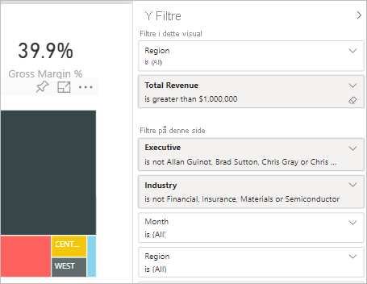
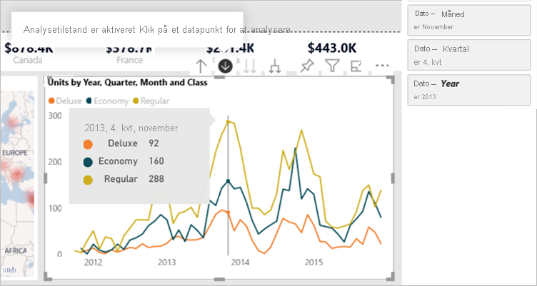
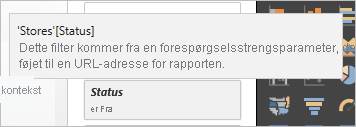
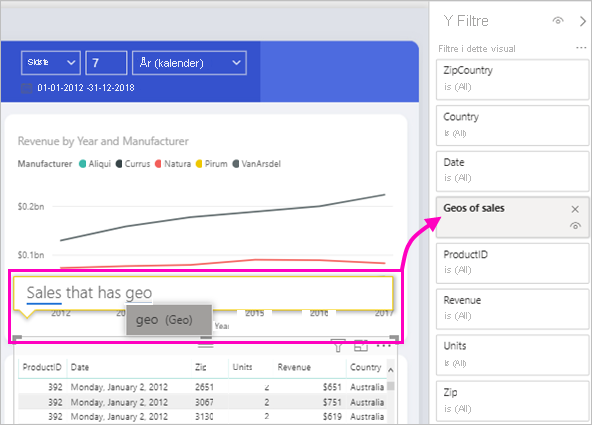

# Typer af filtre i Power BI-rapporter

Filtre fungerer ikke alle på samme måde, fordi de ikke er oprettet på samme måde. Hvordan du opretter dem, påvirker det, hvordan de fungerer, i ruden filter i redigeringstilstand. I denne artikel beskriver vi de forskellige typer filtre: de forskellige måder, du har oprettet dem på, og de forskellige ting, de kan bruges til. Læs om, hvordan du kan [føje filtre til rapporter](power-bi-report-add-filter.md). 

Lad os starte med de to mest almindelige filtertyper: automatisk og manuel.

## Automatiske filtre 

Automatiske filtre er de filtre, der automatisk tilføjes på visualiseringsniveau i filtreringsruden, når du bygger en visualisering. Disse filtre er baseret på de felter, der udgør din visualisering. Brugere med redigeringstilladelse til rapporten kan redigere, rydde, skjule, låse, omdøbe eller sortere dette filter i ruden. De kan ikke slette automatiske filtre, fordi visualiseringen refererer til disse felter.

## Manuelle filtre 

Manuelle filtre er de filtre, som du kan trække og slippe i et vilkårligt afsnit i filterruden, når du redigerer en rapport. Hvis du har tilladelsen Rediger til rapporten, kan du redigere, slette, rydde, skjule, låse, omdøbe eller sortere dette filter i ruden.

Læs om, hvordan du [føjer filtre til en rapport](power-bi-report-add-filter.md).

## Mere avancerede filtre

De næste filtertyper er mindre almindelige, men det er stadig vigtigt at forstå dem, hvis de vises i din rapport. Derudover kan de være nyttige for dig, så du kan oprette det helt rigtige filter til din rapport.

## Filtre for inkludering og udeladelse

Filtre for inkludering og udeladelse føjes automatisk til filtreringsruden, når du bruger funktionalitet for inkludering og udeladelse for en visualisering. Hvis du kan redigere en rapport, kan du slette, låse, skjule eller sortere dette filter i ruden. Du kan ikke redigere, rydde eller omdøbe et Inkluderings-eller udeladelses filter, da det er knyttet til visuals med Inkluderings-og udeladelses funktioner.

## Detailudledningsfiltre

Detailudledningsfiltre føjes automatisk til filtreringsruden, når du bruger funktionalitet for detailudledning for en visualisering i din rapport. Hvis du kan redigere en rapport, kan du redigere eller rydde filteret i ruden. Du kan ikke slette, skjule, låse, omdøbe eller sortere dette filter, da det er knyttet til detailudledning-funktionaliteten i visualiseringer. Hvis du vil fjerne nedrulnings filteret, skal du vælge knappen til detaljeudledning for det visuelle element.

## Tværudledningsfiltre

Filtre på tværs af detaljer føjes automatisk til ruden, når et nedrulnings filter overføres til et andet visuelt element på rapportsiden via tværgående eller tværgående fremhævnings funktionen. Selvom du kan redigere en rapport, kan du ikke slette, fjerne, skjule, låse, omdøbe eller sortere dette filter, da det er knyttet til detailudledning-funktionaliteten i visualiseringer. Du kan heller ikke redigere dette filter, da det kommer fra detailudledning i en anden visualisering. Hvis du vil fjerne nedrulnings filteret, skal du vælge knappen til detaljeudledning for det visuelle element, der sender filteret.

## Detalje adgangs filtre

Detalje adgangs filtre sendes fra én side til en anden via detaljeadgangsfunktionen. De vises i ruden detaljeadgang. Der findes to typer detalje adgangs filtre. Den første type er den, der aktiverer detaljeadgang. Hvis du kan redigere en rapport, kan du redigere, slette, rydde, skjule eller låse denne type filter. Den anden type er det filter til detaljeudledning, der overføres til destinationen på baggrund af filtre på sideniveau på kildesiden. Du kan redigere, slette eller rydde denne midlertidige type detail-through-filter. Du kan ikke låse eller skjule dette filter for slutbrugere.

Læs om, hvordan du [opretter detalje adgangs filtre](desktop-drillthrough.md).

## URL-filtre

URL-filtre bliver føjet til ruden ved at tilføje en URL-forespørgselsparameter. Hvis du kan redigere en rapport, kan du redigere, slette eller rydde filteret i ruden. Du kan ikke skjule, låse, omdøbe eller sortere dette filter, da det er knyttet til URL-parameteren. Hvis du vil fjerne filteret, skal du fjerne parameteren fra URL-adressen. Her er et eksempel på en URL-adresse med en parameter:

app.powerbi.com/groups/me/apps/*app-id*/reports/*report-id*/ReportSection?filter=Stores~2FStatus%20eq%20'Off'

Læs om [konfiguration af URL-filtre](../collaborate-share/service-url-filters.md).

## Pass-through-filtre

Pass-through-filtre er filtre på visualiseringsniveau, der er oprettet via spørgsmål og svar. Hvis du kan redigere en rapport, kan du slette, skjule eller sortere disse filtre i ruden. Du kan dog ikke omdøbe, redigere, rydde eller låse disse filtre.

## Sammenligning af filtertyper

I denne tabel sammenlignes det, som forfattere kan gøre med de forskellige filtertyper.

| Filtertype | Rediger | Clear | Slet | Skjul | Lås | Sort | Omdøb |
|----|----|----|----|----|----|----|----|
| Manuelle filtre | Y | Y | Y | Y | Y | Y | Y |
| Automatiske filtre | Y | Y | N | Y | Y | Y | Y |
| Filtre for Inkluder/Ekskluder | N | N | Y | Y | Y | Y | N |
| Detailudledningsfiltre | Y | Y | N | N | N | N | N |
| Tværudledningsfiltre | N | N | N | N | N | N | N |
| Detalje adgangs filtre (starter detailudledning) | Y | Y | Y | Y | Y | N | N |
| Detalje adgangs filtre (midlertidige) | Y | Y | Y | N | N | N | N |
| URL-filtre – midlertidige | Y | Y | Y | N | N | N | N |
| Pass-through-filtre | N | N | Y | Y | N | Y | N |

## De næste trin

[Føj filtre til rapporter](power-bi-report-add-filter.md)

[Få en præsentation af ruden Rapportfiltre](../consumer/end-user-report-filter.md)

[Filtre og fremhævning i rapporter](power-bi-reports-filters-and-highlighting.md)

Har du flere spørgsmål? [Prøv at spørge Power BI-community'et](https://community.powerbi.com/)
