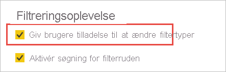

# <a name="format-filters-in-power-bi-reports"></a>Formatér filtre i Power BI rapporter

[!INCLUDE [applies-to](../includes/applies-to.md)] [!INCLUDE [yes-desktop](../includes/yes-desktop.md)] [!INCLUDE [yes-service](../includes/yes-service.md)]

Du har god kontrol over rapportfilterets design og funktionalitet. I denne artikel forklares det, hvordan du kan formatere ruden filtre, så det ser ud som resten af rapporten. Du kan låse og endda skjule filtre.


Det første trin er at [føje filtre til din rapport](power-bi-report-add-filter.md). Som Rapportdesigner er der mange måder, hvorpå du kan formatere ruden filtre:

- Tilføj og fjern felter, der kan filtreres efter. 
- Rediger filtertilstanden.
- Formatér og tilpas filtreringsruden, så den føles som en del af rapporten.
- Definer, om ruden Filtre skal være åben eller skjult som standard, når en forbruger åbner rapporten.
- Skjul hele filtreringsruden eller specifikke filtre, som forbrugerne af rapporten ikke skal se.
- Kontrollér og angiv også bogmærke for tilstanden Synlighed, Åben og Skjult for filtreringsruden.
- Lås filtre, som forbrugerne ikke må redigere.

Når forbrugerne læser en rapport, kan de pege på en hvilken som helst visualisering for at se en skrivebeskyttet liste over alle de filtre eller udsnit, der påvirker den pågældende visualisering.


Læs om, [hvordan rapport læsere bruger filtre](../consumer/end-user-report-filter.md) i læsetilstand i rapporter.

## <a name="build-the-filters-pane"></a>Opbyg filtreringsruden

Ruden filtre er som standard formateret på baggrund af de aktuelle rapportindstillinger. I filtreringsruden konfigurerer du, hvilke filtre du vil inkludere, og opdaterer eksisterende filtre. Ruden filtre ser ens ud for dine rapport forbrugere, når du publicerer rapporten. 

1. Når du føjer en visualisering til et rapportlærred, tilføjer Power BI automatisk et filter i filtreringsruden for hvert felt i visualiseringen.

2. Hvis du vil oprette ruden filtre, skal du trække andre interessante felter til ruden filtre, enten som filtre for visualisering, side eller rapport niveau.

## <a name="show-or-hide-the-filters-pane"></a>Vis eller Skjul ruden filtre

### <a name="hide-the-filters-pane-in-reading-mode"></a>Skjul ruden filtre i læsetilstand

Hvis du ikke ønsker, at dine rapport læsere skal se ruden filtre, skal du vælge ikonet med **øjet** ud for **filtre**.

 

### <a name="hide-the-filters-pane-while-editing"></a>Skjul ruden Filtre, mens du redigerer

Du kan skjule ruden filtre, mens du redigerer din rapport, når du ikke bruger ruden filtre, og du har brug for ekstra plads på skærmen. 

- På fanen **View** kan du bruge knappen **filtre** til at få vist eller skjule ruden filtre.


Denne indstilling skjuler kun ruden filtre i Power BI Desktop. Der er ingen tilsvarende i redigeringstilstand i Power BI-tjeneste.

## <a name="lock-or-hide-filters"></a>Lås eller skjul filtre

Du kan låse eller skjule de enkelte filterkort. Hvis du låser et filter, kan forbrugerne af rapporten se, men ikke ændre det. Hvis du skjuler det, kan de slet ikke se det. Det er typisk nyttigt at skjule filterkort, hvis du har brug for at skjule filtre til dataoprydning, der udelukker Null-værdier eller uventede værdier. 

- I filtreringsruden skal du markere eller fjerne markeringen i ikonerne **Lås filter** eller **Skjul filter** på et filterkort.

   

I takt med at du slår disse indstillinger til og fra i filtreringsruden, kan du se ændringerne blive afspejlet i rapporten. Skjulte filtre vises ikke på pop op-filterlisten for en visualisering.

Du kan også konfigurere tilstanden for filtreringsruden, så den følger dine bogmærker i rapporten. Der kan angives bogmærke for tilstandene Åben, Lukket og Synlighed for ruden.
 
## <a name="format-the-filters-pane"></a>Formatér filtreringsruden

En stor del af filteroplevelsen er, at du kan formatere filtreringsruden, så den matcher udseendet af din rapport. Du kan også formatere filtreringsruden forskelligt for hver side i rapporten. Her er de elementer, du kan formatere: 

- Baggrundsfarve
- Baggrundsgennemsigtighed
- Kant slået til eller fra
- Kantfarve
- Skrifttype, farve og tekststørrelse for titel og overskrift

Du kan også formatere disse elementer for filterkort, afhængigt af om de er anvendt (indstillet til noget) eller tilgængelige (ryddet): 

- Baggrundsfarve
- Baggrundsgennemsigtighed
- Kant: til eller fra
- Kantfarve
- Skrifttype, farve og tekststørrelse
- Farve på inputfelt

### <a name="format-the-filters-pane-and-cards"></a>Formatér filtreringsruden og kortene

1. I rapporten skal du klikke på selve rapporten eller baggrunden (*tapetet*), og derefter skal du i ruden **Visualiseringer** vælge **Formatér**. 
    Du kan se formateringsindstillinger for rapportsiden, tapetet samt filtreringsruden og filterkort.

1. Udvid **ruden Filtre** for at angive farven på baggrunden, ikonet og den venstre kant, som skal komplementere rapportsiden.

    

1. Udvid **Filterkort** for at angive farve og kant for **Tilgængelig** og **Anvendt**. Hvis du angiver forskellige farver for kortene Tilgængelig og Anvendt, er det oplagt, hvilke filtre der anvendes. 
  
    

## <a name="theming-for-filters-pane"></a>Temaer for ruden Filtre
Du kan nu ændre standardindstillingerne for ruden Filtre med temafilen. Her er et eksempel på kodestykke for et tema, der kan hjælpe dig i gang:

 
```
"outspacePane": [{ 

"backgroundColor": {"solid": {"color": "#0000ff"}}, 

"foregroundColor": {"solid": {"color": "#00ff00"}}, 

"transparency": 50, 

"titleSize": 35, 

"headerSize": 8, 

"fontFamily": "Georgia", 

"border": true, 

"borderColor": {"solid": {"color": "#ff0000"}} 

}], 

"filterCard": [ 

{ 

"$id": "Applied", 

"transparency": 0, 

"backgroundColor": {"solid": {"color": "#ff0000"}}, 

"foregroundColor": {"solid": {"color": "#45f442"}}, 

"textSize": 30, 

"fontFamily": "Arial", 

"border": true, 

"borderColor": {"solid": {"color": "#ffffff"}}, 

"inputBoxColor": {"solid": {"color": "#C8C8C8"}} 

}, 

{ 

"$id": "Available", 

"transparency": 40, 

"backgroundColor": {"solid": {"color": "#00ff00"}}, 

"foregroundColor": {"solid": {"color": "#ffffff"}}, 

"textSize": 10, 

"fontFamily": "Times New Roman", 

"border": true, 

"borderColor": {"solid": {"color": "#123456"}}, 

"inputBoxColor": {"solid": {"color": "#777777"}} 

}] 
```

## <a name="sort-the-filters-pane"></a>Sortér ruden Filtre

Brugerdefinerede sorteringsfunktioner er tilgængelige i filtreringsruden. Når du opretter rapporter, kan du trække og slippe filtre for at omarrangere dem i en hvilken som helst rækkefølge.


Standardsorteringsrækkefølgen er alfabetisk for filtre. Hvis du vil starte en brugerdefineret sorteringstilstand, skal du bare trække et filter til en ny placering. Du kan kun omarrangere filtre på det niveau, de gælder for. Du kan f. eks. ændre rækkefølgen af filtrene på visualiserings niveau i afsnittet visualiserings niveau i ruden filtre.

## <a name="improved-filters-pane-accessibility"></a>Forbedret tilgængelighed i filtreringsruden

Vi har forbedret navigation via tastaturet for filtreringsruden. Du kan bruge tabulator til at bevæge dig gennem alle dele af filtreringsruden og bruge genvejstasten på tastaturet eller Skift + F10 til at åbne genvejsmenuen.


## <a name="rename-filters"></a>Omdøb filtre
Når du redigerer filtreringsruden, kan du dobbeltklikke på titlen for at redigere den. Det er nyttigt at kunne omdøbe filtre, hvis du vil opdatere filterkortet, så det giver mere mening for dine slutbrugere. Husk, at når du omdøber filterkortet, omdøbes det viste navn på feltet på feltlisten *ikke*. Det ændrer blot det viste navn, der bruges i filterkortet.


## <a name="filters-pane-search"></a>Søgning i ruden Filtre

Du kan bruge søgefunktionen i ruden Filtre rude til at søge efter titel på tværs af dine filterkort. Denne funktion er praktisk, hvis du har flere forskellige filterkort i ruden Filtre og har brug for hjælp til at finde de relevante.


Du kan også formatere søgefeltet på samme måde, som du kan formatere de andre elementer i ruden Filtre.


Denne søgefunktion i ruden Filtre er som standard er slået til, men du kan også vælge at slå den til eller fra ved at vælge **Aktivér søgning for ruden Filtre** under indstillingerne for **rapporten** i dialogboksen **Indstillinger**.


## <a name="restrict-changes-to-filter-type"></a>Begræns ændringer af filtertype

I afsnittet **Filtreringsoplevelse** under indstillinger for **rapporten** kan du styre, om brugere kan ændre filtertypen.



## <a name="allow-saving-filters"></a>Tillad lagring af filtre

Læserne af din rapport kan som standard gemme filtre for din rapport. Du kan vælge, at de ikke skal have tilladelse til at gemme filtre.

- Under indstillingerne for **rapporten** i dialogboksen **Indstillinger** under **Faste filtre** skal du vælge **Giv ikke slutbrugere tilladelse til at gemme filtre i denne rapport**.

    :::image type="content" source="media/power-bi-report-filter/power-bi-persistent-filters.png" alt-text="Skærmbillede af Giv ikke slutbrugere tilladelse til at gemme filtre i denne rapport.":::

## <a name="apply-filters-button"></a>Knappen Anvend filtre

Du kan tilføje en enkelt **Anvend**-knap i filtreringsruden, så du og dine slutbrugere kan anvende alle filterændringer på én gang. Denne knap kan være en fordel, hvis du vil udsætte anvendelse af filterændringer. Du behøver kun at vente én gang, når du er klar til at anvende alle filter ændringerne i rapporten eller visualiseringerne.

:::image type="content" source="media/power-bi-report-filter/apply-filter-button.png" alt-text="Anvend filterknappen":::

### <a name="turn-on-the-apply-button"></a>Slå knappen Anvend til

Du kan vælge denne funktion på rapportniveau. Funktionen er dog som standard slået fra.

1. Gå til **Filer** > **Indstillinger** > **Indstillinger** > **Reduktion af forespørgsler**.

1. Vælg **Føj en enkelt Anvend-knap til filterruden for at anvende ændringer på én gang**.

    :::image type="content" source="media/power-bi-report-filter/apply-all-filters.png" alt-text="Slå knappen Anvend filter til":::

### <a name="format-the-apply-button"></a>Formatér knappen Anvend

Du kan i øjeblikket styre en del af formateringen af teksten **Anvend** til knappen. Angiv følgende indstillinger i afsnittet **Filterrude** i ruden **Formatér**:

- **Afkrydsningsfelt og Anvend farve** styrer udfyldningsfarve. 
- **Farve på skrifttype og ikon** styrer tekstfarven.
- **Tekststørrelse i sidehoved** styrer tekststørrelsen.
- **Skrifttypefamilie** styrer skrifttypen.

    :::image type="content" source="media/power-bi-report-filter/format-apply-filter.gif" alt-text="Formatér teksten til knappen Anvend filter":::

## <a name="considerations-and-limitations"></a>Overvejelser og begrænsninger

Ruden Filtre vises ikke i Publicer på internettet. Hvis du planlægger at udgive en rapport på internettet, kan du overveje at tilføje udsnit til filtrering i stedet for.

## <a name="next-steps"></a>Næste trin

- [Sådan bruger du rapportfiltre](../consumer/end-user-report-filter.md)
- [Filtre og fremhævning i rapporter](power-bi-reports-filters-and-highlighting.md)
- [Forskellige typer af filtre i Power BI](power-bi-report-filter-types.md)

Har du flere spørgsmål? [Prøv at spørge Power BI-community'et](https://community.powerbi.com/)
