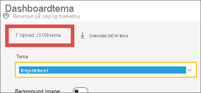
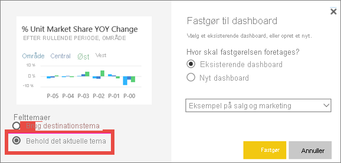
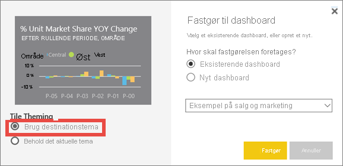

# <a name="use-dashboard-themes-in-the-power-bi-service"></a>Brug dashboardtemaer i Power BI-tjenesten
Med **dashboardtemaer** kan du anvende et farvetema på hele dit dashboard, f.eks virksomhedens farver, sæsonmæssige farver eller andre farvetemaer, som du gerne vil anvende. Når du anvender et dashboardtema, bruges farverne fra det valgte tema til alle visualiseringer på dit dashboard. Der gælder nogle få undtagelser, som er beskrevet i afsnittet [Overvejelser og begrænsninger](#considerations-and-limitations) i denne artikel.


Ændring af farverne i rapportvisualiseringerne på dashboardet påvirker ikke visualiseringerne i den tilknyttede rapport. Når du fastgør felter fra en rapport, hvor der allerede er [anvendt et rapporttema](desktop-report-themes.md), kan du også vælge at beholde det aktuelle tema eller bruge dashboardtemaet.


## <a name="prerequisites"></a>Forudsætninger
* [Åbn eksempeldashboardet Sales and Marketing](sample-datasets.md) for at følge med.


## <a name="how-dashboard-themes-work"></a>Sådan fungerer dashboardtemaer
For at komme i gang skal du åbne et dashboard, som du har oprettet, eller som du kan redigere. Vælg **Rediger** > **Dashboardtema**. 


Vælg et af de medfølgende temaer i dashboardruden.  I eksemplet herunder har vi valgt **Dark**.


## <a name="create-a-custom-theme"></a>Opret et brugerdefineret tema

Standardtemaet til Power BI-dashboards er **Light**. Hvis du vil tilpasse farverne eller oprette dit eget tema, skal du vælge **Brugerdefineret** på rullelisten. 


Brug de brugerdefinerede indstillinger for at oprette dit eget dashboardtema. Hvis du tilføjer et baggrundsbillede, anbefaler vi, at billedet har en opløsning på mindst 1920 x 1080. Hvis du vil bruge et billede som baggrund, skal du uploade billedet til et offentligt websted, kopiere URL-adressen og indsætte den i feltet **URL-adresse til billede**. 

## <a name="use-a-json-theme"></a>Brug et JSON-tema
En anden metode til at oprette et brugerdefineret tema er at uploade en JSON-fil, som indeholder indstillinger for alle de farver, du vil bruge i dit dashboard. I Power BI Desktop kan rapportoprettere bruge JSON-filer til [oprette temaer til rapporter](desktop-report-themes.md). Du kan uploade de samme JSON-filer til dashboards eller finde og uploade JSON-filer fra [siden Temagalleri](https://community.powerbi.com/t5/Themes-Gallery/bd-p/ThemesGallery) i Power BI-community'et. 


Du kan også gemme dit brugerdefinerede tema som en JSON-fil og derefter dele den med andre dashboardoprettere. 

### <a name="use-a-theme-from-the-theme-gallery"></a>Brug et tema fra temagalleriet

Ligesom med indbyggede og brugerdefinerede indstillinger anvendes farverne automatisk på alle felter på dashboardet, når du uploader et tema. 

1. Peg på et tema, og vælg **Vis rapport**.

    

2. Rul ned, og find linket til JSON-filen.  Vælg downloadikonet, og gem filen.

    

3. Gå tilbage til vinduet Brugerdefineret dashboardtema i Power BI-tjenesten, og vælg **Upload JSON-tema**.

    

4. Gå til den placering, hvor du har gemt JSON-filen, og vælg **Åbn**.

5. Vælg **Gem** på dashboardtemasiden. Det nye tema anvendes på dit dashboard.

    

## <a name="reports-and-dashboards-with-different-themes"></a>Rapporter og dashboards med forskellige temaer

Hvis der bruges et andet tema end dashboardtemaet i din rapport, kan du i de fleste tilfælde styre, om det aktuelle rapporttema skal bevares i visualiseringen, eller om dashboardtemaet skal bruges. "DIN"-skrifttypefamilien med sort tekst bruges dog til kortvisualiseringer på dashboards. Du kan ændre tekstfarven for alle felterne på et dashboard, herunder kortene, ved at oprette et brugerdefineret dashboardtema.

- Når du fastgør et felt på et dashboard, kan du vælge **Behold det aktuelle tema** for at bevare rapporttemaet. På dashboardet vil visualiseringen beholde rapporttemaet inklusive indstillingerne for gennemsigtighed.

    Det eneste tidspunkt, hvor du får vist indstillingerne for **Felttemaer**, er, hvis du oprettede rapporten i Power BI Desktop, [tilføjede et rapporttema](desktop-report-themes.md) og derefter publicerede rapporten i Power BI-tjenesten.

    

- Prøv at fastgøre feltet igen, og vælg **Brug dashboardtema**.

    

## <a name="dashboard-theme-json-file-format"></a>JSON-filformat for dashboardtema

På det mest grundlæggende niveau har JSON-temafilen kun én linje, der er påkrævet: **name**.

```json
{
    "name": "Custom Theme"
}
```

Alt andet end **name** er valgfrit. Du kan frit tilføje de relevante egenskaber, som du vil bruge til at formatere temafilen, og fortsætte med at bruge Power BI-standarder til resten.

JSON-filen til dashboardtemaer indeholder:

- name: Temanavnet (det eneste påkrævede felt).
- foreground og background: Farver for dashboardet.
- dataColors: En liste over hexfarvekode, der skal bruges til data i diagrammer. Du kan inkludere lige så få eller lige så mange farver, du vil.
- tiles: Konfigurationer af baggrund og farver for dashboards.
- visualStyles: Detaljeret formatering af visualiseringer.

Her er et eksempel på et JSON-tema til standardtemaet Light:

```json
{

"name":"Light",

"foreground":"#000000",

"background":"#EAEAEA",

"dataColors":["#01B8AA","#374649","#FD625E","#F2C80F","#5F6B6D","#8AD4EB","#FE9666","#A66999"],

"tiles":{"background":"#FFFFFF","color":"#000000"},

"visualStyles":{"*":{"*":{"*":[{"color":{"solid":{"color":"#000000"}}}]}}}

}
```

## <a name="considerations-and-limitations"></a>Overvejelser og begrænsninger

* Du kan ikke anvende dashboardtemaer på fastgjorte liverapportsider, iframe-felter, SSRS-felter, projektmappefelter eller billeder.
* Du kan se dashboardtemaer på mobilenheder, men du kan kun oprette et dashboardtema i Power BI-tjenesten.
* Brugerdefinerede dashboardtemaer virker kun med felter, der er fastgjort fra rapporter.

## <a name="next-steps"></a>Næste trin

- [Anvend temaer på rapporter](desktop-report-themes.md)
