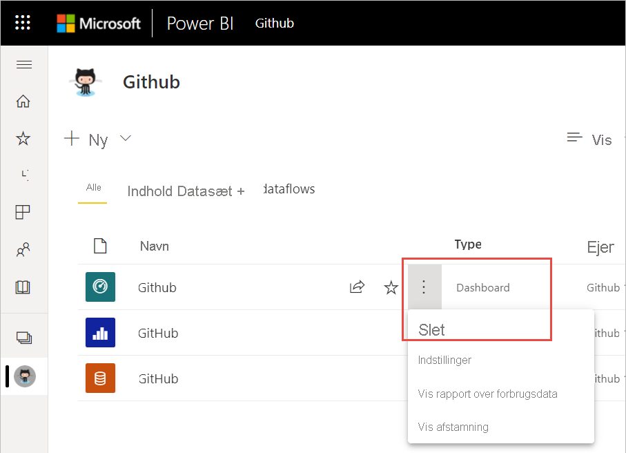
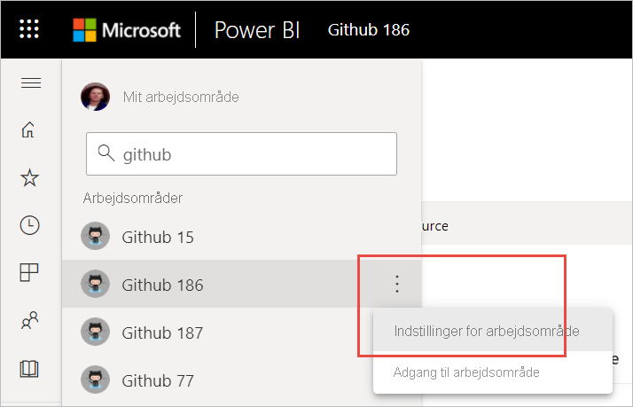
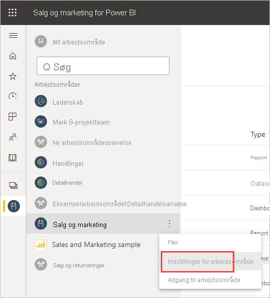
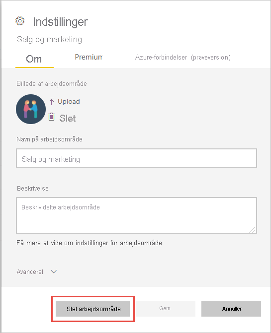

# Slet næsten alt i Power BI-tjenesten
I denne artikel får du mere at vide om, hvordan du sletter et dashboard, en rapport, en projektmappe, et datasæt, en app eller et arbejdsområde i Power BI-tjenesten. Du kan slette næsten alt i Power BI-tjenesten med nogle få undtagelser. 

## Slet et dashboard, en rapport, et datasæt eller en projektmappe

1. Vælg fanen **Alle** i dit arbejdsområde.
1. Vælg **Flere indstillinger (...)** ved siden af det aktiv, du vil slette, og vælg **Slet**.

    

1. Vælg **Slet** for at bekræfte sletningen.

## Fjern en app fra din side med applisten

Du kan nemt fjerne apps fra din side med applisten. Hvis du fjerner en app, slettes appen ikke for andre medlemmer. Det er kun en administrator eller et medlem af et arbejdsområde, der kan slette appen permanent fra arbejdsområdet.

1. Vælg **Apps** i navigationsruden for at åbne siden med applisten.
2. Hold over den app, du vil slette, og vælg sletteikonet :::image type="icon" source="media/service-delete/power-bi-delete-report2.png" border="false":::.

   

   Hvis du kommer til at fjerne en app ved et uheld, har du flere muligheder for at få den tilbage.  Du kan bede personen, der oprettede appen, om at sende den igen. Du kan finde den oprindelige mail med linket til appen. Du kan undersøge, om meddelelsen om appen stadig findes i [meddelelsescentret](../consumer/end-user-notification-center.md), eller du kan kontrollere din organisations [AppSource](../consumer/end-user-apps.md).

## Fjern eller slet et arbejdsområde

Power BI har to forskellige typer arbejdsområder: de originale eller *klassiske* arbejdsområder og de nye arbejdsområder. Processerne til at fjerne eller slette dem er forskellige. Læs mere om [nye og klassiske arbejdsområder](../collaborate-share/service-new-workspaces.md).

### Fjern medlemmer fra et nyt arbejdsområde

Det er kun arbejdsområdeadministratorer, der kan fjerne personer fra et nyt arbejdsområde. Hvis du er administrator, kan du fjerne dig selv eller enhver anden. Hvis du er den eneste administrator for et arbejdsområde, kan du dog ikke fjerne dig selv i Power BI.

1. Vælg **Få adgang til** i øverste højre hjørne i visningslisten i arbejdsområdet.

    :::image type="content" source="media/service-delete/power-bi-select-access.png" alt-text="Skærmbillede af valg af Adgang.":::

1. I ruden **Adgang** skal du vælge **Flere indstillinger (...)** ud for navnet på den person, du vil fjerne, og vælge **Fjern**.

    :::image type="content" source="media/service-delete/power-bi-access-remove.png" alt-text="Skærmbillede af ruden Adgang og valg af Fjern.":::

### Slet et nyt arbejdsområde

Når du opretter et af de *nye arbejdsområder* , opretter du ikke en tilknyttet Microsoft 365-gruppe. Hvis du er administrator af arbejdsområdet, kan du slette et nyt arbejdsområde uden at påvirke Microsoft 365-grupper. Læs mere om [nye og klassiske arbejdsområder](../collaborate-share/service-new-workspaces.md).

Som administrator for et arbejdsområde kan du slette det eller fjerne andre fra det. Når du sletter det, slettes den tilknyttede app også for alle gruppemedlemmer, og appen fjernes fra AppSource. 

1. Vælg **Arbejdsområder** i navigationsruden

2. Vælg **Flere indstillinger** (...) til højre for det arbejdsområde, der skal slettes, og vælg **Indstillinger for arbejdsområde**.

    

3. I ruden **Indstillinger for arbejdsområde** skal du vælge **Slet arbejdsområde** > **Slet**.

### Fjern et klassisk arbejdsområde fra din liste

Hvis du ikke længere vil være medlem af et klassisk arbejdsområde, kan du * *_forlade_* _ det, hvorefter det fjernes fra din liste. Selvom du forlader et arbejdsområde, har alle andre medlemmer af arbejdsområdet det stadig.  

> [!NOTE]
> Hvis du er den eneste administrator af arbejdsområdet, tillader Power BI ikke, at du forlader det.
>

1. Start i det arbejdsområde, du vil fjerne.

2. Vælg _ *Flere indstillinger* * (...) i øverste højre hjørne, og vælg **Forlad arbejdsområde** > **Forlad**.

      :::image type="content" source="media/service-delete/power-bi-leave-workspace.png" alt-text="Skærmbillede af Flere indstillinger, Forlad arbejdsområde.":::

   > [!NOTE]
   > De indstillinger, du kan se på rullelisten, afhænger af, om du er administrator eller medlem af det pågældende arbejdsområde.
   >

### Slet et klassisk arbejdsområde

> [!WARNING]
> Når du opretter et *klassisk* arbejdsområde, opretter du en Microsoft 365-gruppe. Når du sletter et klassisk arbejdsområde, sletter du den pågældende Microsoft 365-gruppe. Gruppen slettes også fra andre Microsoft 365-produkter, f.eks. SharePoint og Microsoft Teams.
> 

Det er ikke det samme at slette et arbejdsområde som at forlade et arbejdsområde. Du skal være administrator af arbejdsområdet for at slette det. Når du sletter det, slettes den tilknyttede app også for alle gruppemedlemmer og fjernes fra AppSource. Hvis du er den eneste administrator for et arbejdsområde, så kan du dog ikke fjerne dig selv i Power BI.

1. Vælg **Arbejdsområder** i navigationsruden.

2. Vælg **Flere indstillinger (...)**  > **Indstillinger for arbejdsområde** ud for det arbejdsområde, der skal slettes.

    

3. Vælg **Slet arbejdsområde** i vinduet **Indstillinger** , og bekræft derefter **sletningen**.

    

## Overvejelser og begrænsninger

- Når du fjerner et *dashboard* , sletter du ikke det underliggende datasæt eller de rapporter, der er knyttet til dette dashboard.
- Hvis du er *ejer af et dashboard eller en rapport* , kan du fjerne det. Hvis du har delt dashboardet med kolleger, fjernes det også fra deres arbejdsområder i Power BI, hvis du fjerner det fra dit eget arbejdsområde i Power BI.
- Hvis et *dashboard eller en rapport er delt med dig* , kan du ikke fjerne dashboardet.
- Når du sletter en rapport, bliver det datasæt, som rapporten er baseret på, ikke slettet.  Alle visualiseringer, som du har fastgjort til et dashboard fra rapporten, er også sikre. De forbliver på dashboardet, indtil du sletter dem individuelt.
- Du kan slette et *datasæt*. Når du sletter et datasæt, sletter du dog også alle rapporter og dashboardfelter, der indeholder data fra det pågældende datasæt.
- Du kan fjerne *projektmapper*. Men når du fjerner en projektmappe, fjerner du også alle rapporter og dashboardfelter, der indeholder data fra denne projektmappe. Hvis en projektmappe er gemt på OneDrive for Business, bliver den ikke slettet fra OneDrive, når du sletter den fra Power BI.
- Hvis et *dashboard eller en rapport* er en del af en [organisations indholdspakke](../collaborate-share/service-organizational-content-pack-disconnect.md), kan du ikke slette den ved hjælp af denne metode.  Se [Fjern din forbindelse til en organisationsindholdspakke](../collaborate-share/service-organizational-content-pack-disconnect.md).
- Hvis et *datasæt* er en del af en eller flere organisationsindholdspakker, kan du kun slette det ved at fjerne det fra de indholdspakker, hvor det bruges, vente på, at det bliver behandlet og derefter prøve at slette det igen.

## Næste trin

Denne artikel indeholdte oplysninger om, hvordan du sletter de større komponenter i Power BI-tjenesten. Her er nogle andre ting, du også kan slette.  

- [Fjern et udvalgt dashboard](../consumer/end-user-featured.md)
- [Fjern et dashboard fra favoritter](../consumer/end-user-favorite.md)
- [Slet et dashboardfelt](service-dashboard-edit-tile.md)

Har du flere spørgsmål? [Prøv at spørge Power BI-community'et](https://community.powerbi.com/)