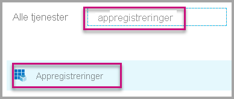
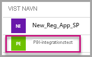
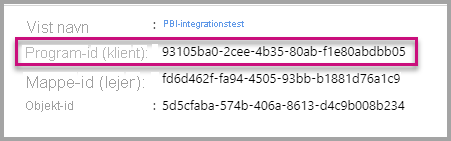
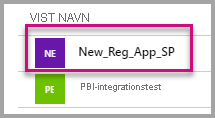
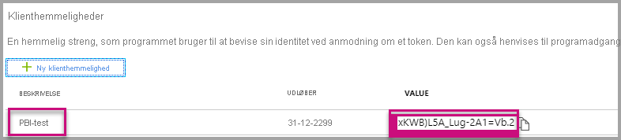

# <a name="tutorial-automate-configuration-of-template-app-installation-using-an-azure-function"></a>Selvstudium: Automatiser konfigurationen af installationen af skabelonprogrammer ved hjælp af en Azure-funktion

Skabelonprogrammer er en fantastisk måde for kunder at begynde at få indsigt i deres data på. Få skabelonapps op at køre hurtigt ved at knytte dem til deres data. Skabelonappsene giver kunderne forudopbyggede rapporter, som de kan tilpasse efter deres egne behov.

Kunderne ved ikke altid, hvordan de opretter forbindelse til deres data. Det kan være et problem for kunderne at angive disse oplysninger, når de installerer en skabelonapp.

Hvis du er datatjenesteudbyder og har oprettet en skabelonapp for at hjælpe dine kunder med at komme i gang med at arbejde med deres data på din tjeneste, kan du gøre det nemmere for dem at installere din skabelonapp. Du kan automatisere konfigurationen af din skabelonapps parametre.

Når kunden logger på din portal, vælger de et særligt link, som du har forberedt. Dette link:

- Starter automationen, som indsamler de nødvendige oplysninger.
- Forudkonfigurerer skabelonappens parametre.
- Omdirigerer kunden til deres Power BI-konto, hvor de kan installere appen.

Kunden skal blot vælge **Installér** og godkendes i forhold til datakilden, hvorefter han eller hun er klar.

Denne kundeoplevelse er illustreret nedenfor.


I dette selvstudium skal du bruge et eksempel på en automatiseret installation af Azure Functions, som vi har oprettet, for at forudkonfigurere og installere din skabelonapp. Denne prøve er lavet simpel med vilje med henblik på demonstration. Den indkapsler konfigurationen af en Azure-funktion for at gøre brug af Power BI-API'er med henblik på automatisk installation af en skabelonapp og konfiguration af appen for brugerne.

Du kan finde flere oplysninger om det generelle automatiseringsflow og de API'er, som appen bruger, i [Automatiser konfigurationen af installationen af en skabelonapp](template-apps-auto-install.md).

Vores simple program bruger en Azure-funktion. Du kan finde flere oplysninger om Azure Functions i [dokumentationen til Azure Functions](/azure/azure-functions/).

## <a name="basic-flow"></a>Grundlæggende flow

Følgende er det grundlæggende flow for, hvad programmet gør, når kunden starter det ved at klikke på linket i din portal.

1. Brugeren logger på ISV'ens portal og klikker på det angivne link. Denne handling igangsætter flowet. I denne fase forberedes den brugerspecifikke konfiguration på ISV'ens portal.

1. ISV'en henter et token *kun til apps*, der er baseret på en [tjenesteprincipal (token kun til apps)](../embedded/embed-service-principal.md), der er registreret i ISV'ens lejer.

1. Ved hjælp af [REST API'er til Power BI](/rest/api/power-bi/) opretter ISV'en en *installationsbillet*, der indeholder den brugerspecifikke parameterkonfiguration, som ISV'en har forberedt.

1. ISV'en omdirigerer brugeren til Power BI ved hjælp af en ```POST```-omdirigeringsmetode, der indeholder installationsbilletten.

1. Brugeren omdirigeres til sin Power BI-konto med installationsbilletten og bliver bedt om at installere skabelonprogrammet. Når brugeren vælger **Installér**, installeres skabelonappen.

>[!Note]
>Selvom parameterværdierne er konfigureret af ISV'en, når installationsbilletten oprettes, leveres legitimationsoplysninger relateret til datakilden kun af brugeren i de sidste faser af installationen. Dette forhindrer, at de eksponeres til en tredjepart, og sikrer en sikker forbindelse mellem brugeren og datakilderne for skabelonappen.

## <a name="prerequisites"></a>Forudsætninger

* Konfigurer din egen Microsoft Azure Active Directory-lejer. Se [Opret en Azure Active Directory-lejer](../embedded/create-an-azure-active-directory-tenant.md) for at få oplysninger om, hvordan du konfigurerer en.
* En [tjenesteprincipal (token kun til apps)](../embedded/embed-service-principal.md), der er registreret i ovennævnte lejer.
* En [parameteriseret skabelonapp](../../connect-data/service-template-apps-overview.md), der er klar til installation. Skabelonappen skal være oprettet i den samme lejer, som du registrerer programmet i Azure Active Directory i. Se [Tip til skabelonapp](../../connect-data/service-template-apps-tips.md) eller [Opret en skabelonapp i Power BI](../../connect-data/service-template-apps-create.md) for at få flere oplysninger.
* Hvis du vil teste dit arbejdsforløb til automatisering, skal du føje tjeneste principalen til arbejdsområdet skabelon app som administrator.
* En Power BI Pro-licens. Hvis du ikke er tilmeldt Power BI Pro, kan du [tilmelde dig en gratis prøveversion](https://powerbi.microsoft.com/pricing/), før du begynder.

## <a name="set-up-your-template-apps-automation-development-environment"></a>Konfigurer dit udviklingsmiljø til automatisering af skabelonprogrammer

Før du fortsætter med at konfigurere dit program, skal du følge vejledningen i [Hurtig start: Opret en Azure Functions-app med Azure App Configuration](/azure/azure-app-configuration/quickstart-azure-functions-csharp) for at udvikle en Azure-funktion sammen med konfigurationen af en Azure-app. Opret din appkonfiguration som beskrevet i artiklen.

### <a name="register-an-application-in-azure-ad"></a>Registrer en app i Azure Active Directory

Opret en tjenesteprincipal som beskrevet i [Integrer Power BI-indhold med en tjenesteprincipal og en programhemmelighed](../embedded/embed-service-principal.md).

Sørg for at registrere programmet som et **serverbaseret webprogram**. Du registrerer et serverbaseret webprogram for at oprette en programhemmelighed.

Gem *app-id'et* (ClientID) og *programhemmeligheden* (ClientSecret) til senere trin.

Du kan gennemgå [konfigurationsværktøjet til integrering](https://aka.ms/embedsetup/AppOwnsData) for hurtigt at komme i gang med at oprette en appregistrering. Hvis du bruger [værktøjet til registrering af Power BI-program](https://app.powerbi.com/embedsetup), skal du vælge indstillingen **Integrer for dine kunder**.

Føj tjeneste principalen til arbejdsområdet skabelon-app som administrator, så du kan teste dit arbejdsforløb for automatisering.

## <a name="template-app-preparation"></a>Forberedelse af skabelonprogram

Når du har oprettet din skabelonapp, og den er klar til installation, skal du gemme følgende oplysninger til de næste trin:

* *App-id*, *pakkenøgle* og *ejer-id*, som de vises i URL-adressen til installation i slutningen af processen [Definer egenskaber for skabelonappen](../../connect-data/service-template-apps-create.md#define-the-properties-of-the-template-app), da appen blev oprettet.

    Du kan også få det samme link ved at vælge **Hent link** i [Udgivelsesadministration](../../connect-data/service-template-apps-create.md#manage-the-template-app-release) for skabelonappen.

* *Parameternavne*, som defineret i datasættet for skabelonappen. Der skelnes mellem store og små bogstaver i parameternavne. De kan også hentes via fanen **Parameterindstillinger**, når du [definerer egenskaberne for skabelonappen](../../connect-data/service-template-apps-create.md#define-the-properties-of-the-template-app), eller fra indstillingerne for datasæt i Power BI.

>[!NOTE]
>Du kan teste det forudkonfigurerede installationsprogram for din skabelonapp, hvis skabelonappen er klar til installation, selvom den endnu ikke er offentligt tilgængelig på AppSource. Men før brugere uden for din lejer kan bruge det automatiserede installationsprogram til at installere din skabelonapp, skal skabelonappen være offentligt tilgængelig på [markedspladsen til Power BI-programmer](https://app.powerbi.com/getdata/services). Før du distribuerer skabelonappen ved hjælp af det automatiserede installationsprogram, du opretter, skal du sørge for at publicere det i [Partnercenter](/azure/marketplace/partner-center-portal/create-power-bi-app-offer).


## <a name="install-and-configure-your-template-app"></a>Installér og konfigurer din skabelonapp

I dette afsnit skal du bruge et eksempel på en automatiseret installation af Azure Functions, som vi har oprettet, for at forudkonfigurere og installere din skabelonapp. Denne prøve er lavet simpel med vilje med henblik på demonstration. Det giver dig mulighed for at gøre brug af en [Azure-funktion](/azure/azure-functions/functions-overview) og [Azure App Configuration](/azure/azure-app-configuration/overview) for nemt at udrulle og bruge API'en til automatiseret installation til dine skabelonapps.

### <a name="download-visual-studio-version-2017-or-later"></a>Download [Visual Studio](https://www.visualstudio.com/) (version 2017 eller nyere)

Download [Visual Studio](https://www.visualstudio.com/) (version 2017 eller nyere). Sørg for at downloade den nyeste [NuGet-pakke](https://www.nuget.org/profiles/powerbi).

### <a name="download-the-automated-installation-azure-functions-sample"></a>Download eksemplet på en automatiseret installation af Azure Functions

Download [eksemplet på en automatiseret installation af Azure Functions](https://github.com/microsoft/Template-apps-examples/tree/master/Developer%20Samples/Automated%20Install%20Azure%20Function) fra GitHub for at komme i gang.


### <a name="set-up-your-azure-app-configuration"></a>Konfigurer konfigurationen af Azure-appen

Hvis du vil køre dette eksempel, skal du konfigurere Azure-appkonfigurationen med værdierne og nøglerne, som beskrevet nedenfor. Nøglerne er **app-id**, **programhemmelighed** og skabelonappens **AppId**, **PackageKey** og **OwnerId**. Se følgende afsnit for at få oplysninger om, hvordan du får disse værdier.

Nøglerne er også defineret i filen **Constants.cs**.

| Konfigurationsnøgle | Betydning           |
|---------------    |-------------------|
| TemplateAppInstall:Application:AppId | **AppId** fra [installations-URL-adressen](#get-the-template-app-properties) |
| TemplateAppInstall:Application:PackageKey | **PackageKey** fra [installations-URL-adressen](#get-the-template-app-properties) |
| TemplateAppInstall:Application:OwnerId | **OwnerId** fra [installations-URL-adressen](#get-the-template-app-properties) |
| TemplateAppInstall:ServicePrincipal:ClientId | Tjenesteprincipalens [app-id](#get-the-application-id) |
| TemplateAppInstall:ServicePrincipal:ClientSecret | Tjenesteprincipalens [programhemmelighed](#get-the-application-secret) |
|||


Filen **Constants.cs** vises her.


#### <a name="get-the-template-app-properties"></a>Hent egenskaberne for skabelonappen

Udfyld alle de relevante egenskaber for skabelonappen, som blev defineret, da appen blev oprettet. Disse egenskaber er skabelonappens **AppId**, **PackageKey** og **OwnerId**.

Følg disse trin for at hente de foregående værdier:

1. Log på [Power BI](https://app.powerbi.com).

1. Gå til programmets oprindelige arbejdsområde.

1. Åbn ruden **Udgivelsesadministration**.

    

1. Vælg appversionen, og hent linket til installationen.

    

1. Kopiér linket til udklipsholderen.

    

1. Denne URL-adresse til installation indeholder de tre parametre for URL-adressen, som du skal bruge. Brug værdierne **appId**, **packageKey** og **ownerId** for appen. Et eksempel på en URL-adresse ligner den, der vises her.

    ```html
    https://app.powerbi.com/Redirect?action=InstallApp&appId=3c386...16bf71c67&packageKey=b2df4b...dLpHIUnum2pr6k&ownerId=72f9...1db47&buildVersion=5
    ```

#### <a name="get-the-application-id"></a>Hent app-id'et

Udfyld oplysningerne om **applicationId** med app-id'et fra Azure. Værdien **applicationId** bruges af appen til at identificere sig selv over for de brugere, du anmoder om tilladelser fra.

Hvis du vil hente applicationId, skal du benytte denne fremgangsmåde:

1. Log på [Azure Portal](https://portal.azure.com).

1. I venstre rude skal du vælge **Alle tjenester** > **Appregistreringer**.

    

1. Vælg den app, der skal bruge **app-id'et**.

    

1. Der er angivet et app-id som GUID. Brug dette app-id som **applicationId** for appen.

    

#### <a name="get-the-application-secret"></a>Hent programhemmeligheden

Udfyld oplysningerne for **ApplicationSecret** ud fra sektionen **Nøgler** i sektionen **Appregistreringer** i Azure. Denne attribut fungerer, når du bruger den pågældende [tjenesteprincipal](../embedded/embed-service-principal.md).

Hvis du vil hente programhemmeligheden, skal du benytte denne fremgangsmåde:

 1. Log på [Azure Portal](https://portal.azure.com).

 1. I venstre rude skal du vælge **Alle tjenester** > **Appregistreringer**.

    

1. Vælg den app, der skal bruge **programhemmeligheden**.

    

1. Vælg **Certifikater og hemmeligheder** under **Administrer**.

1. Vælg **Nye kundehemmeligheder**.

1. Angiv et navn i feltet **Beskrivelse**, og vælg en varighed. Vælg derefter **Gem** for at hente værdien til appen. Når du lukker ruden **Nøgler** efter at have gemt nøgleværdien, vises feltet **Værdi** kun som skjult. På det tidspunkt kan du ikke hente nøgleværdien. Hvis du mister nøgleværdien, skal du oprette en ny i Azure Portal.

    

## <a name="test-your-function-locally"></a>Test din funktion lokalt

Følg trinnene som beskrevet i [Kør funktionen lokalt](/azure/azure-functions/functions-create-your-first-function-visual-studio#run-the-function-locally) for at køre funktionen.

Konfigurer din portal for at sende en ```POST```-anmodning til URL-adressen for funktionen. Et eksempel er ```POST http://localhost:7071/api/install```. Anmodningens brødtekst skal være et JSON-objekt, der beskriver nøgleværdipar. Nøgler er de *navne på parametre*, som er defineret i Power BI Desktop. Værdier er de ønskede værdier, der skal angives for hver parameter i skabelonappen.

>[!Note]
> I produktion udledes parameterværdier for hver bruger ud fra portalens forventede logik.

Det ønskede flow skal være:

1. Portalen forbereder anmodningen pr. bruger eller session.
1. ```POST /api/install```-anmodningen sendes til din Azure-funktion. Anmodningsbrødteksten består af nøgleværdipar. Nøglen er navnet på parameteren. Værdien er den ønskede værdi, der skal angives.
1. Hvis alt er konfigureret korrekt, bør browseren automatisk omdirigere til kundens Power BI-konto og vise det automatiserede installationsflow.
1. Ved installationen angives parameterværdier som konfigureret i trin 1 og 2.
 
## <a name="next-steps"></a>Næste trin

### <a name="publish-your-project-to-azure"></a>Publicer dit projekt på Azure

Hvis du vil udgive dit projekt i Azure, skal du følge vejledningen i [dokumentationen til Azure Functions](/azure/azure-functions/functions-create-your-first-function-visual-studio#publish-the-project-to-azure). Derefter kan du integrere API'er til automatisk installation af skabelonappen i dit produkt og begynde at teste den i produktionsmiljøer.