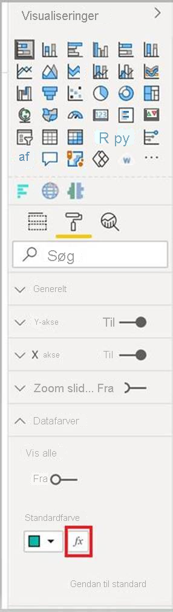

# <a name="add-conditional-formatting"></a>Tilføj betinget formatering

[Betinget formatering](../../visuals/service-tips-and-tricks-for-color-formatting.md#conditional-formatting-for-visualizations) gør det muligt for opretteren af en rapport at angive, hvordan farver vises i en rapport, afhængigt af en numerisk værdi.

I denne artikel beskrives det, hvordan du føjer den betingede formateringsfunktion til din visualisering i Power BI.

Betinget formatering kan kun anvendes på følgende egenskabstyper:
* Farve
* Tekst
* Ikon
* URL-adresse til websted

## <a name="add-conditional-formatting-to-your-project"></a>Føj betinget formatering til dit projekt

I dette afsnit kan du se, hvordan du føjer betinget formatering til en eksisterende Power BI-visualisering. Kodeeksemplet i denne artikel er baseret på visualiseringen [SampleBarChart](https://github.com/microsoft/PowerBI-visuals-sampleBarChart). Du kan undersøge kildekoden i [barChart.ts](https://github.com/microsoft/PowerBI-visuals-sampleBarChart/blob/master/src/barChart.ts).

### <a name="add-a-conditional-color-formatting-entry-in-the-format-pane"></a>Tilføj en betinget farveformatering i ruden Format

I dette afsnit får du mere at vide om, hvordan du føjer en betinget farveformatering til et datapunkt i ruden Format.

1. Du skal bruge matrixen `propertyInstanceKind` i `VisualObjectInstance`, som vises ved `powerbi-visuals-api`. Det første trin er at kontrollere, at filen indeholder denne import:

    ```typescript
    import powerbiVisualsApi from "powerbi-visuals-api";
    ```

2. Hvis du vil angive den relevante type formatering (*Constant*, *ConstantOrRule* eller *Rule*), skal du bruge fastteksttypen `VisualEnumerationInstanceKinds`. Føj følgende import til din fil:

    ```typescript
    import VisualEnumerationInstanceKinds = powerbiVisualsApi.VisualEnumerationInstanceKinds;
    ```

3. Vis alle de egenskaber, som du gerne vil have skal understøtte betinget formatering, under matrixen `propertyInstanceKind`. Definer disse egenskaber i metoden `enumerateObjectInstances`.

    ```typescript
    public enumerateObjectInstances(options: EnumerateVisualObjectInstancesOptions): VisualObjectInstanceEnumeration {
            …
            case 'colorSelector':
                …
                    objectEnumeration.push({
                        objectName: objectName,
                        displayName: barDataPoint.category,
                        properties: {
                            fill: {
                                solid: {
                                    color: barDataPoint.color
                                }
                            }
                        },
                        selector: dataViewWildcard.createDataViewWildcardSelector(dataViewWildcard.DataViewWildcardMatchingOption.InstancesAndTotals),
                        altConstantValueSelector: barDataPoint.selectionId.getSelector(),

                        // List your conditional formatting properties
                        propertyInstanceKind: {
                            fill: VisualEnumerationInstanceKinds.ConstantOrRule
                        }
                    });
                }
            …
    }

    ```

    `VisualEnumerationInstanceKinds.ConstantOrRule` opretter grænsefladen for den betingede formatering sammen med grænsefladeelementet for konstant formatering.

    >[!div class="mx-imgBorder"]
    >

### <a name="define-how-conditional-formatting-behaves"></a>Definer, hvordan betinget formatering fungerer

Definer, hvordan formateringen skal anvendes på dine datapunkter.

Brug `createDataViewWildcardSelector`, der er deklareret under `powerbi-visuals-utils-dataviewutils`, til at angive, om betinget formatering skal anvendes på instanser, totaler eller begge dele. Se [DataViewWildcard](utils-dataview.md#) for at få flere oplysninger.

I `enumerateObjectInstances` skal du foretage følgende ændringer af de objekter, du vil anvende betinget formatering på:

 * Erstat værdien `selector` med kaldet `dataViewWildcard.createDataViewWildcardSelector(dataViewWildcardMatchingOption)`. `DataViewWildcardMatchingOption` angiver, om betinget formatering anvendes på instanser, totaler eller begge dele.

* Tilføj egenskaben `altConstantValueSelector` med den værdi, der tidligere er defineret for egenskaben `selector`.

```typescript
case 'colorSelector':
         …
            objectEnumeration.push({
                objectName: objectName,
                displayName: barDataPoint.category,
                properties: {
                    fill: {
                        solid: {
                            color: barDataPoint.color
                        }
                    }
                },

                // Define whether the conditional formatting will apply to instances, totals, or both
                selector: dataViewWildcard.createDataViewWildcardSelector(dataViewWildcard.DataViewWildcardMatchingOption.InstancesAndTotals),

                // Add this property with the value previously defined for the selector property
                altConstantValueSelector: barDataPoint.selectionId.getSelector(),

                propertyInstanceKind: { 
                    fill: VisualEnumerationInstanceKinds.ConstantOrRule
                }
            });
        }

```

## <a name="next-steps"></a>Næste trin

Gennemse artiklen [DataViewUtils](utils-dataview.md).