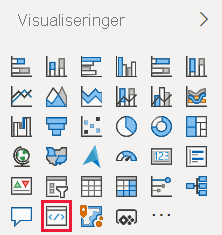
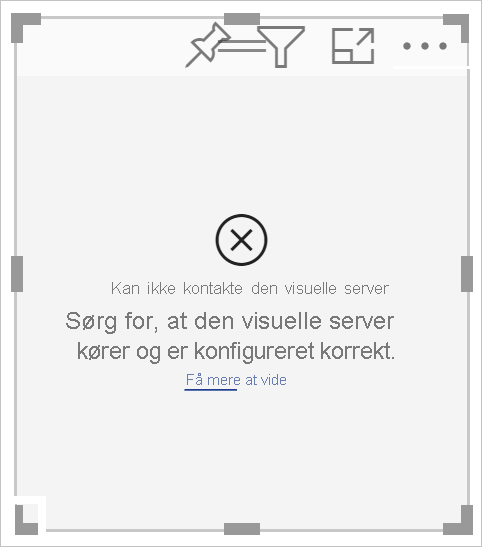
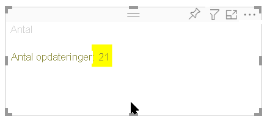
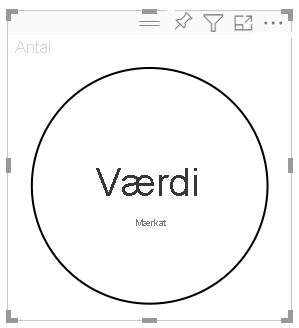
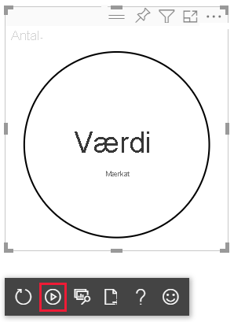

# <a name="tutorial-develop-a-power-bi-circle-card-visual"></a>Selvstudium: Udvikl en Power BI-cirkelkortvisualisering

Som udvikler kan du oprette dine egne Power BI-visualiseringer. Disse visualiseringer kan bruges af dig, din organisation eller af tredjeparter.

I dette selvstudium lærer du, hvordan du udvikler en Power BI-visualisering kaldet et cirkelkort, der viser en formateret måleværdi i en cirkel. Cirkelkortvisualiseringen understøtter tilpasning af udfyldningsfarven og konturens tykkelse.

I dette selvstudium lærer du, hvordan du gør følgende:
> [!div class="checklist"]
> * Opret et udviklingsprojekt til din visualisering.
> * Udvikl din visualisering med D3-visualiseringer.
> * Konfigurer din visualisering for at behandle data.

## <a name="prerequisites"></a>Forudsætninger

Før du begynder at udvikle din Power BI-visualisering, skal du bekræfte, at du har alt, hvad der er angivet i denne sektion.

* Du skal have en **Power BI Pro**-konto. Hvis du ikke har en, kan du [tilmelde dig en gratis prøve](https://powerbi.microsoft.com/pricing/).

* [Visual Studio Code (VS Code)](https://www.visualstudio.com/). VS Code er et ideelt IDE (integreret udviklingsmiljø) til udvikling af JavaScript- og TypeScript-programmer.

* [Windows PowerShell](/powershell/scripting/install/installing-windows-powershell) version 4 eller nyere (til Windows). Eller [Terminal](https://macpaw.com/how-to/use-terminal-on-mac) (til OSX).

* Et miljø, der er klar til udvikling af en Power BI-visualisering. [Konfigurer dit miljø til udvikling af en Power BI-visualisering](environment-setup.md).

* I dette selvstudium bruges **US Sales Analysis**-rapporten. Du kan [downloade](https://microsoft.github.io/PowerBI-visuals/docs/step-by-step-lab/images/US_Sales_Analysis.pbix) denne rapport og uploade den til Power BI-tjenesten eller bruge din egen rapport. Hvis du har brug for flere oplysninger om Power BI-tjenesten og uploade filer, kan du se selvstudiet [Kom i gang med at oprette i Power BI-tjenesten](../../fundamentals/service-get-started.md).

## <a name="create-a-development-project"></a>Opret et udviklingsprojekt

I dette afsnit opretter du et projekt til cirkelkortvisualiseringen.

1. Åbn PowerShell, og naviger til den mappe, du vil oprette dit projekt i.

2. Angiv følgende kommando:

    ```PowerShell
    pbiviz new CircleCard
    ```

3. Naviger til projektets mappe.

    ```powershell
    cd CircleCard
    ```

4. Start cirkelkortvisualiseringen. Din visualisering kører nu, mens den hostes på din computer.

    ```powershell
    pbiviz start
    ```
    >[!IMPORTANT]
    >Luk ikke PowerSell-vinduet indtil slutningen af selvstudiet. Du stopper kørslen af visualiseringen ved at trykke på Ctrl + C, og hvis du bliver bedt om at afslutte batchjobbet, skal du trykke på Y og *Enter*.

## <a name="view-the-circle-card-in-power-bi-service"></a>Få vist cirkelkortet i Power BI-tjenesten

Vi bruger **US Sales Analysis**-rapporten til at teste cirkelkortvisualiseringen i Power BI-tjenesten. Du kan [downloade](https://microsoft.github.io/PowerBI-visuals/docs/step-by-step-lab/images/US_Sales_Analysis.pbix) denne rapport og uploade den til Power BI-tjenesten.

Du kan også bruge din egen rapport til at teste cirkelkortvisualiseringen.

>[!NOTE]
>Før du fortsætter, skal du bekræfte, at du har [aktiveret indstillingerne for udviklervisualiseringer](environment-setup.md#set-up-power-bi-service-for-developing-a-visual).

1. Log på [PowerBI.com](https://powerbi.microsoft.com/), og åbn **US Sales Analysis**-rapporten.

2. Vælg **Flere indstillinger** > **Rediger**.

    >[!div class="mx-imgBorder"]
    >

3. Opret en ny side til test ved at klikke på knappen **Ny side** nederst i grænsefladen i Power BI-tjenesten.

    >[!div class="mx-imgBorder"]
    >

4. I ruden **Visualiseringer** skal du markere **Udviklervisualisering**.

    >[!div class="mx-imgBorder"]
    >

    Denne visualisering repræsenterer den brugerdefinerede visualisering, som kører på din computer. Den er kun tilgængelig, når indstillingen [fejlfinding af brugerdefineret visualisering](environment-setup.md#set-up-power-bi-service-for-developing-a-visual) er aktiveret.

5. Bekræft, at der blev føjet en visualisering til rapportlærredet.

    >[!div class="mx-imgBorder"]
    >

    Dette er en simpel visualisering, der viser det antal gange, som metoden update er blevet kaldt. I denne fase henter visualiseringen ingen data.

    >[!NOTE]
    >Hvis der vises en fejlmeddelelse for forbindelsen i visualiseringen, skal du åbne en ny fane i din browser, navigere til `https://localhost:8080/assets/status` og give din browser tilladelse til at bruge denne adresse.
    >
    >

6. Med den nye visualisering valgt skal du gå til ruden **Felter**, udvide **Salg** og markere **Mængde**.

    >[!div class="mx-imgBorder"]
    >

7. Hvis du vil teste, hvordan visualiseringen reagerer, skal du tilpasse størrelsen af den og bemærke, hvordan værdien *Opdater antal* øges, hver gang du tilpasser størrelsen af visualiseringen.

    >[!div class="mx-imgBorder"]
    >

## <a name="add-visual-elements-and-text"></a>Tilføj visualiseringer og tekst

I dette afsnit lærer du, hvordan du omdanner din visualisering til en cirkel og får den til at vise tekst.

>[!NOTE]
>I dette selvstudium bruges [Visual Studio Code](https://code.visualstudio.com/) (VS Code) til at udvikle Power BI-visualiseringen.

### <a name="modify-the-visuals-file"></a>Rediger filen visuals

Konfigurer filen **visual.ts** ved at slette og tilføje nogle få kodelinjer.

1. Åbn dit projekt i VS Code (**Filer** > **Åbn mappe**).

2. I **ruden Stifinder** skal du udvide mappen **src** og vælge filen **visual.ts**.

    >[!div class="mx-imgBorder"]
    >

    > [!IMPORTANT]
    > Læg mærke til kommentarerne øverst i filen **visual.ts**. Tilladelse til at bruge Power BI-visualiseringspakker tildeles gratis i henhold til vilkårene i MIT-licensen (Massachusetts Institute of Technology). Som en del af aftalen skal du lade kommentarerne øverst i filen stå.

3. Fjern følgende kodelinjer fra filen *visual.ts*.

    * *VisualSettings*-importen:
        ```typescript
        import { VisualSettings } from "./settings";
        ```

    * De fire erklæringer om private variabler på klasseniveau.

    * Alle kodelinjer i *konstruktøren*.

    * Alle kodelinjer i metoden *update*.

    * Alle resterende kodelinjer under metoden *update*, herunder metoderne *parseSettings* og *enumerateObjectInstances*.

4. Føj følgende kodelinjer til slutningen af importafsnittet:

    * *IVisualHost* – En samling egenskaber og tjenester, der bruges til at interagere med visualiseringsværten (Power BI).

         ```typescript
        import IVisualHost = powerbi.extensibility.IVisualHost;
        ```

    * *D3-bibliotek*

        ```typescript
        import * as d3 from "d3";
        type Selection<T extends d3.BaseType> = d3.Selection<T, any,any, any>;
        ```
    
        >[!NOTE]
        >Hvis du ikke har installeret dette bibliotek som en del af din konfiguration, skal du [installere D3 JavaScript-biblioteket](environment-setup.md#d3-javascript-library).

5. Under erklæringen for klassen *Visual* skal du indsætte følgende egenskaber for klasseniveau. Du skal kun tilføje kodelinjer, der starter med `private`.

    ```typescript
    export class Visual implements IVisual {
        // ...
        private host: IVisualHost;
        private svg: Selection<SVGElement>;
        private container: Selection<SVGElement>;
        private circle: Selection<SVGElement>;
        private textValue: Selection<SVGElement>;
        private textLabel: Selection<SVGElement>;
        // ...
    }
    ```

6. Gem filen **visual.ts**.

### <a name="add-a-circle-and-text-elements"></a>Tilføj en cirkel og tekstelementer

Tilføj D3 Scalable Vector Graphics (SVG). Dette gør det muligt at oprette tre figurer: en cirkel og to tekstelementer.

1. Åbn **visual.ts** i VS Code.

2. Føj følgende kode til *konstruktøren*.

    ```typescript
    this.svg = d3.select(options.element)
        .append('svg')
        .classed('circleCard', true);
    this.container = this.svg.append("g")
        .classed('container', true);
    this.circle = this.container.append("circle")
        .classed('circle', true);
    this.textValue = this.container.append("text")
        .classed("textValue", true);
    this.textLabel = this.container.append("text")
        .classed("textLabel", true);
    ```

    >[!TIP]
    >Hvis du vil forbedre læsbarheden, anbefales det, at du formaterer dokumentet, hver gang du kopierer kodestykker til dit projekt. Højreklik et vilkårligt sted i VS Code, og vælg *Formatér dokument* (Alt + Skift + F).

3. Gem filen **visual.ts**.

### <a name="set-the-width-and-height"></a>Angiv bredde og højde

Angiv visualiseringens bredde og højde, og initialiser attributterne og typografierne for visualiseringens elementer.

1. Åbn **visual.ts** i VS Code.

2. Føj følgende kode til metoden *update*.

    ```typescript
    let width: number = options.viewport.width;
    let height: number = options.viewport.height;
    this.svg.attr("width", width);
    this.svg.attr("height", height);
    let radius: number = Math.min(width, height) / 2.2;
    this.circle
        .style("fill", "white")
        .style("fill-opacity", 0.5)
        .style("stroke", "black")
        .style("stroke-width", 2)
        .attr("r", radius)
        .attr("cx", width / 2)
        .attr("cy", height / 2);
    let fontSizeValue: number = Math.min(width, height) / 5;
    this.textValue
        .text("Value")
        .attr("x", "50%")
        .attr("y", "50%")
        .attr("dy", "0.35em")
        .attr("text-anchor", "middle")
        .style("font-size", fontSizeValue + "px");
    let fontSizeLabel: number = fontSizeValue / 4;
    this.textLabel
        .text("Label")
        .attr("x", "50%")
        .attr("y", height / 2)
        .attr("dy", fontSizeValue / 1.2)
        .attr("text-anchor", "middle")
        .style("font-size", fontSizeLabel + "px");
    ```

3. Gem filen **visual.ts**.

### <a name="optional-review-the-code-in-the-visuals-file"></a>(Valgfri) Gennemse koden i filen visuals

Bekræft, at koden i filen *visuals.ts* ligner følgende:

```typescript
/*
*  Power BI Visual CLI
*
*  Copyright (c) Microsoft Corporation
*  All rights reserved.
*  MIT License
*
*  Permission is hereby granted, free of charge, to any person obtaining a copy
*  of this software and associated documentation files (the ""Software""), to deal
*  in the Software without restriction, including without limitation the rights
*  to use, copy, modify, merge, publish, distribute, sublicense, and/or sell
*  copies of the Software, and to permit persons to whom the Software is
*  furnished to do so, subject to the following conditions:
*
*  The above copyright notice and this permission notice shall be included in
*  all copies or substantial portions of the Software.
*
*  THE SOFTWARE IS PROVIDED *AS IS*, WITHOUT WARRANTY OF ANY KIND, EXPRESS OR
*  IMPLIED, INCLUDING BUT NOT LIMITED TO THE WARRANTIES OF MERCHANTABILITY,
*  FITNESS FOR A PARTICULAR PURPOSE AND NONINFRINGEMENT. IN NO EVENT SHALL THE
*  AUTHORS OR COPYRIGHT HOLDERS BE LIABLE FOR ANY CLAIM, DAMAGES OR OTHER
*  LIABILITY, WHETHER IN AN ACTION OF CONTRACT, TORT OR OTHERWISE, ARISING FROM,
*  OUT OF OR IN CONNECTION WITH THE SOFTWARE OR THE USE OR OTHER DEALINGS IN
*  THE SOFTWARE.
*/
"use strict";

import "core-js/stable";
import "./../style/visual.less";
import powerbi from "powerbi-visuals-api";
import VisualConstructorOptions = powerbi.extensibility.visual.VisualConstructorOptions;
import VisualUpdateOptions = powerbi.extensibility.visual.VisualUpdateOptions;
import IVisual = powerbi.extensibility.visual.IVisual;
import EnumerateVisualObjectInstancesOptions = powerbi.EnumerateVisualObjectInstancesOptions;
import VisualObjectInstance = powerbi.VisualObjectInstance;
import DataView = powerbi.DataView;
import VisualObjectInstanceEnumerationObject = powerbi.VisualObjectInstanceEnumerationObject;
import IVisualHost = powerbi.extensibility.IVisualHost;
import * as d3 from "d3";
type Selection<T extends d3.BaseType> = d3.Selection<T, any, any, any>;

export class Visual implements IVisual {
    private host: IVisualHost;
    private svg: Selection<SVGElement>;
    private container: Selection<SVGElement>;
    private circle: Selection<SVGElement>;
    private textValue: Selection<SVGElement>;
    private textLabel: Selection<SVGElement>;

    constructor(options: VisualConstructorOptions) {
        this.svg = d3.select(options.element)
            .append('svg')
            .classed('circleCard', true);
        this.container = this.svg.append("g")
            .classed('container', true);
        this.circle = this.container.append("circle")
            .classed('circle', true);
        this.textValue = this.container.append("text")
            .classed("textValue", true);
        this.textLabel = this.container.append("text")
            .classed("textLabel", true);
    }

    public update(options: VisualUpdateOptions) {
        let width: number = options.viewport.width;
        let height: number = options.viewport.height;
        this.svg.attr("width", width);
        this.svg.attr("height", height);
        let radius: number = Math.min(width, height) / 2.2;
        this.circle
            .style("fill", "white")
            .style("fill-opacity", 0.5)
            .style("stroke", "black")
            .style("stroke-width", 2)
            .attr("r", radius)
            .attr("cx", width / 2)
            .attr("cy", height / 2);
        let fontSizeValue: number = Math.min(width, height) / 5;
        this.textValue
            .text("Value")
            .attr("x", "50%")
            .attr("y", "50%")
            .attr("dy", "0.35em")
            .attr("text-anchor", "middle")
            .style("font-size", fontSizeValue + "px");
        let fontSizeLabel: number = fontSizeValue / 4;
        this.textLabel
            .text("Label")
            .attr("x", "50%")
            .attr("y", height / 2)
            .attr("dy", fontSizeValue / 1.2)
            .attr("text-anchor", "middle")
            .style("font-size", fontSizeLabel + "px");
    }
}
```

### <a name="modify-the-capabilities-file"></a>Rediger filen capabilities

Slet unødvendige kodelinjer fra filen capabilities.

1. Åbn dit projekt i VS Code (**Filer** > **Åbn mappe**).

2. Vælg filen **capabilities.json**.

    >[!div class="mx-imgBorder"]
    >

3. Fjern alle elementer fra objektet (linje 14-60).

4. Gem filen **capabilities.json**.

### <a name="restart-the-circle-card-visual"></a>Genstart cirkelkortvisualiseringen

Stop kørslen af visualiseringen, og genstart den.

1. I det PowerShell-vindue, hvor visualiseringen kører, skal du trykke på Ctrl + C, og hvis du bliver bedt om at afslutte batchjobbet, skal du trykke på Y og derefter *Enter*.

2. I PowerShell skal du starte visualiseringen.

    ```powershell
    pbiviz start
    ```

### <a name="test-the-visual-with-the-added-elements"></a>Test visualiseringen med de tilføjede elementer

Bekræft, at de nyligt tilføjede elementer vises i visualiseringen.

1. Åbn *Power BI US Sales Analysis*-rapporten i Power BI-tjenesten. Hvis du bruger en anden rapport til at udvikle cirkelkortvisualiseringen, skal du navigere til den pågældende rapport.

2. Sørg for, at visualiseringen er formet som en cirkel.

    >[!div class="mx-imgBorder"]
    >

    >[!NOTE]
    >Hvis der ikke vises noget i visualiseringen, skal du fra ruden **Felter** trække feltet **Mængde** til udviklervisualiseringen.

3. Tilpas størrelsen af visualiseringen.

    Bemærk, at cirklen og teksten er skaleret til at passe til dimensionerne af visualiseringen. Metoden update kaldes, når du tilpasser størrelsen af visualiseringen igen, og derfor bliver visualiseringens elementer omskaleret.

### <a name="enable-auto-reload"></a>Aktivér automatisk genindlæsning

Brug denne indstilling til at sikre, at visualiseringen automatisk genindlæses, hver gang du gemmer ændringer af projektet.

1. Naviger til *Power BI US Sales Analysis*-rapporten (eller til det projekt, der indeholder din cirkelkortvisualisering).

2. Vælg cirkelkortvisualiseringen.

3. Vælg **Skift automatisk genindlæsning** i den flydende værktøjslinje.

    >[!div class="mx-imgBorder"]
    >

## <a name="get-the-visual-to-process-data"></a>Hent visualiseringen for at behandle data

I dette afsnit definerer du dataroller og tilknytninger af datavisninger. Du redigerer også visualiseringen for at vist navnet på den værdi, den viser.

### <a name="configure-the-capabilities-file"></a>Konfigurer filen capabilities

Rediger filen **capabilities.json** for at definere datarollen og tilknytningerne af datavisninger.

* **Definition af datarollen**

    Definer matrixen *dataRoles* med en enkelt datarolle for typen *measure*. Denne datarolle kaldes for *measure* og vises som *Måling*. Det muliggør videregivelse af enten feltet measure eller et felt, der opsummeres.

    1. Åbn filen **capabilities.json** i VS Code.

    2. Fjern alt indhold i matrixen **dataRoles** (linje 3-12).

    3. Indsæt følgende kode i matrixen **dataRoles**.

        ```json
        {
            "displayName": "Measure",
            "name": "measure",
            "kind": "Measure"
        }
        ```

    4. Gem filen **capabilities.json**.

* **Definition af tilknytningen af datavisningen**

    Definer en fil kaldet *measure* i matrixen *dataViewMappings*. Dette felt kan videregives til datarollen.

    1. Åbn filen **capabilities.json** i VS Code.

    2. Fjern alt indhold i matrixen **dataViewMappings** (linje 10-30).

    3. Indsæt følgende kode i matrixen **dataViewMappings**.

        ```json
        {
            "conditions": [
                { "measure": { "max": 1 } }
            ],
            "single": {
                "role": "measure"
            }
        }
        ```

    4. Gem filen **capabilities.json**.

### <a name="optional-review-the-capabilities-file-code-changes"></a>(Valgfri) Gennemse kodeændringer i filen capabilities

Bekræft, at feltet *measure* vises i cirkelkortvisualiseringen, og gennemse de ændringer, du foretager, ved hjælp af indstillingen *Vis DataView*. 

1. Åbn *Power BI US Sales Analysis*-rapporten i Power BI-tjenesten. Hvis du bruger en anden rapport til at udvikle cirkelkortvisualiseringen, skal du navigere til den pågældende rapport.

2. Bemærk, at cirkelkortvisualiseringen nu kan konfigureres med et felt med titlen *Måling*. Du kan trække og slippe elementer fra ruden **Felter** til feltet *Måling*.

    >[!div class="mx-imgBorder"]
    >

    > [!Note]
    > Visualiseringsprojektet indeholder endnu ikke logik, der binder data.

3. Vælg **Vis datavisning** i den flydende værktøjslinje. 

    >[!div class="mx-imgBorder"]
    >

4. Vælg de tre prikker for at udvide visningen, og vælg **enkelt** for at få vist værdien.

    >[!div class="mx-imgBorder"]
    >

5. Udvid **metadata**, derefter matrixen **columns** og gennemse værdierne **format** og **displayName**.

    >[!div class="mx-imgBorder"]
    >

6. Hvis du vil skifte tilbage til visualiseringen, skal du vælge **Vis datavisning** på værktøjslinjen, der flyder over visualiseringen.

### <a name="configure-the-visual-to-consume-data"></a>Konfigurer visualiseringen til at bruge data

Foretag ændringer af filen **visual.ts**, så cirkelkortvisualiseringen kan bruge data.

1. Åbn filen **visual.ts** i VS Code.

2. Tilføj følgende linje for at importere `DataView`-grænsefladen fra `powerbi`-modulet.

    ```typescript
    import DataView = powerbi.DataView;
    ```

3. Gør følgende i metoden *update*:

    * Tilføj følgende sætning som den første sætning. Sætningen tildeler *dataView* til en variabel for at give nem adgang og deklarerer variablen for at referere til *dataView*-objektet.

        ```typescript
        let dataView: DataView = options.dataViews[0];
        ```

    * Erstat **.text("Value")** med denne kodelinje:

        ```typescript
        .text(<string>dataView.single.value)
        ```

    * Erstat **.text("Label")** med denne kodelinje:

        ```typescript
        .text(dataView.metadata.columns[0].displayName)
        ```

4. Gem filen **visual.ts**.

5. Gennemse visualiseringen i Power BI-tjenesten. Værdien og det viste navn vises nu i visualiseringen.

## <a name="next-steps"></a>Næste trin

> [!div class="nextstepaction"]
> [Føj formateringsindstillinger til cirkelkortvisualiseringen](custom-visual-develop-tutorial-format-options.md)

> [!div class="nextstepaction"]
> [Opret en Power BI-visualisering med liggende søjlediagram](create-bar-chart.md)

> [!div class="nextstepaction"]
> [Få mere at vide om, hvordan du foretager fejlfinding af en Power BI-visualisering, du har oprettet](visuals-how-to-debug.md)

> [!div class="nextstepaction"]
> [Projektstruktur i Power BI-visualiseringer](visual-project-structure.md)
