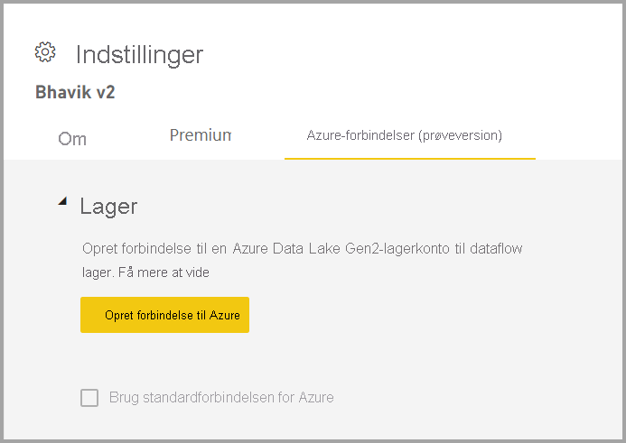
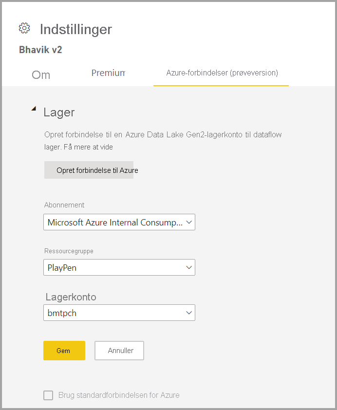

# Konfiguration af dataflowlager til brug af Azure Data Lake Gen 2 

Data, der bruges sammen med Power BI, gemmes som standard i et internt lager, der leveres af Power BI. Med integrationen af dataflow og Azure Data Lake Storage Gen 2 (ADLS Gen2) kan du gemme dine dataflow på din organisations Azure Data Lake Storage Gen2-konto.

Der er to måder til konfiguration af, hvilket ADLS Gen 2-lager du skal bruge: Du kan bruge en lejer, der har fået tildelt en ADLS Gen 2-konto, eller du kan hente din egen ADLS Gen 2-butik på et arbejdsområdeniveau. 

## Forudsætninger

Hvis du vil hente din egen ADLS Gen 2-konto, skal du have ejertilladelse til enten lagerkontoen, ressourcegruppen eller abonnementslaget. Hvis du er administrator, skal du stadig tildele dig selv ejertilladelse.  **Understøtter i øjeblikket ikke ADLS Gen2 lagerkonti bag en firewall**

Lagerkontoen skal oprettes med det [hierarkiske navneområde](/azure/storage/blobs/create-data-lake-storage-account) aktiveret. 

ADLS Gen 2-kontoen skal udrulles i det samme område som din Power BI-lejer. Der opstår en fejl, hvis ressourcernes placering ikke er i det samme område.

Endelig kan du oprette forbindelse til alle ADLS Gen 2 fra administrationsportalen, men hvis du opretter forbindelse direkte til et arbejdsområde, skal du først sikre, at der ikke er nogen dataflows i arbejdsområdet, før du opretter forbindelse.

## Oprettelse af forbindelse til en Azure Data Lake Gen 2 i et arbejdsområde
Gå til et arbejdsområde, der ikke har nogen dataflows. Vælg **Indstillinger for arbejdsområde** under en ny fane med navnet **Azure-forbindelser**. Vælg fanen **Azure Connections**, og vælg derefter afsnittet **Lager**.

 
Indstillingen **Brug Azure-standardforbindelse** er synlig, hvis lejeren allerede har konfigureret ADLS Gen 2. Du har to muligheder: Brug den lejerkonfigurerede ADLS Gen 2 ved at markere afkrydsningsfeltet **Brug Azure-standardforbindelsen**, eller vælge **Opret forbindelse til Azure** for at pege på en ny Azure Storage-konto. 

Når du vælger **Opret forbindelse til Azure**, henter Power BI en liste over Azure-abonnementer, som du har adgang til. Udfyld rullemenuerne, og vælg et gyldigt Azure-abonnement, en gyldig ressourcegruppe og en gyldig lagerkonto, hvor indstillingen Hierarkisk navneområde er aktiveret, hvilket er ADLS Gen 2-flaget.

 
Når du har valgt, skal du vælge **Gem**, så du nu har vedhæftet arbejdsområdet til din egen ADLS Gen 2-konto. Power BI konfigurerer automatisk lagerkontoen med de nødvendige tilladelser og konfigurerer det Power BI-filsystem, dataene skal skrives til. På dette tidspunkt skrives alle dataflowdata i dette arbejdsområde direkte til dette filsystem, som kan bruges sammen med andre Azure-tjenester, så der oprettes en enkelt kilde til alle dine organisations- eller afdelingsdata.

## Fjernelse af Azure Data Lake Gen 2 fra et arbejdsområde eller en lejer

Hvis du vil fjerne en forbindelse på et arbejdsområdeniveau, skal du først sikre dig, at alle dataflow i arbejdsområdet er slettet. Når alle dataflow er fjernet, skal du vælge **Afbryd forbindelsen** i indstillingerne for arbejdsområdet. Det samme gælder for en lejer, men du skal først sikre dig, at forbindelsen mellem alle arbejdsområder og lejerlagerkontoen også er afbrudt, før du kan afbryde forbindelsen på lejerniveau.

## Disabling Azure Data Lake Gen 2

Under **Dataflow** i **Administrationsportal** kan du deaktivere adgangen for brugere, så de ikke kan bruge denne funktion, og forhindre arbejdsområdeadministratorer i at medbringe deres eget Azure Storage.

## Næste trin
Du kan finde flere oplysninger om dataflow og Power BI i følgende artikler:

* [Introduktion til dataflow og selvbetjent dataforberedelse](dataflows-introduction-self-service.md)
* [Oprettelse af et dataflow](dataflows-create.md)
* [Konfigurer og brug et dataflow](dataflows-configure-consume.md)
* [Premium-funktioner for dataflow](dataflows-premium-features.md)
* [AI med dataflow](dataflows-machine-learning-integration.md)
* [Begrænsninger og overvejelser i forbindelse med dataflow](dataflows-features-limitations.md)
* [Bedste praksis i forbindelse med dataflow](dataflows-best-practices.md)
