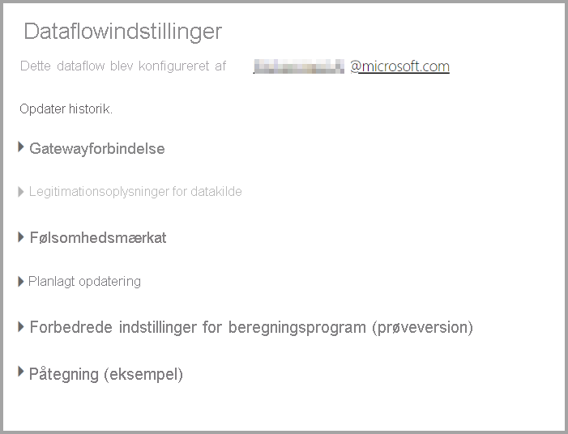
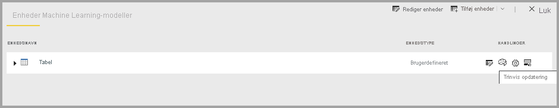

# Konfigurer og brug et dataflow

Med dataflow kan du samle data fra flere kilder og forberede de samlede data til modellering. Når du opretter et dataflow, bliver du bedt om at opdatere dataene for dataflowet. Det er påkrævet at opdatere et dataflow, før det kan forbruges i et datasæt i Power BI Desktop, og før der kan refereres til det som en sammenkædet eller beregnet enhed.

## Konfiguration af et dataflow

Hvis du vil konfigurere opdateringen af et dataflow, skal du vælge menuen **Mere** (ellipsen) og vælge **Indstillinger**.

Indstillingerne under **Indstillinger** omfatter mange muligheder for din data flow, som beskrevet i følgende afsnit.

* **Overtag ejerskabet:** Hvis du ikke er ejeren af dataflowet, er mange af disse indstillinger deaktiveret. Hvis du vil overtage ejerskabet af dataflow, skal du vælge **Overtag** for at overtage kontrollen. Du bliver bedt om at angive legitimationsoplysninger for at sikre, at du har det nødvendige adgangsniveau.

* **Gatewayforbindelse:** I dette afsnit kan du vælge, om dataflow bruger en gateway, og vælge den gateway, der bruges. 

* **Legitimationsoplysninger for datakilde:** I dette afsnit skal du vælge, hvilke legitimationsoplysninger der bruges, og du kan ændre den måde, du godkende til datakilden på.

* **Følsomhedsmærkat:** Her kan du definere følsomheden for dataene i dataflowet. Hvis du vil vide mere om følsomhedsmærkater, skal du se [Sådan anvendes følsomhedsmærkater i Power BI](../../admin/service-security-apply-data-sensitivity-labels.md).

* **Planlagt opdatering:** Her kan du definere de tidspunkter på dagen, hvor det valgte dataflow opdateres. En dataflow kan opdateres med samme hyppighed som et datasæt.

* **Udvidede indstillinger for beregningsprogram:** Her kan du definere, om dataflowet gemmes i beregningsprogrammet. Beregningsprogrammet tillader efterfølgende dataflow, der refererer til dette dataflow, for at udføre fletninger og joinforbindelser og andre transformationer meget hurtigere, end du ellers ville kunne. Det gør det også muligt for DirectQuery at blive udført via dataflowet. Hvis du vælger **Til**, sikres det, at dataflow altid understøttes i DirectQuery-tilstand, og eventuelle referencer drager fordel af programmet. Hvis du vælger **Optimeret** betyder det, at programmet kun bruges, hvis der er en reference til dette dataflow. Hvis du vælger **Fra**, deaktiveres beregningsprogrammet og DirectQuery-funktionaliteten for dette dataflow.

* **Godkendelser:** Du kan definere, om dataflowet skal certificeres eller hæves. 

## Opdatering af et dataflow
Dataflow fungerer som byggeblokke oven på hinanden. Lad os antage, at du har et dataflow med navnet *Rådata* , og en sammenkædet enhed med navnet *Transformerede data*, som indeholder en sammenkædet enhed til dataflowet *Rådata*. Når opdateringen af tidsplanen for dataflowet *Rådata* udløses, udløser den alle de dataflow, der refererer til den efter fuldførelsen. Denne funktionalitet opretter en opdateringskædereaktion, så du undgår at skulle planlægge dataflow manuelt. Der er et par små forskelle, du skal være opmærksom på, når du arbejder med opdateringerne af sammenkædede enheder:

* En sammenkædet enhed udløses kun af en opdatering, hvis den findes i det samme arbejdsområde

* En sammenkædet enhed låses for redigering, hvis en kildeenhed opdateres. Hvis et dataflow i en referencekæde ikke opdateres, vender alle dataflows tilbage til de gamle data (dataflowopdateringer fungerer som transaktioner i et arbejdsområde).

* Kun enheder, der refereres til, opdateres, når de udløses af fuldførelsen af en kildeopdatering. Hvis du vil planlægge alle objekterne, skal du også angive en opdatering af tidsplanen for den sammenkædede enhed. Undgå at angive en tidsplan for opdatering for sammenkædede dataflows for at undgå dobbeltopdatering.

**Annuller opdatering** Dataflow understøtter i modsætning til datasæt muligheden for at annullere en opdatering. Hvis en opdatering kører længe, kan du vælge indstillingerne for dataflow (ellipsen ud for dataflowet) og derefter vælge **Annuller opdatering**.

**Trinvis opdatering (kun Premium)** Dataflow kan også indstilles til trinvis opdatering. Det gør du ved at vælge det dataflow, du vil konfigurere til trinvis opdatering, og derefter vælge ikonet for trinvis opdatering.

Hvis du angiver trinvis opdatering, føjes der parametre til dataflowet for at angive datointervallet. Du kan finde flere oplysninger om, hvordan du konfigurerer trinvis opdatering, i artiklen [Trinvis opdatering i Power Query](https://docs.microsoft.com/power-query/dataflows/incremental-refresh).

Der er nogle tilfælde, hvor du ikke bør angive trinvis opdatering:

* Sammenkædede enheder må ikke bruge trinvis opdatering, hvis de refererer til et dataflow. Dataflow understøtter ikke forespørgselsfoldning (selvom enheden er DirectQuery-aktiveret). 

* Datasæt, der refererer til dataflow, må ikke bruge trinvis opdatering. Opdateringer til dataflows er generelt højtydende, så trinvise opdateringer burde ikke være nødvendige. Hvis opdateringerne tager for lang tid, kan du overveje at bruge beregningsprogrammet eller DirectQuery-tilstand.

## Forbrug af et dataflow

En dataflow kan forbruges på følgende tre måder:

* Opret en sammenkædet enhed fra dataflowet for at give en anden dataflowforfatter mulighed for at bruge dataene

* Opret et datasæt fra dataflowet for at gøre det muligt for en bruger at anvende dataene til at oprette rapporter

* Opret en forbindelse fra eksterne værktøjer, der kan læse fra CDM-formatet

**Forbrug fra Power BI Desktop** Du forbruger et dataflow ved at køre Power BI Desktop og vælge **Power BI-dataflow-connectoren** i dialogboksen **Hent data**.

> [!NOTE]
> Power BI-dataflow-connectoren bruger et andet sæt legitimationsoplysninger end den bruger, der aktuelt er logget på. Dette er tilsigtet for at understøtte brugere med flere lejere.

Vælg, hvilket dataflow og hvilke enheder du vil oprette forbindelse til. 

> [!NOTE]
> Du kan oprette forbindelse til et hvilket som helst dataflow og en hvilken som helst enhed, uanset hvilket arbejdsområde de findes i, og om de er defineret i et Premium- eller et ikke-Premium-arbejdsområde.

Hvis DirectQuery er tilgængelig, bliver du bedt om at vælge, om du vil oprette forbindelse til enhederne via DirectQuery eller Importér. 

I DirectQuery-tilstand kan du hurtigt udspørge store datasæt lokalt. Du kan dog ikke udføre yderligere transformationer. 

Brug af Importér hente dataene ind i Power BI, og kræver, at datasættet opdateres uafhængigt af dataflowet.

## Næste trin
Du kan finde flere oplysninger om dataflow og Power BI i følgende artikler:

* [Introduktion til dataflow og selvbetjent dataforberedelse](dataflows-introduction-self-service.md)
* [Oprettelse af et dataflow](dataflows-create.md)
* [Konfiguration af dataflowlager til brug af Azure Data Lake Gen 2](dataflows-azure-data-lake-storage-integration.md)
* [Premium-funktioner for dataflow](dataflows-premium-features.md)
* [AI med dataflow](dataflows-machine-learning-integration.md)
* [Begrænsninger og overvejelser i forbindelse med dataflow](dataflows-features-limitations.md)