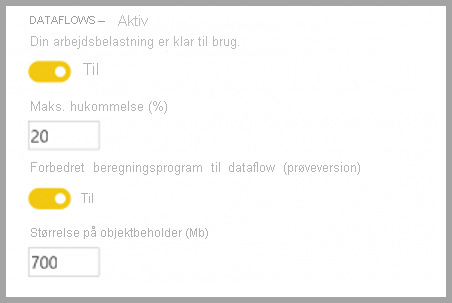
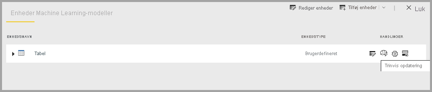

# Premium-funktioner for dataflow

Dataflows understøttes for Power BI Pro- og Power BI Premium-brugere. Nogle funktioner er kun tilgængelige med et Power BI Premium-abonnement. Denne artikel indeholder en detaljeret beskrivelse af Premium-funktionerne og deres brug. 

Følgende funktioner er kun tilgængelige med Power BI Premium:

* Forbedret beregningsprogram
* Direct Query
* Beregnede enheder
* Sammenkædede enheder
* Trinvis opdatering

De følgende afsnit indeholder en detaljeret beskrivelse af disse funktioner.

## Det forbedrede beregningsprogram

Det forbedrede beregningsprogram i Power BI gør det muligt for Power BI Premium-abonnenter at bruge deres kapacitet til at optimere brugen af dataflows. Hvis du bruger det forbedrede beregningsprogram, får du følgende fordele:

* Reducerer betydeligt den opdateringstid, der er krævet i forbindelse med langvarige ETL-trin, i forhold til beregnede enheder, som f.eks. udførelse af *joinforbindelser*, *distinct*, *filtre* og *gruppér efter*
* Udfør DirectQuery-forespørgsler over enheder

Aktivering af det forbedrede beregningsprogram er beskrevet i det følgende, hvor du også finder svar på almindelige spørgsmål.

### Brug af det forbedrede beregningsprogram

Det forbedrede beregningsprogram aktiveres fra siden **Kapacitetsindstillinger** i Power BI-tjenesten i afsnittet **Dataflows**. Det forbedrede beregningsprogram er som standard slået **Fra**. Hvis du vil aktivere det forbedrede beregningsprogram, skal du skifte til **Til** som vist på følgende billede og gemme dine indstillinger. 

> [!IMPORTANT]
> Det forbedrede beregningsprogram fungerer kun for Power BI-kapaciteter på A3 og derover.

Når det forbedrede beregningsprogram er aktiveret, kan du vende tilbage til **dataflow** og se en forbedring af ydeevnen i alle beregnede enheder, der udfører komplekse handlinger, f.eks. handlinger som *joinforbindelser* eller *gruppér efter* for dataflows, der er oprettet ud fra eksisterende sammenkædede enheder på samme kapacitet. 

Hvis du vil udnytte beregningsprogrammet optimalt, skal du opdele ETL-fasen i to separate dataflow på følgende måde:

* **Dataflow 1** – dette dataflow bør kun overføre det, der kræves af en datakilde, og placere det i dataflow 2.
* **Dataflow 2** – Udfør alle ETL-handlinger i dette andet dataflow, men sørg for, at du refererer til dataflow 1, som skal være på samme kapacitet. Sørg også for, at du udfører handlinger, der kan foldes (filtrere, gruppere efter, distinct, joinforbindelse), først før en anden handling for at sikre, at beregningsprogrammet anvendes.

### Almindelige spørgsmål og svar

**Spørgsmål:** Jeg har aktiveret det forbedrede beregningsprogram, men mine opdateringer er langsommere. Hvorfor?

**Svar:** Hvis du aktiverer det forbedrede beregningsprogram, er der to mulige forklaringer, der kan føre til langsommere opdateringstider:

 * Når det forbedrede beregningsprogram er aktiveret, kræver det noget hukommelse for at fungere korrekt. Derfor reduceres den hukommelse, der er tilgængelig til at udføre en opdatering, og derfor øges sandsynligheden for, at opdateringerne sættes i kø, hvilket reducerer antallet af dataflow, der kan opdateres samtidig. Hvis du vil løse dette, skal du øge den hukommelse, der er tildelt til dataflows, når du aktiverer udvidet beregning, for at sikre, at den hukommelse, der er tilgængelig for samtidige dataflow-opdateringer, forbliver den samme.

 * En anden årsag til, at du muligvis oplever langsommere opdateringer, er, at beregningsprogrammet kun fungerer oven på eksisterende enheder. Hvis dit dataflow refererer til en datakilde, der ikke er et dataflow, får du ikke vist en forbedring. Der vil ikke være nogen forbedring af ydeevnen, da den indledende indlæsning fra en datakilde vil være langsommere i visse større datascenarier, da dataene skal overføres til det forbedrede beregningsprogram.  

**Spørgsmål:** Jeg kan ikke se, at det forbedrede beregningsprogram skifter indstilling. Hvorfor?

**Svar:** Det forbedrede beregningsprogram udgives i etaper til områder i hele verden. Vi forventer, at alle områder understøttes i slutningen af 2020.

**Spørgsmål:** Hvilke datatyper understøttes af beregningsprogrammet?

**Svar:** Det forbedrede beregningsprogram og dataflows understøtter i øjeblikket følgende datatyper. Hvis dit dataflow ikke bruger en af følgende datatyper, opstår der en fejl under opdateringen:

* Dato/klokkeslæt
* Decimaltal
* Tekst
* Heltal
* Dato/klokkeslæt/zone
* Sand/falsk
* Dato
* Klokkeslæt

## Brug DirectQuery med dataflow i Power BI (prøveversion)

Du kan bruge DirectQuery til at oprette direkte forbindelse til dataflow og dermed oprette direkte forbindelse til dit dataflow uden at skulle importere dets data. 

Brug af DirectQuery med dataflow muliggør følgende forbedringer af dine processer for Power BI og dataflow:

* **Undgå separate opdateringsplaner** – DirectQuery opretter direkte forbindelse til et dataflow, hvilket fjerner behovet for at oprette et importeret datasæt. Derfor betyder brug af DirectQuery med dine dataflow, at du ikke længere har brug for separate opdateringsplaner for dataflowet og datasættet for at sikre, at dine data er synkroniseret.

* **Filtrering af data** – DirectQuery er nyttig til at arbejde med en filtreret visning af dataene i et dataflow. Hvis du vil filtrere data og dermed arbejde med en mindre delmængde af dataene, kan du bruge DirectQuery (og beregningsprogrammet) til at filtrere data i dataflow og arbejde med den filtrerede delmængde, du har brug for.

### Brug af DirectQuery til dataflow

Brug af DirectQuery med dataflow er en prøveversionsfunktion, som blev tilgængelig med Power BI Desktop-versionen fra maj 2020. 

Der er også nogle forudsætninger for at bruge DirectQuery med dataflow:

* Dit dataflow skal befinde sig i et Power BI Premium-aktiveret arbejdsområde
* **Beregningsprogrammet** skal være slået til

### Aktivér DirectQuery til dataflow

Det forbedrede beregningsprogram skal være i sin optimerede tilstand for at sikre, at dit dataflow er tilgængeligt til DirectQuery-adgang. Du aktiverer DirectQuery til dataflow ved at angive den nye indstilling **Forbedret beregningsprogram** til **Til**. På følgende billede kan du se, hvordan indstillingen er korrekt valgt.

Når du har anvendt denne indstilling, skal du opdatere dataflowet, før optimeringen træder i kraft.

### Overvejelser og begrænsninger for DirectQuery

Der er nogle få kendte begrænsninger for DirectQuery og dataflow:

* I prøveperioden for denne funktion kan nogle kunder opleve timeout eller problemer med ydeevnen, når de bruger DirectQuery med dataflow. Sådanne problemer bliver aktivt håndteret i prøveperioden.

* Sammensatte/blandede modeller, der har import- og DirectQuery-datakilder, understøttes ikke i øjeblikket.

* Store dataflow kan have problemer med timeout ved visning af visualiseringer. Store dataflow, hvor der er problemer med timeout, skal bruge importtilstand.

* Under indstillinger for datakilde viser dataflow-connectoren ugyldige legitimationsoplysninger, hvis du bruger DirectQuery. Dette påvirker ikke funktionsmåden, og datasættet fungerer korrekt. 

## Beregnede enheder

Du kan udføre **i lager-beregninger**, når du bruger **dataflow** vha. et Power BI Premium-abonnement. Dermed kan du udføre beregninger af dine eksisterende dataflow og få resultater, der giver dig mulighed for at fokusere på oprettelse af rapporter og analyser.

Hvis du vil udføre i lager-beregninger, skal du først oprette dataflowet og hente data ind i det pågældende Power BI-dataflowlager. Når du har et dataflow, der indeholder data, kan du oprette beregnede objekter, som er objekter, der udfører i lager-beregninger.

### Overvejelser og begrænsninger i forbindelse med beregnede enheder

* Når du arbejder med dataflow, der er oprettet i en organisations Azure Data Lake Storage Gen2-konto, fungerer tilknyttede enheder og beregnede enheder kun korrekt, når enhederne er placeret i samme lagerkonto. 

Når du skal udføre beregninger på data, der er joinforbundet med data i det lokale miljø og i clouden, er den bedste praksis at oprette et nyt dataflow for hver kilde (ét for det lokale miljø og ét for cloudmiljøet) og derefter oprette et tredje dataflow, der skal flettes med/beregnes over disse to datakilder.

## Sammenkædede enheder

Du kan referere til eksisterende dataflows, når du bruger dem med et Power BI Premium-abonnement, så du enten kan udføre en beregning på disse enheder ved hjælp af beregnede enheder eller oprette en "enkelt kilde til sandhed"-tabel, som du kan genbruge i flere dataflow.

## Trinvis opdatering

Dataflow kan indstilles til trinvis opdatering, så du undgår at skulle trække alle dataene ud ved alle opdateringer. Det gør du ved at vælge dataflowet og derefter vælge ikonet Trinvis opdatering.

Hvis du angiver trinvis opdatering, føjes der parametre til dataflowet for at angive datointervallet. Du kan finde flere oplysninger om, hvordan du konfigurerer trinvis opdatering, i artiklen [Trinvis opdatering](https://docs.microsoft.com/power-query/dataflows/incremental-refresh).

### Situationer, hvor du ikke skal angive trinvis opdatering

Undlad at angive et dataflow til trinvis opdatering i følgende situationer:

* Sammenkædede enheder må ikke bruge trinvis opdatering, hvis de refererer til et dataflow. Dataflows understøtter ikke forespørgselsfoldning (selvom enheden er DirectQuery-aktiveret). 
* Datasæt, der refererer til dataflow, må ikke bruge trinvis opdatering. Opdateringer af dataflows bør generelt fungere godt. Hvis opdateringerne tager længere tid end forventet, kan du overveje at bruge beregningsprogrammet og/eller DirectQuery-tilstand.

## Næste trin
Du kan finde flere oplysninger om dataflow og Power BI i følgende artikler:

* [Introduktion til dataflow og selvbetjent dataforberedelse](dataflows-introduction-self-service.md)
* [Oprettelse af et dataflow](dataflows-create.md)
* [Konfigurer og brug et dataflow](dataflows-configure-consume.md)
* [Konfiguration af dataflowlager til brug af Azure Data Lake Gen 2](dataflows-azure-data-lake-storage-integration.md)
* [AI med dataflow](dataflows-machine-learning-integration.md)
* [Begrænsninger og overvejelser i forbindelse med dataflow](dataflows-features-limitations.md)