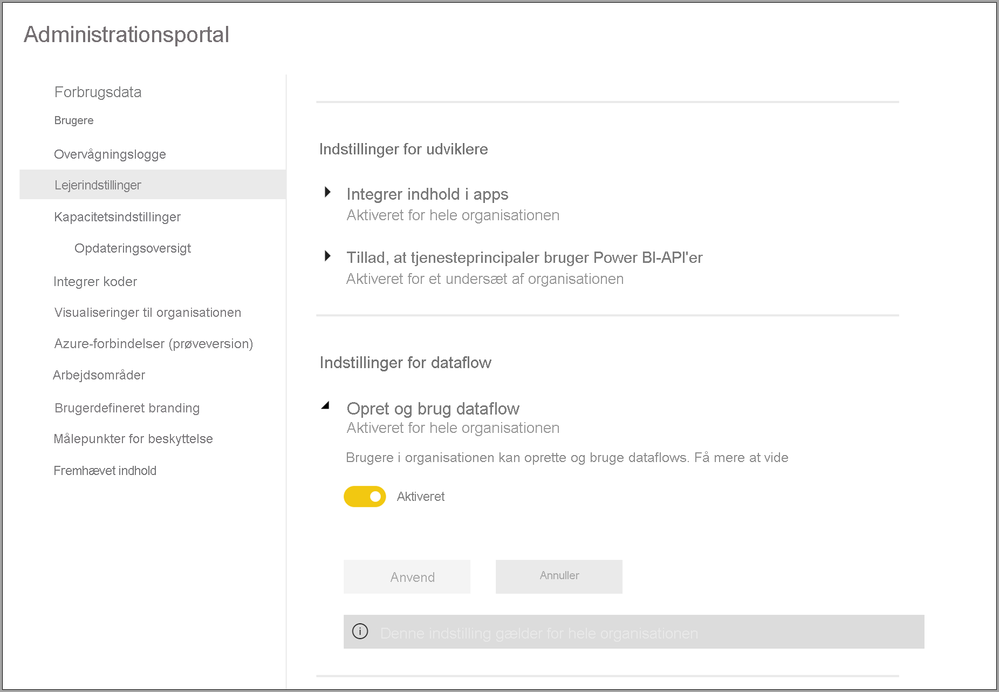
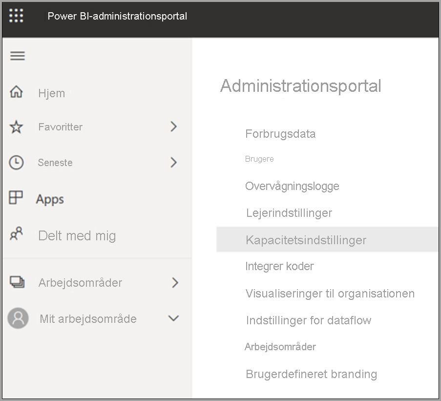
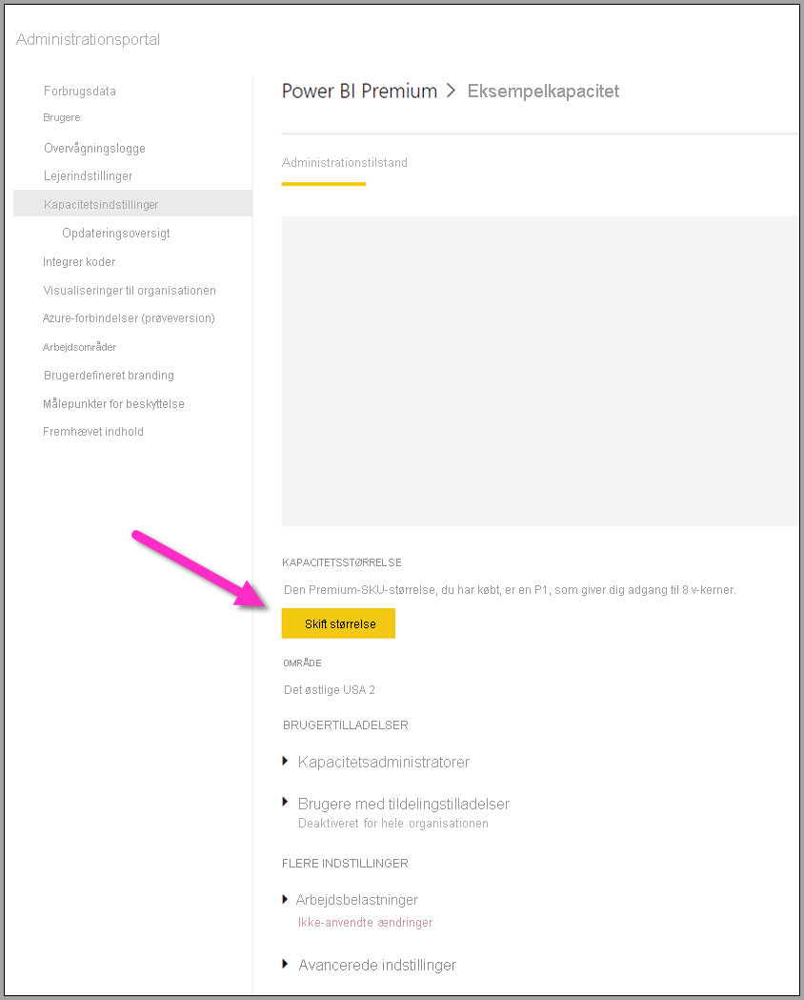
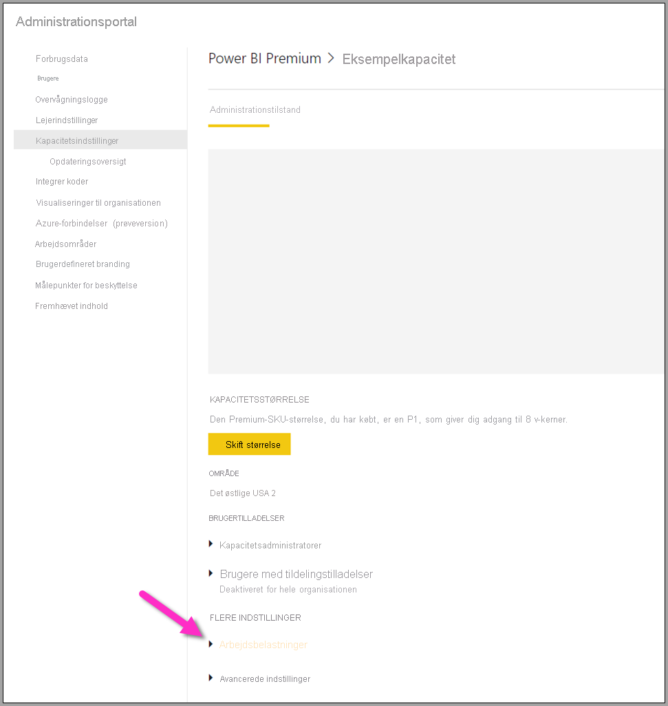
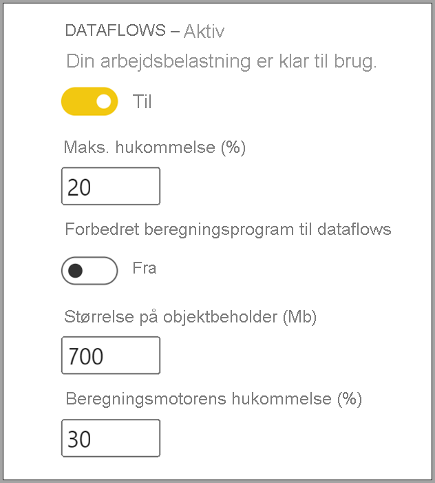

# Konfigurer dataflowarbejdsbelastninger i Power BI Premium

Du kan oprette dataflowarbejdsbelastninger i dit Power BI Premium-abonnement. I Power BI bruges begrebet *arbejdsbelastninger* til at beskrive Premium-indhold. Arbejdsbelastninger omfatter datasæt, sideinddelte rapporter, dataflow og kunstig intelligens. *Dataflowarbejdsbelastningen* giver dig mulighed for at bruge selvbetjeningsfunktionen til dataforberedelse i dataflow til at indtage, transformere, integrere og forbedre data. Dataflow i Power BI Premium administreres via **Administrationsportalen** .

Følgende afsnit indeholder en beskrivelse af, hvordan du aktiverer dataflow i din organisation, og hvordan du finindstiller indstillingerne af dem i din Premium-kapacitet samt vejledning til almindelig brug.

## Aktivering af dataflow i Power BI Premium

Det første krav i forbindelse med brug af dataflow i dit Power BI Premium-abonnement er at muliggøre oprettelse og brug af dataflow i din organisation. På **Administrationsportalen** skal du vælge **Lejerindstillinger** og skubbe skyderen under **Indstillinger for dataflow** til **Aktiveret** , som vist på følgende billede.

Når dataflowarbejdsbelastningen er aktiveret, er den konfigureret med standardindstillingerne. Det kan være en god idé at tilpasse disse indstillinger efter behov. Dernæst beskrives, hvor du kan finde disse indstillinger, hver indstilling beskrives, og du får hjælp til at forstå, hvornår det kan være en god idé at ændre disse værdier for at optimere ydeevnen af dit dataflow.

## Tilpasning af indstillinger for dataflow

Når du har aktiveret dataflow, kan du bruge **Administrationsportalen** til at ændre eller tilpasse, hvordan dataflow oprettes, og hvordan de bruger ressourcer i dit Power BI Premium-abonnement. Nedenstående trin viser, hvordan du tilpasser indstillingerne for dataflow.

1. På **Administrationsportalen** skal du vælge **Lejerindstillinger** for at få vist alle de kapaciteter, der er blevet oprettet. Vælg en kapacitet for at administrere indstillingerne.

    

2. Din Power BI Premium-kapacitet afspejler de ressourcer, der er tilgængelige til dine dataflow. Du kan ændre størrelsen af din kapacitet ved at vælge knappen **Skift størrelse** , som vist på følgende billede.

    

3. Under Kapacitetsindstillinger kan du konfigurere indstillingerne for dataflow ved at udvide **Arbejdsbelastninger** .

    

4. Under afsnittet **Arbejdsbelastninger** skal du rulle til området **Dataflow** . På følgende billede vises de indstillinger, du kan bruge til at styre eller tilpasse funktionsmåden af dataflowarbejdsbelastningen for din kapacitet.

    

Følgende tabel indeholder en grundlæggende beskrivelse af indstillingerne for dataflow.

| **Administrationsafsnit** | **Navn på indstilling** | **Beskrivelse** |
|---------|---------|---------|
| **Størrelse af kapacitet** | **Skift størrelse** | Den kapacitet, der er valgt i øjeblikket, vises sammen med mulighederne for at ændre kapaciteten. Hvis du ændrer denne indstilling, kan du skalere kapaciteten op eller ned. |
| **Arbejdsbelastning** | **Maks. hukommelse (%)** | Den maksimale procentdel af tilgængelig hukommelse, som dataflows kan bruge i en kapacitet. |
| **Arbejdsbelastning** | **Forbedret beregningsprogram til dataflow** | Aktivér denne indstilling for at få op til 20 gange hurtigere beregning af beregnede enheder, når der arbejdes med store datamængder.  **Du skal genstarte kapaciteten for at aktivere det nye program.**  Du kan finde flere oplysninger i [Forbedret beregningsprogram til dataflows](../../admin/service-admin-premium-workloads.md#enhanced-dataflows-compute-engine). |
| **Arbejdsbelastning** | **Størrelse af objektbeholder** | Den maksimale størrelse på den objektbeholder, som dataflows bruger til hver enhed i dataflowet. Standardværdien er 700 MB. Du kan finde flere oplysninger i [Størrelse af objektbeholder](../../admin/service-admin-premium-workloads.md#container-size). |
| **Arbejdsbelastning** | **Hukommelse til beregningsprogram (%)** | Den maksimale procentdel af hukommelse, der er allokeret til beregningsprogrammet. Standardværdien er 30 % |

I de efterfølgende afsnit gennemgås hver indstilling i detaljer, samt hvordan de påvirker din dataflowarbejdsbelastning.

### Forståelse af indstillinger for dataflowarbejdsbelastning

En nem måde at tænke på indstillinger for dataflowarbejdsbelastningen på er at bruge en analogi. Du kan tænkte på *kapacitetsstørrelsen* eller den type Power BI Premium-instans, du har, som din *restaurant* . I din restaurant har du *arbejdsbelastningshukommelse* , som er dit *køkken* . *Beregningsprogrammet* er din *ovn* . Og endelig repræsenterer *objektbeholderen* kvaliteten af din *kok* . For at evaluere dine dataflowarbejdsbelastninger skal du forestille dig, at du er ved at tilberede et måltid til et meget stort eller meget betydningsfuldt middagsselskab. Der kommer meget vigtige gæster, og middagen skal være klar til at blive serveret, når de ankommer.

Denne restaurantanalogi bruges til at give en forklaring af og vejledning til hver enkelt indstilling. Vi starter på det øverste niveau – din Premium-kapacitet – da det er det første valg, du foretager, når du bruger Power BI Premium.

#### SKU'er for Premium-kapacitet – skaler hardwaren op

I Power BI Premium-arbejdsbelastninger bruges en kombination af front-end- og back-end-kerner til at håndtere hurtige forespørgsler på tværs af forskellige typer arbejdsbelastninger. Artiklen om [kapacitetsnoder](../../admin/service-premium-what-is.md#capacity-nodes) indeholder et diagram, der viser de aktuelle specifikationer på tværs af de tilgængelige tilbud på arbejdsbelastninger. Kapaciteter af typen A3 og derover kan udnytte beregningsprogrammet, så når du vil bruge det forbedrede beregningsprogram, skal du starte der – [Kapacitetsnoder](../../admin/service-premium-what-is.md#capacity-nodes). 

I vores restaurantanalogi er valg af en kapacitet ligesom at vælge en restaurant af højere kvalitet. Selvom det koster mere, kan du forvente et højere niveau af ydeevne pga. stigningen i front-end-kerner, back-end-kerner og mere hukommelse. Når du kommer til en større restaurant, er der et større køkken og bedre kokke, hvilket er beslægtet med at opgradere til en højere SKU i Power BI Premium. Det giver dig fordel af øget CPU-hastighed, øget hukommelse pr. handling og mere parallelitet.

#### Maks. hukommelse – dedikation af en kapacitet til dataflow 

Indstillingen **Maks. hukommelse %** er den procentdel af hukommelse til dataflowarbejdsbelastninger ud af den fysiske hukommelse, som er tilgængelig til Premium-kapacitet. Du kan dedikere op til den fulde kapacitet til en dataflowarbejdsbelastning på en effektiv måde, og så skaleres kapaciteten dynamisk op efter behov til den allokering, du angiver. I forhold til vores analogi svarer det til, at du kan tilberede flere måltider, hvis du gør dit køkken større – på samme måde kan du øge din kapacitets størrelse af arbejdsbelastningen for dataflow og tillade flere dataflow. Selvom styring af dynamiske ressourcer er på plads, kan du med konfigurationen af *Maks. hukommelse %* dedikere 100 % af hukommelsen til dataflowarbejdsbelastningen. Dette er til det sjældne tilfælde, hvor du vil sikre, at kapacitetens hukommelse er tilgængelig til din dataflowarbejdsbelastning i stedet for at stole på Ressourcestyring. I vores analogi svarer det til, at du sikrer, at køkkenet fokuserer på tilberedelse af et specifikt måltid til en gæst, men dedikerer hele køkkenet til opgaven. Muligheden for at dedikere flere betyder naturligvis ikke bedre mad, eller at det kommer på bordet hurtigere – hvilket forklares i næste afsnit.

#### Størrelse af objektbeholder – problemer med opdatering eller manglende hukommelse

Lad os kigge på indstillingen **Størrelse af objektbeholder (Mb)** . Internt bruger dataflow en proces kaldet *miks objektbeholdere* til at evaluere dine ETL-processer. Programmet opdeler din forespørgselslogik i disse objektbeholdere, og de kan behandles parallelt. Antallet af objektbeholdere sikrer sideløbende behandling på en effektiv måde og øger ydeevnen. Disse objektbeholdere er først begrænset af **Kapaciteten** , dernæst af indstillingen **Maks. hukommelse %** og til sidst mængden af hukommelse, du allokerer specifikt til dem i indstillingen for objektbeholdere, der som standard er 700 Mb. Så det er muligt at øge mængden af hardwarehukommelse og øge størrelsen af objektbeholderen, men det vil reducere de parallelle handlinger, samtidig med at der dedikeres mere hukommelse til en bestemt ETL-proces i dine objektbeholdere. Antallet af objektbeholdere er begrænset til tre gange antallet af back-end-kerner, hvilket er vigtigt, da du ikke kan gøre objektbeholderen meget lille, og der er mange parallelle objektbeholdere udover dette punkt. Den mindste størrelse, du kan angive for en objektbeholder, er 200 Mb. Størrelsen af objektbeholderen er også begrænset til et forespørgselsniveau, hvilket betyder, at hver forespørgsel udføres i sin egen objektbeholder, når forespørgsler refererer til andre forespørgsler. I dette tilfælde opdateres de som en del af den samme objektbeholder.

Hvis vi vender tilbage til vores analogi, så giver færre, men mere fokuserede kokke i køkkenet, dig mulighed for at tilberede et måltid meget hurtigere, afhængigt af hvilken type bestillinger der afgives og kompleksiteten af måltidet. Byttehandlen her går ud på at have færre kokke, men mere fokuseret tid til tilberedningen. På samme måde kan forøgelse af objektbeholderens størrelse til 1200-1500 MB betyde, at der forekommer en stigning i ydeevnen for et mindre antal mere komplicerede ETL-jobs – aktiviteter såsom sammenlægninger, joinforbindelser, pivotforbindelser, rækker- eller kolonnemanipulationer – da vi leverer mere hukommelse til hver objektbeholder, men når vi gør det, så reduceres antallet af objektbeholdere. Ligesom analogien antyder, så kan for mange bestillinger faktisk forsinke køkkenet, hvilket er sådan, du kan tænke på størrelsen af objektbeholderen. Brug dette, når du skal fuldføre komplicerede enhedshandlinger, og du er villig til at bytte parallellitet med ydeevne, da forøgelse af denne ressource deler den allokerede hukommelse mellem færre objektbeholdere.

For at opsummere: Du vil optimere størrelsen af din objektbeholder, baseret på hvilke forespørgsler der bruges. Hvis du f.eks. blot indlæser data fra en kilde til en enhed, er det ikke nødvendigt at trække data ind og udføre nogen handlinger, og dataene indlæses blot til lageret. I denne situation vil du have så meget parallelitet som muligt, da du vil øge hastigheden af indlæsningen og opdatere handlingerne. Hvis du derimod tilføjer flere transformationshandlinger – komplekse filtre, joinforbindelser, sammenlægninger – kan hukommelsen være meget højere, da vi har brug for at behandle nogle af disse transformationshandlinger i hukommelsen. Hvis du har andre dataflowhandlinger kørende på kapaciteten, skal du være opmærksom på, at det kan sinke disse handlinger og tvinge dem i kø for at have et udførelsestidspunkt. Til dette formål hjælpes overvågning og administration af dataflow, opdatering af ydeevne og hele kapaciteten af appen **Power BI Premium Capacity Metrics** . Du kan bruge appen [Power BI Premium Capacity Metrics](../../admin/service-premium-capacity-optimize.md#what-content-is-using-up-my-capacity) til at filtrere efter kapacitet og gennemse metrikværdier for arbejdsområdeindholdets ydeevne. Det er muligt at gennemse målepunkterne for ydeevnen og ressourceforbruget efter time for de seneste syve dage for alt indhold, der er gemt i en Premium-kapacitet. Så det anbefales at starte med appen for at undersøge ydeevnen af dataflow.

#### Forbedret beregningsprogram – en mulighed for at forbedre ydeevnen

I vores analogi er det [forbedrede beregningsprogram](dataflows-premium-features.md#the-enhanced-compute-engine) ligesom en ovn. Power BI bruger et beregningsprogram til at behandle dine forespørgsler og opdatere handlinger. Det forbedrede beregningsprogram er en forbedring af standardprogrammet og fungerer ved at indlæse data i en SQL-cache og bruger SQL til at sætte fart på transformationen af enheden, opdatere handlinger og muliggøre DirectQuery-forbindelse. Hvis vi sammenligner programmerne med ovne, kan du tilberede måltider hurtigere og mere effektivt ved at bruge den forbedrede ovn. Når den er konfigureret til **Til** eller **Optimeret** for beregningsenheder, bruger Power BI SQL til at sætte fart på ydeevnen, hvis din forretningslogik tillader det. Når programmet er slået **Til** muliggøres DirectQuery-forbindelser også. Ligesom i analogien er der måske ikke behov for en ovn til nogle måltider, eller ovnen bruges ikke. Man kan tænke på det forbedrede beregningsprogram på en lignende måde: Sørg for, at det forbedrede beregningsprogram bruges korrekt til dit dataflow.

> [!NOTE]
> Det forbedrede beregningsprogram er endnu ikke tilgængeligt i alle områder.

## Vejledning til almindelige scenarier

Dette afsnit indeholder en vejledning til almindelige scenarier, når du bruger dataflowarbejdsbelastninger med Power BI Premium.

### Langsomme opdateringstider

Langsomme opdateringstider er normalt et problem med parallelitet. Du bør gennemgå følgende indstillinger i denne rækkefølge:

1. Et vigtigt begreb i forbindelse med langsomme opdateringstider er typen af din dataforberedelse. For at vende tilbage til vores restaurantanalogi beskrevet tidligere i denne artikel kan du forestille dig, at du allerede har tilberedt mad klar til at blive brugt. I dette scenarie kan mades laves færdig meget hurtigere pga. minimal tilberedningstid. Ligeledes bør du optimere langsomme opdateringstider ved at udnytte, at din datakilde faktisk udfører forberedelsen og forespørgselslogikken på forhånd, når du kan. Når du bruger en relationsdatabase såsom SQL som din kilde, skal du især se, om den indledende forespørgsel kan køres på kilden, og bruge denne kildeforespørgsel til din indledende udtrækning af dataflow til datakilden. Hvis du ikke kan bruge en oprindelig forespørgsel i kildesystemet, skal du udføre handlinger, som [dataflowprogrammet kan folde til datakilden](https://docs.microsoft.com/power-query/power-query-folding).

2. Overvej at brede opdateringstiderne ud på den samme kapacitet. Opdateringshandlinger er en proces, der kræver betydelig beregning. I forhold til vores restaurantanalogi er udbredelse af opdateringstider beslægtet med at begrænse antallet af gæster i restauranten. Ligesom restauranter planlægget antallet af gæster og kapaciteten, kan du også overveje at opdatere handlinger på tidspunkter, hvor brugen ikke er på sit højeste. Dette kan række langt i forhold til at lindre belastningen på kapaciteten.

3. Øg den samlede mængde hukommelse, der gives til arbejdsbelastningen. Tænk på dette som køkkenets størrelse. Finindstilling af denne ressource svarer til at tilpasse, hvor mange kokke der kan være i køkkenet. Dette gøres ved at tilpasse indstillingen **Maks. hukommelse %** og øge den op til 100 %.

4. Reducer mængden af hukommelse til objektbeholderen, hvilket muliggør flere objektbeholdere. Du kan tænke på dette på denne måde: I stedet for at hyre en berømt kok som f.eks. Gordon Ramsey, kan du hyre mange kompetente, men billigere kokke. Så har du flere kokke i køkkenet, men disse kokke kan kun udføre mindre opgaver. Du har dermed flere objektbeholdere, men mindre hukommelse.

5. Udfør begge forrige trin, hvilket muliggør en højere grad af parallelitet, da du får flere kokke og et større køkken.
    
6. Hvis trinnene i dette afsnit ikke giver den ønskede grad af parallelitet, kan du overveje at opgradere din kapacitet til en højere SKU. Følg derefter de forrige trin under dette afsnit igen.

### Undtagelser for manglende hukommelse

Når du oplever **undtagelser for manglende hukommelse** , skal du øge ydeevnen af objektbeholderen og hukommelsen. Udfør følgende trin.

1. Øg objektbeholderens hukommelse. Dette svarer til at have én stjernekok i forhold til mange kokke, som beskrevet i forrige afsnit.

2. Øg hukommelsen for arbejdsbelastningen og mere hukommelse til objektbeholderen. I vores analogi skaber dette et større køkken og kokke af højere kvalitet.

3. Hvis disse ændringer ikke giver dig den ønskede grad af parallelitet, kan du overveje en højere SKU for Power BI Premium.

### Brug af beregningsprogrammet til at forbedre ydeevnen

Udfør følgende trin for at gøre det muligt, at arbejdsbelastningerne udløser beregningsprogrammet og altid forbedrer ydeevnen:

**For beregnede og sammenkædede enheder i det samme arbejdsområde:**

1. I forbindelse med *dataindtagelse* skal du fokusere på at få data ind i lageret så hurtigt, men kun ved hjælp af filtre, hvis de reducerer den overordnede størrelse af datasættet. Det er bedste praksis at bevare din transformationslogik adskilt fra dette trin og give programmet mulighed for at fokusere på den indledende indsamling af ingredienser. Adskil derefter din transformations- og forretningslogik i separate dataflow i det samme arbejdsområde ved hjælp af sammenkædede eller beregnede enheder. Det giver programmet mulighed for at aktivere og sætte fart på dine beregninger. I vores analogi svarer det tilberedningen af mad i køkkenet: Tilberedning er typisk et separat og særskilt trin fra indsamling af råvarer, og det er en forudsætning for at sætte mad i ovnen. På samme måde skal du forberede din logik separat, før den kan udnytte fordelen ved beregningsprogrammet.

2. Sørg for, at du udfører de handlinger, der foldes, f.eks. fletninger, joinforbindelser, konvertering [m.fl.](https://docs.microsoft.com/power-query/power-query-folding#transformations-that-can-achieve-folding)

3. Oprettelse af dataflow [i publicerede retningslinjer og begrænsninger](dataflows-features-limitations.md#dataflows-in-premium).

Du kan også bruge DirectQuery.

### Beregningsprogrammet er slået til, men ydeevnen er langsom

Udfør følgende trin, når du undersøger scenarier, hvor beregningsprogrammet er slået til, men du oplever en langsommere ydeevne:

1. Begræns beregnede og sammenkædede enheder, der findes på tværs af arbejdsområder.

2. Hvis din indledende opdatering med beregningsprogrammet er slået til, så skrives dataene i søen og i cachen. Denne dobbeltskrivning betyder, at disse opdateringer er langsommere.

3. Hvis du har et dataflow, der er sammenkædet til mange dataflow, skal du sørge for, at du planlægger opdateringer af kildedataflowene, så de ikke alle opdateres samtidigt.

## Næste trin
Du kan finde flere oplysninger om dataflow og Power BI i følgende artikler:

* [Introduktion til dataflow og selvbetjent dataforberedelse](dataflows-introduction-self-service.md)
* [Oprettelse af et dataflow](dataflows-create.md)
* [Konfigurer og brug et dataflow](dataflows-configure-consume.md)
* [Konfiguration af dataflowlager til brug af Azure Data Lake Gen 2](dataflows-azure-data-lake-storage-integration.md)
* [AI med dataflow](dataflows-machine-learning-integration.md)
* [Begrænsninger og overvejelser i forbindelse med dataflow](dataflows-features-limitations.md)
