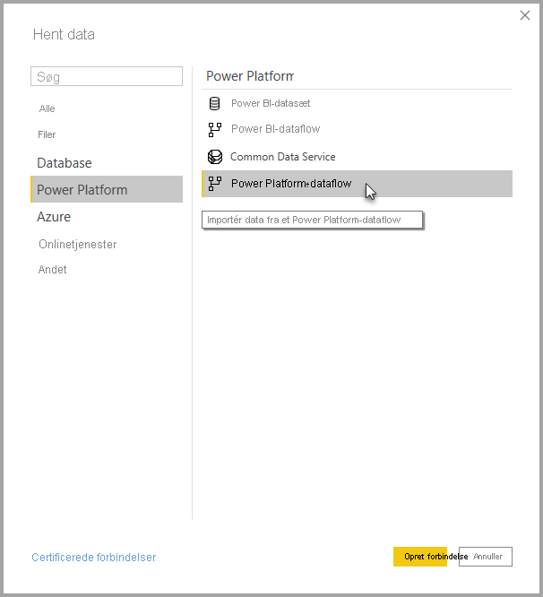

# Opret forbindelse til data oprettet af Power Platform-dataflow i Power BI Desktop
I **Power BI Desktop** kan du oprette forbindelse til data oprettet af **Power Platform-dataflow** på samme måde som enhver anden datakilde i Power BI Desktop.

Med connectoren **Power Platform-dataflow** kan du oprette forbindelse til enheder, der er oprettet af dataflow i Power BI-tjenesten. 

## Overvejelser og begrænsninger

Hvis du vil bruge **connectoren Power Platform-dataflow**, skal du køre den seneste version af **Power BI Desktop**. Du kan altid [hente Power BI Desktop](../fundamentals/desktop-get-the-desktop.md) og installere det på din computer for at sikre dig, at du har den nyeste version.  

> [!NOTE]
> I den tidligere version af connectoren Power Platform-dataflow krævedes det, at du downloadede en MEZ-fil og anbragte den i en mappe. Aktuelle versioner af **Power BI Desktop** inkluderer connectoren Power Platform-dataflow, så denne fil er ikke længere påkrævet og kan medføre konflikter med den inkluderede version af connectoren. Hvis du har placeret denne .MEZ-fil i mappen manuelt, *skal* du slette denne downloadede .MEZ-fil fra mappen **Dokumenter > Power BI Desktop > Brugerdefinerede connectors** for at undgå konflikter. 

## Stationær computers ydeevne
**Power BI Desktop** kører lokalt på den computer, hvor det er installeret. Ydeevnen for dataindtagelse for dataflow bestemmes af en lang række faktorer. Disse faktorer omfatter mængden af dataene, din computers CPU og RAM, netværkets båndbredde, afstanden til datacenteret og andre faktorer.

Du kan forbedre ydeevnen for dataindtagelse for dataflow. Hvis f.eks. mængden af de overførte data er for stor til, at **Power BI Desktop** kan administrere dem på din computer, kan du bruge sammenkædede og beregnede objekter i dataflow til at samle dataene (i dataflow) og kun overføre de samlede data, der er klargjort i forvejen. 

Dette medfører, at behandling af store datamængder udføres online i dataflow i stedet for at blive udført lokalt i din kørende forekomst af **Power BI Desktop**. Denne tilgang giver Power BI Desktop mulighed for at overføre mindre datamængder og sørger for, at oplevelsen med dataflow forbliver dynamisk og hurtig.

## Yderligere overvejelser

De fleste dataflow er placeret i Power BI-tjenestelejeren. **Power BI Desktop**-brugerne kan dog ikke få adgang til dataflow, der er gemt under Azure Data Lake Storage Gen2-kontoen, medmindre de er ejer af dataflowet, eller de udtrykkeligt er godkendt til dataflowets CDM-mappe. Overvej følgende situation:

1.  Anna opretter et nyt arbejdsområde og konfigurerer det til at gemme dataflow i organisationens datasø.
2.  Ben, der også er medlem af det arbejdsområde, Anna har oprettet, vil gerne bruge Power BI Desktop og dataflowconnectoren til at hente data fra det dataflow, Anna har oprettet.
3.  Ben får vist en fejl, da han ikke er føjet til dataflowets CDM-mappe som en godkendt bruger i datasøen.

Problemet kan løses ved, at Ben tildeles læsetilladelser til CDM-mappen og dens filer. Du kan få mere at vide om, hvordan du giver adgang til CDM-mappen i [Konfigurer og brug et dataflow](dataflows/dataflows-configure-consume.md).

## Næste trin
Du kan gøre mange forskellige interessante ting med dataflow. Du kan finde flere oplysninger i følgende ressourcer:

* [Introduktion til dataflow og selvbetjent dataforberedelse](dataflows/dataflows-introduction-self-service.md)
* [Oprettelse af et dataflow](dataflows/dataflows-create.md)
* [Konfigurer og brug et dataflow](dataflows/dataflows-configure-consume.md)
* [Konfiguration af dataflowlager til brug af Azure Data Lake Gen 2](dataflows/dataflows-azure-data-lake-storage-integration.md)
* [Premium-funktioner for dataflow](dataflows/dataflows-premium-features.md)
* [AI med dataflow](dataflows/dataflows-machine-learning-integration.md)

Der findes også artikler om **Power BI Desktop**, som du kan finde nyttige:

* [Datakilder i Power BI Desktop](../connect-data/desktop-data-sources.md)
* [Udform og kombiner data med Power BI Desktop](../connect-data/desktop-shape-and-combine-data.md)
* [Angiv data direkte i Power BI Desktop](../connect-data/desktop-enter-data-directly-into-desktop.md)