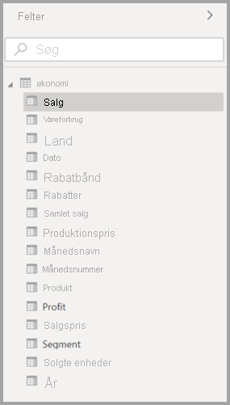
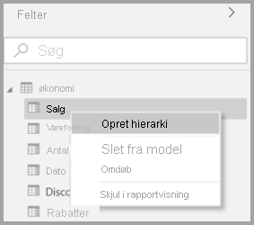
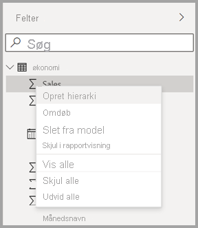
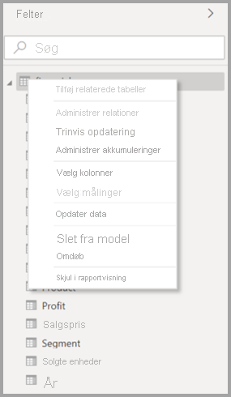
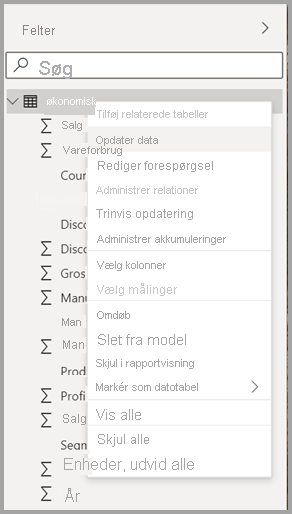
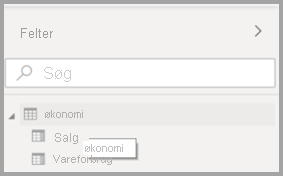

# Brug af feltlisten i Power BI Desktop (prøveversion)

Fra og med opdateringen i november 2020 samler vi **felt** lister på tværs af Modelvisning, Datavisning og Rapportvisning i Power BI Desktop. Samlingen af disse visninger skaber en ensartet funktionalitet og brugergrænseflade på tværs af visninger, og er baseret på brugernes feedback.

Ændringer, du vil bemærke på tværs af visninger, omfatter følgende:

* Ikonografi
* Søgefunktionalitet
* Genvejsmenupunkter
* Lignende funktionsmåde for træk og slip
* Værktøjstip
* Forbedringer af Hjælp til handicappede

Hensigten er at forbedre Power BI Desktop-brugervenligheden. Ændringerne har en minimal indvirkning på din typiske dataarbejdsproces.

## Aktivering af den nye feltliste (eksempelvisning)

Den samlede feltliste starter med **Model** visning og aktiveres derefter for andre visninger. Du aktiverer den samlede feltvisning ved at gå til **Filer > Indstillinger > Indstillinger** i Power BI Desktop og derefter vælge **Prøveversionsfunktioner** i ruden til venstre. Markér afkrydsningsfeltet ud for **Ny feltliste** i afsnittet Prøveversionsfunktioner.

Du bliver bedt om at genstarte Power BI Desktop, for at valget træder i kraft.

## Feltlisteændringer

Opdateringerne af feltlisten vises i følgende tabeller: 

|**Oprindelig feltliste (Modelvisning)**  | **Ny feltliste (Modelvisning)**  |
|:---------:|:---------:|
|**Oprindelig** |**Ny** |
|**Ikoner og brugergrænseflade**       ||
|     |    |
|**Genvejsmenu – felt**       ||
|     |    |
|**Genvejsmenu – tabel**       ||
|     |    |
|**Værktøjstip**       ||
|     |    |

## Ikoner for feltliste

Der er også nye feltlisteikoner. I følgende tabel vises de oprindelige ikoner og den nye version, og der er en kort beskrivelse af hver enkelt. 

|Oprindeligt ikon  |Nyt ikon  |Beskrivelse  |
|:---------:|:---------:|:---------|
|     |           |Mappe på listen Felter         |
|     |         |Numerisk felt: Numeriske felter er samlinger, der f.eks. kan sammenlægges eller beregnes som gennemsnit. Samlinger importeres med dataene og defineres i den datamodel, som din rapport er baseret på. Du kan finde flere oplysninger i [Aggregeringer i Power BI-rapporter](../create-reports/service-aggregates.md).         |
|     |         |Beregnet kolonne med en datatype, der ikke er numerisk: En ny ikke-numerisk kolonne, du opretter, med en DAX-formel (Data Analysis Expressions), der definerer kolonnens værdier. Læs mere om [beregnede kolonner](desktop-calculated-columns.md).        |
|     |          |Numerisk beregnet kolonne: En ny kolonne, du opretter, med en DAX-formel (Data Analysis Expressions), der definerer kolonnens værdier. Læs mere om [beregnede kolonner](desktop-calculated-columns.md).         |
|     |          |Måling: Hver måling har sin egen hårdt kodede formel. Rapportlæsere kan ikke ændre beregningen – hvis det f.eks. er en sum, kan det kun være en sum. Værdierne gemmes ikke i en kolonne. De beregnes løbende, udelukkende afhængigt af hvordan de er placeret i en visualisering. Du kan finde flere oplysninger i [Forstå målinger](desktop-measures.md).         |
|     |         |Målingsgruppe.         |
|     |         |KPI: Et visuelt tip, der viser statussen mod et målbart mål. Læs mere om [KPI-visualiseringer (Key Performance Indicator)](../visuals/power-bi-visualization-kpi.md).         |
|     |           |Felthierarki: Vælg pilen for at se de felter, der udgør hierarkiet. Du kan få flere oplysninger ved at se denne Power BI-video på YouTube om, [hvordan du opretter og arbejder med hierarkier](https://www.youtube.com/watch?v=q8WDUAiTGeU).         |
|     |         |Geo-data: Disse placeringsfelter kan bruges til at oprette kortvisualiseringer.         |
|     |          |Id-felt: Felter med dette ikon er entydige felter, som er angivet til at vise alle værdier, også selvom der er dubletter. Dine data kan f.eks. have poster for to forskellige personer med navnet "Robin Smith", og hver enkelt behandles som entydig. De opsummeres ikke.         |
|     |          |Parameter: Angiv parametre for at gøre dele af dine rapporter og datamodeller (f.eks. et forespørgselsfilter, en datakildereference, en målingsdefinition osv.) afhængige af en eller flere parameterværdier. Du kan finde flere oplysninger i dette Power BI-blogindlæg om [forespørgselsparametre](https://powerbi.microsoft.com/blog/deep-dive-into-query-parameters-and-power-bi-templates/).         |
|     |         |Kalenderdatofelt med en indbygget datotabel.         |
|     |          |Beregnet tabel: En tabel, der er oprettet med en DAX-formel (Data Analysis Expressions), som er baseret på data, der allerede er indlæst i modellen. Disse er bedst egnet til mellemliggende beregninger og gemmes som en del af modellen.         |
|     |         |Advarsel! Et beregnet felt med en fejl. Syntaksen i DAX-udtrykket kan f. eks. være forkert.         |
|     |         |Gruppe: Værdierne i denne kolonne er baseret på grupperingsværdier fra en anden kolonne ved hjælp af grupperings- og placeringsfunktionen. Du kan læse, hvordan du bruger funktionen, under [Brug gruppering og gruppering](../create-reports/desktop-grouping-and-binning.md).         |
| intet oprindeligt ikon    |          |Skift registreringsmåling: Når du konfigurerer en side til automatisk opdatering af sider, kan du konfigurere en [registreringsmåling](../create-reports/desktop-grouping-and-binning.md), der forespørges, for at finde ud af om resten af en sides visualiseringer skal opdateres.         |

## Næste trin

Du vil måske også være interesseret i følgende artikler:

* [Opret beregnede kolonner i Power BI Desktop](desktop-calculated-columns.md)
* [Brug gruppering og gruppering i beholder i Power BI Desktop](../create-reports/desktop-grouping-and-binning.md)
* [Brug gitterlinjer og fastgørelse til gitter i Power BI Desktop-rapporter](../create-reports/desktop-gridlines-snap-to-grid.md)

