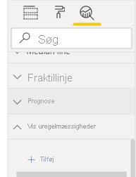

# Registrering af uregelmæssigheder (prøveversion)

[!INCLUDE[consumer-appliesto-nyyn](../includes/consumer-appliesto-nyyn.md)]    

Registrering af uregelmæssigheder hjælper dig med at forbedre dine kurvediagrammer ved automatisk at registrere uregelmæssigheder i dine tidsseriedata. Funktionen giver også forklaringer på uregelmæssigheder for at hjælpe med hovedårsagsanalyse.  Med blot nogle få klik kan du nemt finde indsigt uden at foretage udsnit og opdele dataene. Du kan oprette og få vist uregelmæssigheder i både Power BI Desktop og Power BI-tjenesten. Trinnene og illustrationerne i denne artikel er fra Power BI Desktop.

Da denne funktion er en prøveversion, skal du først slå funktionskontakten til. Gå til **Filer** > **Indstillinger** > **Indstillinger** > **Prøveversionsfunktioner**, og kontrollér, at **Registrering af uregelmæssigheder** er slået til:

:::image type="content" source="media/power-bi-visualization-anomaly-detection//preview-feature-switch.png" alt-text="Skærmbillede, der viser, hvordan du kan aktivere prøveversionsfunktionen Registrering af uregelmæssigheder.":::
 
## Kom i gang
Dette selvstudium bruger onlinesalgsdata for forskellige produkter. For at følge med i selvstudiet skal du downloade [eksempelfilen](https://github.com/microsoft/powerbi-desktop-samples/blob/master/Monthly%20Desktop%20Blog%20Samples/2020/2020SU09%20Blog%20Demo%20-%20September.pbix) med et onlinesalgsscenarie.

Du kan aktivere registrering af uregelmæssigheder ved at vælge diagrammet og tilføje indstillingen "Find uregelmæssigheder" i ruden Analyse. 

 

 Dette diagram viser f. eks. indtjening over tid. Hvis du tilføjer registrering af uregelmæssigheder, forbedres diagrammet automatisk med uregelmæssigheder og det forventede interval af værdier. Når en værdi er uden for den forventede grænse, markeres den som afvigende. Se denne [tekniske blog](https://techcommunity.microsoft.com/t5/ai-customer-engineering-team/overview-of-sr-cnn-algorithm-in-azure-anomaly-detector/ba-p/982798) for at få flere oplysninger om algoritmen Afvigelsesregistrering.

 
 
## Formatér uregelmæssigheder

Denne oplevelse kan tilpasses i stort omfang. Du kan formatere uregelmæssighedens form, størrelse og farve samt det forventede intervals farve, type og gennemsigtighed. Du kan også konfigurere parameteren for algoritmen.  Hvis du øger følsomheden, er algoritmen mere følsom over for ændringer i dine data. I det tilfælde markeres selv en lille afvigelse som en uregelmæssighed. Hvis du reducerer følsomheden, er algoritmen mere selektiv, hvad angår markering af uregelmæssigheder.

 
 
## Forklaringer
Ud over at registrere uregelmæssigheder kan du også automatisk forklare uregelmæssighederne i dataene. Når du vælger uregelmæssigheden, kører Power BI en analyse på tværs af felter i din datamodel for at finde mulige forklaringer. Den giver dig en forklaring på uregelmæssigheden på et naturligt samt de faktorer, der er knyttet til uregelmæssigheden, sorteret efter dens forklaringsstyrke. Her kan jeg se, at indtægten den 30. august var $5187, hvilket er over det forventede interval på $2447 – $3423. Jeg kan åbne kortene i denne rude for at få vist flere detaljer om forklaringen.

 
### Konfigurer forklaringer
Du kan også styre de felter, der bruges til analyse. Hvis du f. eks. trækker Seller og City til feltbrønden **Forklar med**, begrænses analysen i Power BI til kun at omfatte disse felter. I dette tilfælde lader uregelmæssigheden den 31. august til at være knyttet til en bestemt sælger og bestemte byer. Her har sælgeren "Fabrikam", har en styrke på 99 %. Power BI beregner *styrke* som forholdet mellem den forventede værdi, når der filtreres efter dimensionen til afvigelsen i den samlede værdi. Det er f. eks. forholdet mellem den faktiske værdi minus den forventede værdi mellem komponenttidsserien *Fabrikam* og den samlede tidsserie *Overall Revenue* for punktet med uregelmæssigheder. Åbning af dette kort viser visualiseringen med en stigning i indtægten for denne sælger den 31. august. Brug indstillingen **Føj til rapport** for at føje denne visualisering til siden.

## Begrænsninger
- Registrering af uregelmæssigheder understøttes kun for visualiseringer af kurvediagrammer, der indeholder tidsseriedata i feltet Akse.
- Registrering af uregelmæssigheder understøttes ikke for forklaringer, flere værdier eller sekundære værdier i kurvediagramvisualiseringen.
- Registrering af uregelmæssigheder kræver mindst 12 datapunkter.
- Linjerne Prognose/Min./Maks./Gennemsnit/Median/Fraktil fungerer ikke sammen med registrering af uregelmæssigheder.
- Direct Query via SAP-datakilde, Power BI-rapportserver, Direkte forbindelse til Azure Analysis Services og SQL Server Analysis Services understøttes ikke.
- Forklaringer af uregelmæssigheder fungerer ikke sammen med indstillinger for "Vis værdi som".
- Detailudledning til næste niveau i hierarkiet understøttes ikke.
