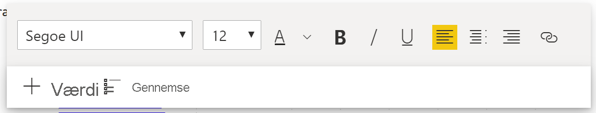
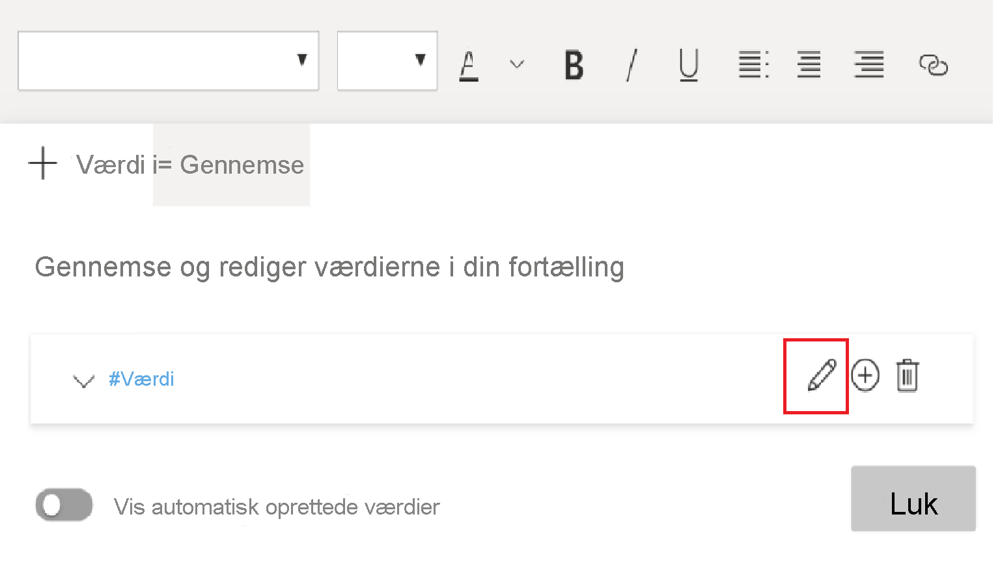

# Opret intelligente narrativer i Power BI (prøveversion)

[!INCLUDE[consumer-appliesto-nyyn](../includes/consumer-appliesto-nyyn.md)]    

[!INCLUDE [power-bi-visuals-desktop-banner](../includes/power-bi-visuals-desktop-banner.md)]

Med visualiseringen Intelligent narrativ kan du hurtigt opsummere visualiseringer og rapporter ved at levere relevant indsigt, der er klar til brug, og som kan tilpasses.

Hvis du bruger denne funktion, kan du føje narrativer til din rapport for at belyse vigtige punkter og tendenser samt redigere sproget og formatere det, så det passer til en bestemt målgruppe. I stedet for at indsætte et skærmbillede af rapporten i PowerPoint, hvor de vigtigste punkter er tilføjet, er det nu muligt at føje narrativer til rapporten, der opdateres ved hver opdatering. Dine slutbrugere kan bruge narrativerne til at forstå deres data, få adgang til centrale punkter hurtigere og forklare dataene til andre.

>[!NOTE]
> Da denne funktion er tilgængelig som prøveversion, skal du først aktivere funktionen ved at gå til Filer > Indstillinger > Indstillinger > Prøveversion og sørge for, at **visualiseringen Intelligent narrativ** er slået til:

Du kan finde den PBIX, der er brugt til scenariet Onlinesalg i denne dokumentation, [her](https://github.com/microsoft/powerbi-desktop-samples/blob/master/Monthly%20Desktop%20Blog%20Samples/2020/2020SU09%20Blog%20Demo%20-%20September.pbix).

## Kom godt i gang 

Klik på det nye ikon for intelligente narrativer i ruden Visualiseringer for automatisk at oprette en oversigt.

 Du får vist et narrativ, der er oprettet på baggrund af alle visualiseringerne på siden. Du kan f.eks. klikke på ikonet for automatisk at generere en oversigt over de visualiseringer, der omhandler omsætning, besøg på websted og salg i denne rapport. Vær opmærksom på, at Power BI automatisk foretager en tendensanalyse for at vise, at både omsætning og besøg er steget, og det beregnes også, hvor stor væksten er – i dette tilfælde en stigning på 72 %.
 
 
 
 Du kan også højreklikke på visualiseringen og vælge **Opsummer**. Dette genererer en automatisk opsummering af visualiseringen. Når du f.eks. højreklikker på -> opsummer punktdiagram, der viser de forskellige transaktioner, analyserer Power BI dataene og viser, hvilken by eller hvilket område der har den højeste omsætning pr. transaktion og det højeste antal transaktioner. Det viser også det forventede interval af værdier for disse målepunkter, så du kan se, at de fleste byer havde en omsætning, der var mindre end 45 USD og havde færre end 10 transaktioner.
 
  
 
 
 ## Rediger oversigten
 
 Oversigten kan **tilpasses** på mange måder, og du kan tilføje ny tekst eller redigere den eksisterende tekst ved hjælp af de samme kontrolelementer som i et almindeligt tekstfelt. Du kan f.eks. gøre teksten fed eller ændre tekstfarven.
 
  
  
  Du kan også tilpasse oversigten og tilføje din egen indsigt ved at tilføje **dynamiske værdier**. Du kan knytte tekst til eksisterende felter og målinger eller bruge naturligt sprog til at definere en ny måling, der skal knyttes til tekst. Hvis du f.eks. vil tilføje oplysninger om antallet af returnerede varer, kan du bruge brugergrænsefladen for tilføjelse af værdier som vist på billedet. Vi har integreret Spørgsmål og svar-brugergrænsefladen for at kunne tilføje dynamiske værdier. Mens du skriver, får du forslag på en rulleliste som i en Spørgsmål og svar-visualisering, og du kan blot gemme forslagene som en værdi.  Ud over at stille spørgsmål om dine data i Spørgsmål og svar er omfanget blevet udvidet, så du kan oprette dine egne beregninger uden at skulle foretage DAX. 
  
   
  
  Du kan formatere de dynamiske værdier, f.eks. for at vise dem som valuta, angive decimalpladser, tusindseparator osv. 
   
   
   
   Det kan du gøre ved at klikke direkte på værdien i oversigten for at formatere den eller klikke på den redigeringsknap, der svarer til værdien, på fanen Gennemse i kontrolelementet for tekstfeltet. 
   
   
   
   Du kan også bruge fanen Gennemse til at gennemse, slette eller genbruge tidligere definerede værdier.  Hvis du klikker på plusikonet, indsættes værdien i oversigten. Du kan også få vist de automatisk genererede værdier ved at slå indstillingen til nederst.

Nogle gange vil du se symbolet for skjulte oversigter, der angiver, at "aktuelle data og filtre ikke giver noget resultat for denne værdi". Det skyldes, at nogle oversigter kan være tomme, da der ikke er noget interessant at sige. En oversigt, der f.eks. ser på høje og lave værdier i et kurvediagram, kan være tom, hvis det er en flad linje, men er ikke tom under andre betingelser. Disse symboler er kun synlige, når du forsøger at redigere oversigterne.

   
   
   ## Interaktioner mellem visualiseringer
   Oversigten er dynamisk og opdaterer automatisk den genererede tekst og de dynamiske værdier, når du krydsfiltrerer. Hvis du f.eks. vælger elektronikprodukter i kransediagrammet, krydsfiltreres resten af rapporten, og oversigten krydsfiltreres også for at fokusere på elektronikprodukterne.  I dette tilfælde er der forskellige tendenser for besøg og omsætning, og teksten opdateres for at afspejle dette. Og antallet af returværdier, du har tilføjet, bliver opdateret til 4196 USD. Nogle af de tomme oversigter kan også opdateres, når du krydsfiltrerer.
   
   
   
   Du kan også udføre mere avanceret filtrering. Hvis du f.eks. kun er interesseret i tendensen på tværs af et bestemt kvartal i denne visualisering, der ser på tendenser for flere forskellige produkter, kan du blot vælge de relevante datapunkter for at få oversigten opdateret for det pågældende fragment.
   
   
   
   ## Begrænsninger
   - Fastgørelse til dashboardet understøttes ikke.
   - Brug af dynamiske værdier og betinget formatering (f.eks. databundet titel) understøttes ikke.
   - Azure Analysis Services, On-Prem AS understøttes ikke.
   - KPI, Kort, Kort med flere rækker, Kartogram, Matrixer, R/Phyton-visualiseringer og brugerdefinerede visualiseringer understøtter ikke opsummering. Nogle af disse visualiseringer tilføjes på et senere tidspunkt.
   - Opsummering understøttes ikke for visualiseringer med kolonner, der er grupperet efter andre kolonner, og kolonner, der er bygget på et datagruppefelt. 
   - Krydsfiltrering uden for visualiseringen understøttes ikke.
   - Omdøbning af dynamiske værdier eller redigering af automatisk genererede dynamiske værdier understøttes ikke.
   - Opsummering af visualiseringer, der indeholder løbende beregninger som spørgsmål og svar med aritmetik, procent af samlet beløb osv. understøttes ikke.
   

